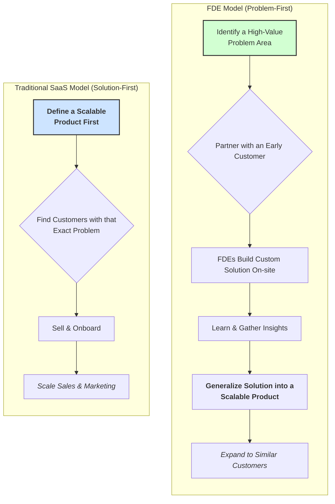
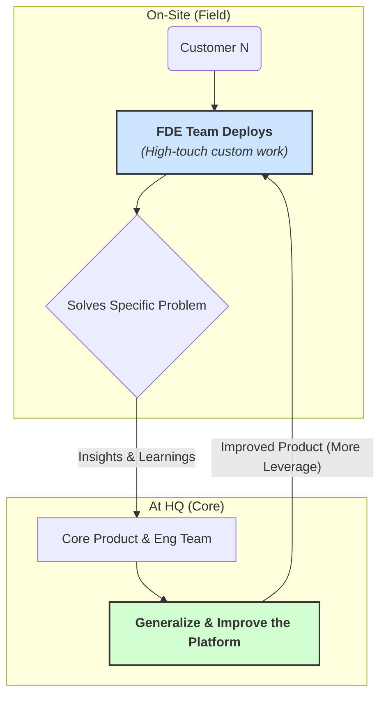
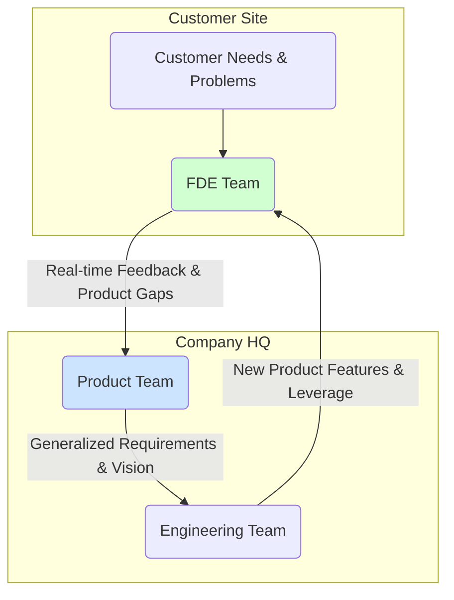
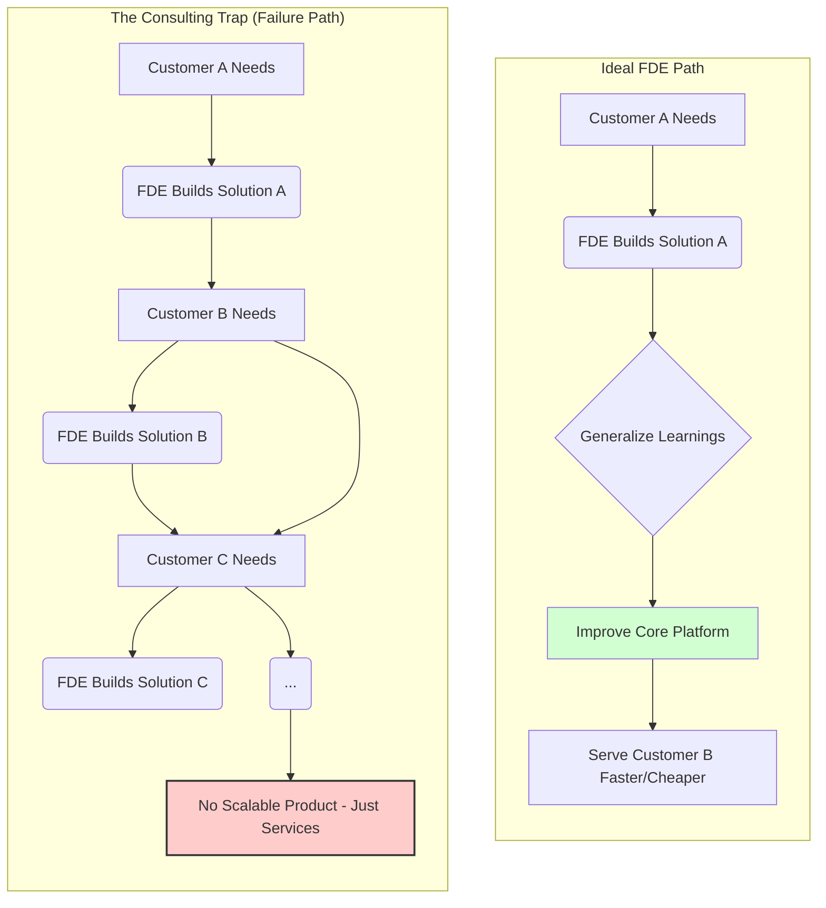
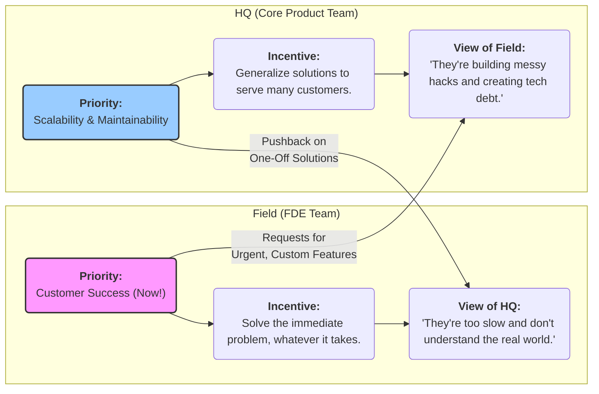

### The FDE Model vs. Traditional SaaS

### The FDE "Unscalable at Scale" Loop

### Information Flow: The Learning Company

### The "Consulting Firm Trap"

### The Cultural Divide: Field vs. HQ

### Financial Risk: The Trough of Sorrow

```mermaid
gantt
    %% Subtitle
    dateFormat  X
    axisFormat %s

    section Traditional SaaS
    Initial Burn      :a1, 0, 3s
    Breakeven         :a2, after a1, 2s
    Steady Growth     :a3, after a2, 8s

    section FDE Model
    Deep Burn (Customer 1) :crit, b1, 0, 6s
    Continued Burn (Customer 2+) :b2, after b1, 4s
    Potential Breakeven :b3, after b2, 3s
    High Growth (If successful) :b4, after b3, 5s
```

