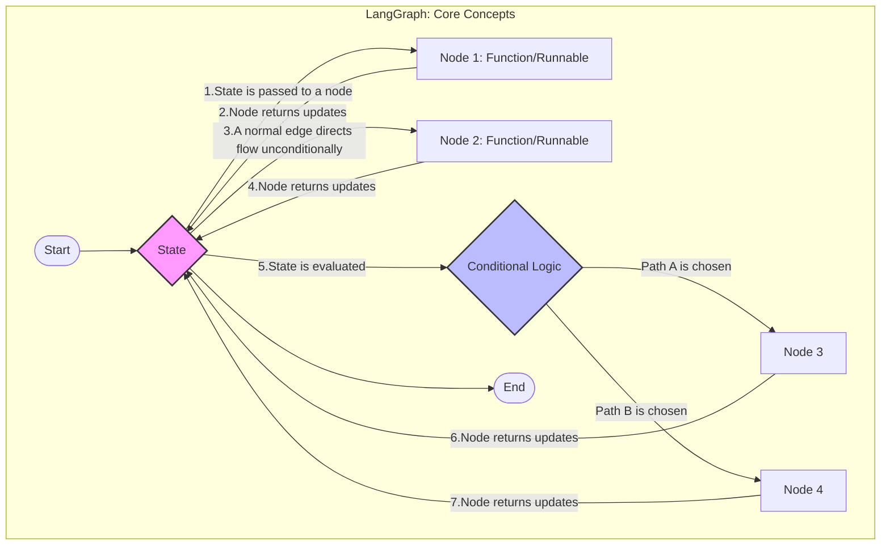
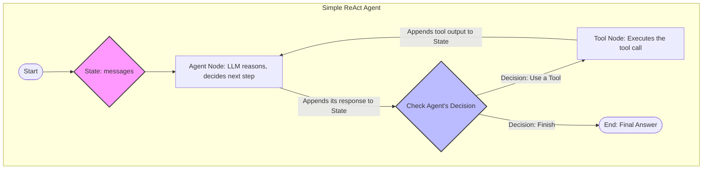
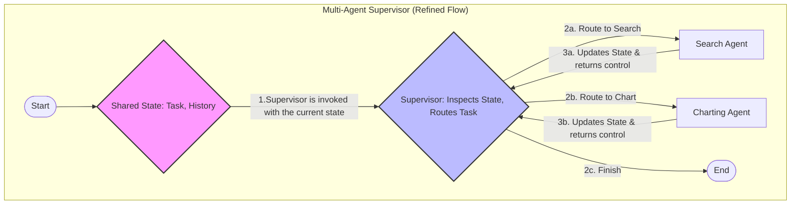
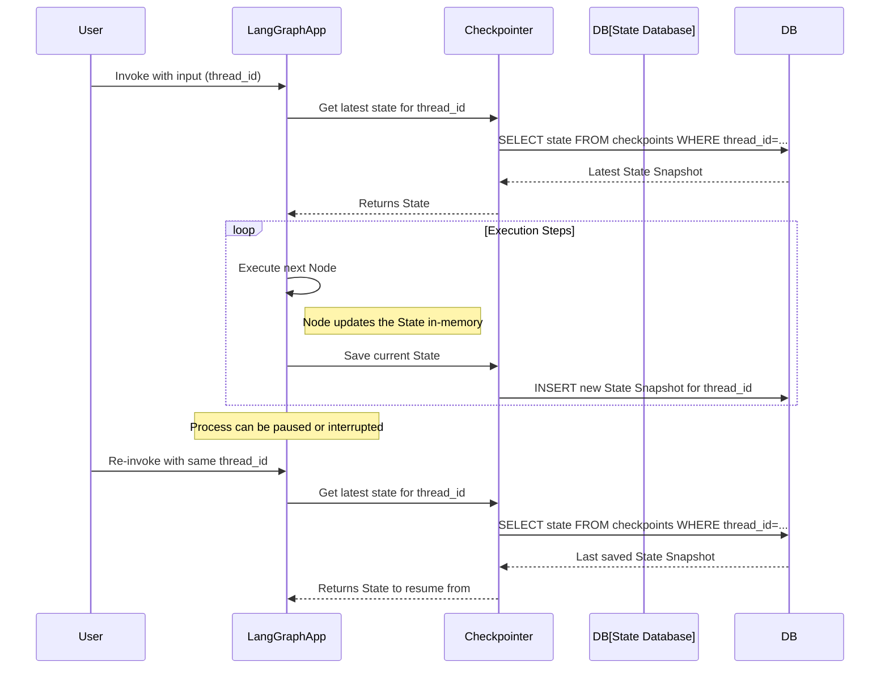

### Core Concepts: State, Nodes, and Edges

```mermaid
graph TB
    direction TB
    subgraph "LangGraph: Core Concepts"
        Start([Start]) --> State{State};

        State -- "1.State is passed to a node" --> Node1["Node 1: Function/Runnable"];
        Node1 -- "2.Node returns updates" --> State;

        State -- "3.A normal edge directs flow unconditionally" --> Node2["Node 2: Function/Runnable"];
        Node2 -- "4.Node returns updates" --> State;

        State -- "5.State is evaluated" --> Condition{Conditional Logic};
        Condition -- "Path A is chosen" --> Node3["Node 3"];
        Condition -- "Path B is chosen" --> Node4["Node 4"];

        Node3 -- "6.Node returns updates" --> State;
        Node4 -- "7.Node returns updates" --> State;

        State --> End([End]);
    end

    %% Styling
    style State fill:#f9f,stroke:#333,stroke-width:2px
    style Condition fill:#bbf,stroke:#333,stroke-width:2px
```

### Simple ReAct Agent Flow

```mermaid
graph TB
    direction TB
    subgraph "Simple ReAct Agent"
        Start([Start]) --> State{State: messages};
        State --> Agent["Agent Node: LLM reasons, decides next step"];

        Agent -- "Appends its response to State" --> Condition{"Check Agent's Decision"};

        Condition -- "Decision: Use a Tool" --> Tool["Tool Node: Executes the tool call"];
        Condition -- "Decision: Finish" --> End([End: Final Answer]);

        Tool -- "Appends tool output to State" --> Agent;
    end

    %% Styling
    style State fill:#f9f,stroke:#333,stroke-width:2px
    style Condition fill:#bbf,stroke:#333,stroke-width:2px
```

### Multi-Agent System with a Supervisor

```mermaid
graph TB
    direction TB
    subgraph "Multi-Agent Supervisor (Refined Flow)"
        Start([Start]) --> SharedState{Shared State: Task, History};

        SharedState -- "1.Supervisor is invoked with the current state" --> Supervisor{Supervisor: Inspects State, Routes Task};

        Supervisor -- "2a. Route to Search" --> SearchAgent["Search Agent"];
        Supervisor -- "2b. Route to Chart" --> ChartingAgent["Charting Agent"];
        Supervisor -- "2c. Finish" --> End([End]);

        SearchAgent -- "3a. Updates State & returns control" --> Supervisor;
        ChartingAgent -- "3b. Updates State & returns control" --> Supervisor;
    end

    %% Styling
    style SharedState fill:#f9f,stroke:#333,stroke-width:2px
    style Supervisor fill:#bbf,stroke:#333,stroke-width:2px
```

### State Management with a Checkpointer

```mermaid
sequenceDiagram
    participant User
    participant LangGraphApp
    participant Checkpointer
    participant DB[State Database]

    User->>LangGraphApp: Invoke with input (thread_id)
    LangGraphApp->>Checkpointer: Get latest state for thread_id
    Checkpointer->>DB: SELECT state FROM checkpoints WHERE thread_id=...
    DB-->>Checkpointer: Latest State Snapshot
    Checkpointer-->>LangGraphApp: Returns State

    loop Execution Steps
        LangGraphApp->>LangGraphApp: Execute next Node
        Note right of LangGraphApp: Node updates the State in-memory
        LangGraphApp->>Checkpointer: Save current State
        Checkpointer->>DB: INSERT new State Snapshot for thread_id
    end

    Note over LangGraphApp: Process can be paused or interrupted

    User->>LangGraphApp: Re-invoke with same thread_id
    LangGraphApp->>Checkpointer: Get latest state for thread_id
    Checkpointer->>DB: SELECT state FROM checkpoints WHERE thread_id=...
    DB-->>Checkpointer: Last saved State Snapshot
    Checkpointer-->>LangGraphApp: Returns State to resume from
```
