### Multi-Agent Research System

### Multi-Agent System Process Diagram

### The Power vs. Cost Trade-off

```mermaid
%%{init: {'theme': 'dark'}}%%
graph TB
    subgraph "The Power vs. Cost Trade-off"
        direction TB

        subgraph "Performance on Complex Queries"
            direction TB
            
            subgraph " "
                direction LR
                SingleAgent["Single-Agent System"]
                MultiAgent["Multi-Agent System"]
            end
            
            subgraph " "
                direction LR
                Result1((X))
                Result2((✓))
            end

            SingleAgent -- "Fails to find answer" --> Result1;
            MultiAgent -- "<b>+90.2% performance</b>" --> Result2;
        end

        subgraph "Relative Token Cost"
            direction LR
            A["Standard Chat<br/>(Baseline: 1x)"]
            B["Single-Agent System<br/>(Approx. 4x)"]
            C["Multi-Agent System<br/>(Approx. 15x)"]
            
            style A height:50px,fill:#87CEEB, color:#000
            style B height:80px,fill:#FFA500, color:#000
            style C height:120px,fill:#FF6347, color:#000
        end
    end

    %% Styling for nodes and links
    style SingleAgent fill:#f9f,stroke:#999,stroke-width:1px, color:#000
    style MultiAgent fill:#9f9,stroke:#999,stroke-width:1px, color:#000
    linkStyle 0 stroke:red,stroke-width:2px
    linkStyle 1 stroke:green,stroke-width:2px
```

### The AI Agent Evaluation Pyramid

### Orchestrator Agent's Prompting Heuristics

Source: [How we built our multi-agent research system](https://www.anthropic.com/engineering/multi-agent-research-system)
