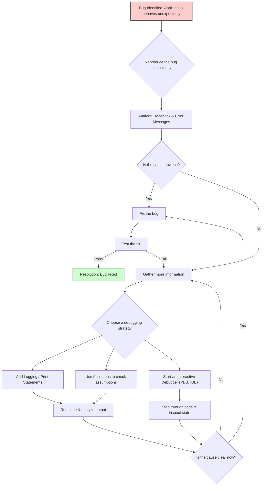
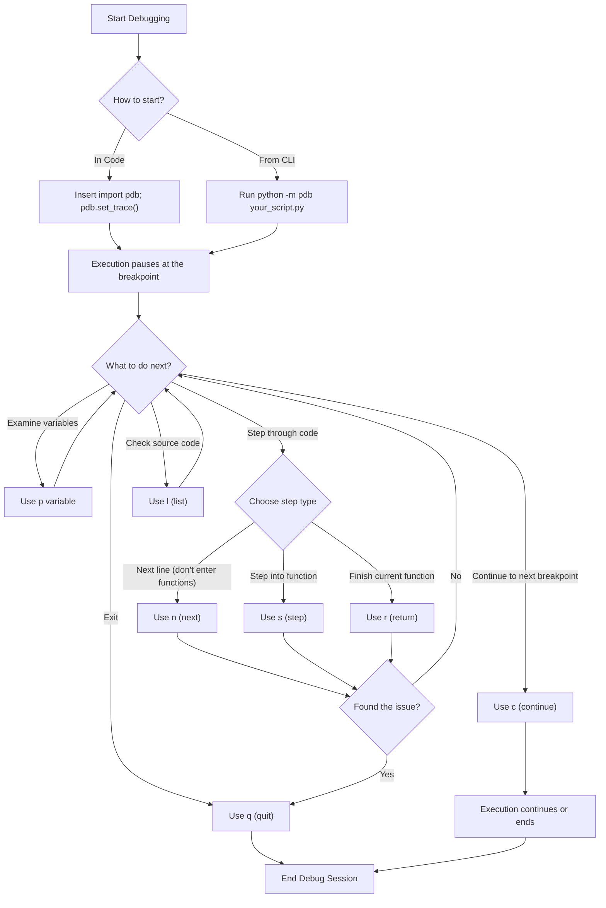
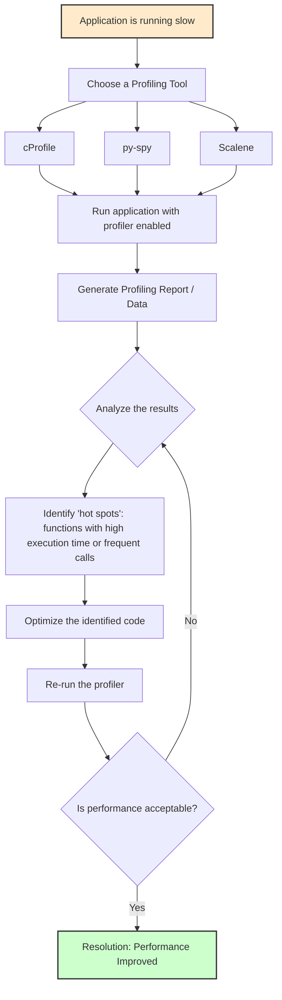
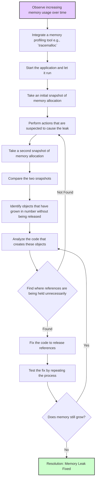

### General Python Debugging Workflow

```mermaid
graph TD
    %% Define Nodes with descriptive IDs
    bugIdentified["Bug Identified: Application behaves unexpectedly"]
    reproduceBug{"Reproduce the bug consistently"}
    analyzeTraceback["Analyze Traceback & Error Messages"]
    isObvious{"Is the cause obvious?"}
    fixBug["Fix the bug"]
    testFix["Test the fix"]
    resolution["Resolution: Bug Fixed"]
    gatherInfo["Gather more information"]
    chooseStrategy{"Choose a debugging strategy"}
    addLogging["Add Logging / Print Statements"]
    useAssertions["Use Assertions to check assumptions"]
    startDebugger["Start an Interactive Debugger (PDB, IDE)"]
    analyzeOutput["Run code & analyze output"]
    stepThroughCode["Step through code & inspect state"]
    isClear{"Is the cause clear now?"}

    %% Define Connections
    bugIdentified --> reproduceBug
    reproduceBug --> analyzeTraceback
    analyzeTraceback --> isObvious

    isObvious -- Yes --> fixBug
    isObvious -- No --> gatherInfo

    fixBug --> testFix
    testFix -- Pass --> resolution
    testFix -- Fail --> gatherInfo

    gatherInfo --> chooseStrategy
    
    chooseStrategy --> addLogging
    chooseStrategy --> useAssertions
    chooseStrategy --> startDebugger

    addLogging --> analyzeOutput
    useAssertions --> analyzeOutput
    startDebugger --> stepThroughCode

    analyzeOutput --> isClear
    stepThroughCode --> isClear

    isClear -- Yes --> fixBug
    isClear -- No --> gatherInfo

    %% Apply Styling
    style bugIdentified fill:#ffcccc,stroke:#333,stroke-width:2px
    style resolution fill:#ccffcc,stroke:#333,stroke-width:2px
```

### Interactive Debugging Session with PDB

```mermaid
graph TD
    A[Start Debugging] --> B{How to start?};
    B -- In Code --> C["Insert import pdb; pdb.set_trace()"];
    B -- From CLI --> D["Run python -m pdb your_script.py"];
    C --> E[Execution pauses at the breakpoint];
    D --> E;
    E --> F{"What to do next?"};
    F -- "Examine variables" --> G["Use p variable"];
    F -- "Step through code" --> H{Choose step type};
    F -- "Check source code" --> I["Use l (list)"];
    F -- "Continue to next breakpoint" --> J["Use c (continue)"];
    F -- "Exit" --> K["Use q (quit)"];
    G --> F;
    I --> F;
    H -- "Next line (don't enter functions)" --> L["Use n (next)"];
    H -- "Step into function" --> M["Use s (step)"];
    H -- "Finish current function" --> N["Use r (return)"];
    L --> O{Found the issue?};
    M --> O;
    N --> O;
    O -- No --> F;
    O -- Yes --> K;
    J --> P[Execution continues or ends];
    K --> Q[End Debug Session];
    P --> Q;
```

### Performance Issue Debugging (Profiling)

```mermaid
graph TD
    A[Application is running slow] --> B[Choose a Profiling Tool];
    B --> B1[cProfile];
    B --> B2[py-spy];
    B --> B3[Scalene];
    B1 --> C[Run application with profiler enabled];
    B2 --> C;
    B3 --> C;
    C --> D[Generate Profiling Report / Data];
    D --> E{Analyze the results};
    E --> F[Identify 'hot spots': functions with high execution time or frequent calls];
    F --> G[Optimize the identified code];
    G --> H[Re-run the profiler];
    H --> I{Is performance acceptable?};
    I -- Yes --> J[Resolution: Performance Improved];
    I -- No --> E;

    style A fill:#ffebcc,stroke:#333,stroke-width:2px
    style J fill:#ccffcc,stroke:#333,stroke-width:2px
```

### Memory Leak Debugging Process

```mermaid
graph TD
    A[Observe increasing memory usage over time] --> B[Integrate a memory profiling tool e.g., `tracemalloc`];
    B --> C[Start the application and let it run];
    C --> D[Take an initial snapshot of memory allocation];
    D --> E[Perform actions that are suspected to cause the leak];
    E --> F[Take a second snapshot of memory allocation];
    F --> G[Compare the two snapshots];
    G --> H[Identify objects that have grown in number without being released];
    H --> I[Analyze the code that creates these objects];
    I --> J{Find where references are being held unnecessarily};
    J -- Found --> K[Fix the code to release references];
    J -- Not Found --> E;
    K --> L[Test the fix by repeating the process];
    L --> M{Does memory still grow?};
    M -- No --> N[Resolution: Memory Leak Fixed];
    M -- Yes --> I;

    style A fill:#e6ccff,stroke:#333,stroke-width:2px
    style N fill:#ccffcc,stroke:#333,stroke-width:2px
```
