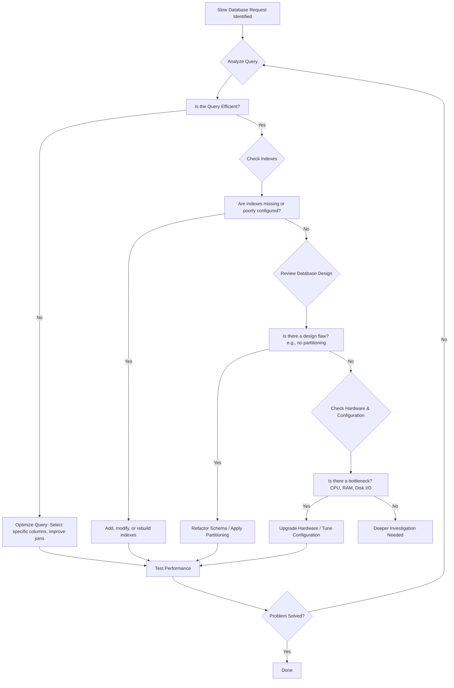
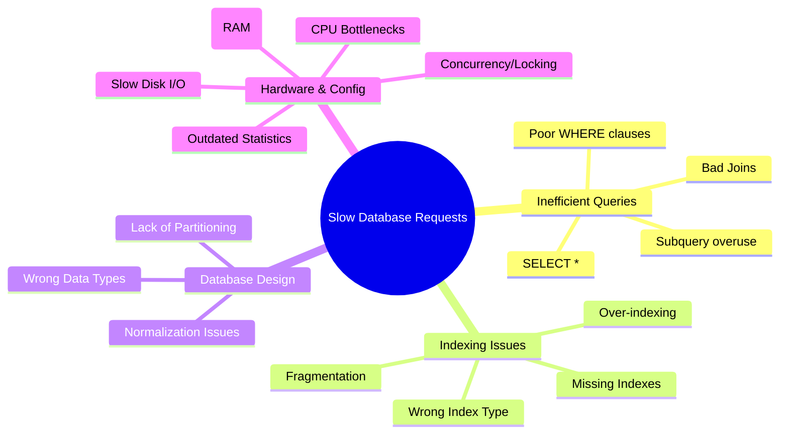

### Troubleshooting Slow Database Requests

```mermaid
graph TD
    A[Slow Database Request Identified] --> B{Analyze Query};
    B --> C[Is the Query Efficient?];
    C -- No --> D[Optimize Query: Select specific columns, improve joins];
    D --> G[Test Performance];
    C -- Yes --> E{Check Indexes};
    E --> F[Are indexes missing or poorly configured?];
    F -- Yes --> H[Add, modify, or rebuild indexes];
    H --> G;
    F -- No --> I{Review Database Design};
    I --> J[Is there a design flaw? e.g., no partitioning];
    J -- Yes --> K[Refactor Schema / Apply Partitioning];
    K --> G;
    J -- No --> L{"Check Hardware & Configuration"};
    L --> M[Is there a bottleneck? CPU, RAM, Disk I/O];
    M -- Yes --> N[Upgrade Hardware / Tune Configuration];
    N --> G;
    M -- No --> O[Deeper Investigation Needed];
    G --> P{Problem Solved?};
    P -- Yes --> Q[Done];
    P -- No --> B;
```

### Reasons for Slow Database Requests

```mermaid
mindmap
  root((Slow Database Requests))
    ::icon(fa fa-database)
    Inefficient Queries
      SELECT *
      Poor WHERE clauses
      Bad Joins
      Subquery overuse
    Indexing Issues
      Missing Indexes
      Over-indexing
      Wrong Index Type
      Fragmentation
    Database Design
      Wrong Data Types
      Normalization Issues
      Lack of Partitioning
    Hardware & Config
      Low Memory (RAM)
      Slow Disk I/O
      CPU Bottlenecks
      Outdated Statistics
      Concurrency/Locking
```
