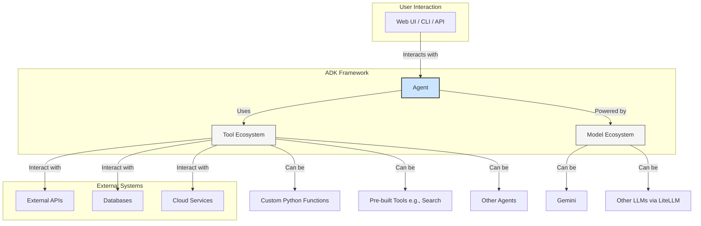
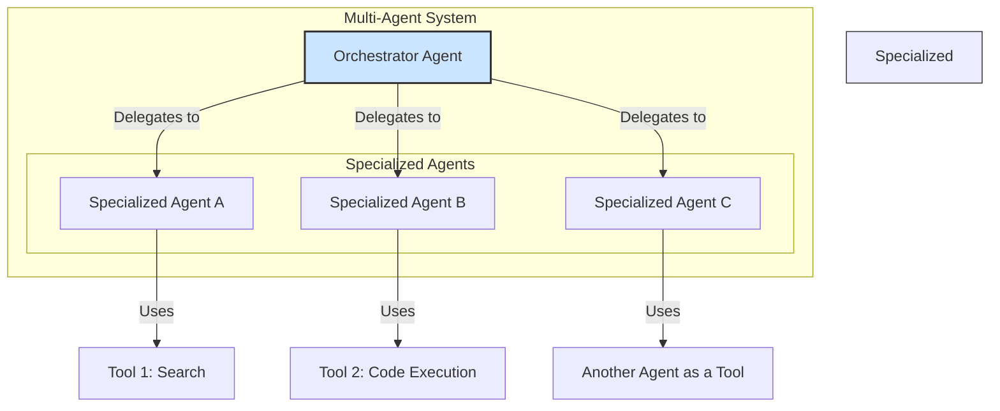
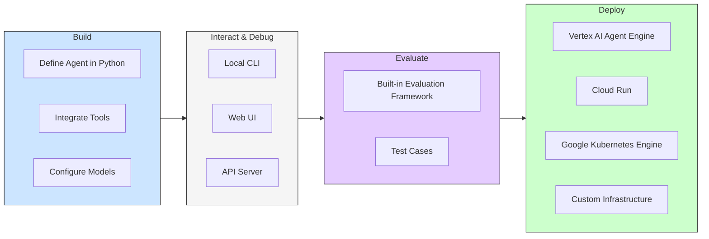
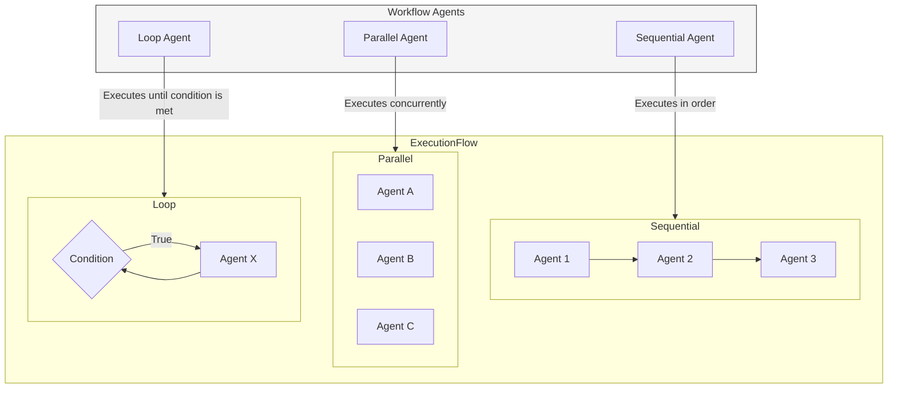

### High-Level ADK Architecture

```mermaid
graph TD
    subgraph User Interaction
        UI[Web UI / CLI / API]
    end

    subgraph ADK Framework
        Agent[Agent]
        Agent -- Uses --> Tools[Tool Ecosystem]
        Agent -- Powered by --> Models[Model Ecosystem]
    end

    subgraph External Systems
        APIs[External APIs]
        Databases[Databases]
        Services[Cloud Services]
    end

    UI -- Interacts with --> Agent
    Tools -- Can be --> CustomFunctions[Custom Python Functions]
    Tools -- Can be --> PreBuiltTools[Pre-built Tools e.g., Search]
    Tools -- Can be --> OtherAgents[Other Agents]
    Tools -- Interact with --> APIs
    Tools -- Interact with --> Databases
    Tools -- Interact with --> Services
    Models -- Can be --> Gemini[Gemini]
    Models -- Can be --> OtherLLMs[Other LLMs via LiteLLM]

    style Agent fill:#cce5ff,stroke:#333,stroke-width:2px
    style Tools fill:#f5f5f5,stroke:#333,stroke-width:1px
    style Models fill:#f5f5f5,stroke:#333,stroke-width:1px
```

### Multi-Agent System in ADK

```mermaid
graph TD
    subgraph Multi-Agent System
        OrchestratorAgent[Orchestrator Agent]
        subgraph Specialized Agents
            AgentA[Specialized Agent A]
            AgentB[Specialized Agent B]
            AgentC[Specialized Agent C]
        end
    end

    OrchestratorAgent -- Delegates to --> AgentA
    OrchestratorAgent -- Delegates to --> AgentB
    OrchestratorAgent -- Delegates to --> AgentC

    AgentA -- Uses --> Tool1[Tool 1: Search]
    AgentB -- Uses --> Tool2[Tool 2: Code Execution]
    AgentC -- Uses --> SubAgent[Another Agent as a Tool]

    style OrchestratorAgent fill:#cce5ff,stroke:#333,stroke-width:2px
    style Specialized Agents fill:#f5f5f5,stroke:#333,stroke-width:1px
```

### Agent Development Lifecycle

```mermaid
graph LR
    subgraph Build
        direction LR

        A[Define Agent in Python]
        B[Integrate Tools]
        C[Configure Models]
    end

    subgraph I_D [Interact & Debug]
        direction LR
        
        D[Local CLI]
        E[Web UI]
        F[API Server]
    end

    subgraph Evaluate
        direction LR
        
        G[Built-in Evaluation Framework]
        H[Test Cases]
    end

    subgraph Deploy
        direction LR
        
        I[Vertex AI Agent Engine]
        J[Cloud Run]
        K[Google Kubernetes Engine]
        L[Custom Infrastructure]
    end

    Build --> I_D
    I_D --> Evaluate
    Evaluate --> Deploy

    style Build fill:#cce5ff,stroke:#333,stroke-width:1px
    style I_D fill:#f5f5f5,stroke:#333,stroke-width:1px
    style Evaluate fill:#e5ccff,stroke:#333,stroke-width:1px
    style Deploy fill:#ccffcc,stroke:#333,stroke-width:1px
```

### Workflow Agents for Orchestration

```mermaid
graph TD
    subgraph WA [Workflow Agents]
        SequentialAgent[Sequential Agent]
        ParallelAgent[Parallel Agent]
        LoopAgent[Loop Agent]
    end

    subgraph ExecutionFlow
        direction LR
        subgraph Sequential
            S1[Agent 1] --> S2[Agent 2] --> S3[Agent 3]
        end
        subgraph Parallel
            P1[Agent A]
            P2[Agent B]
            P3[Agent C]
        end
        subgraph Loop
            L1{Condition}
            L2[Agent X]
            L1 -- True --> L2 --> L1
        end
    end

    SequentialAgent -- Executes in order --> Sequential
    ParallelAgent -- Executes concurrently --> Parallel
    LoopAgent -- Executes until condition is met --> Loop

    style WA fill:#f5f5f5,stroke:#333,stroke-width:1px
```
