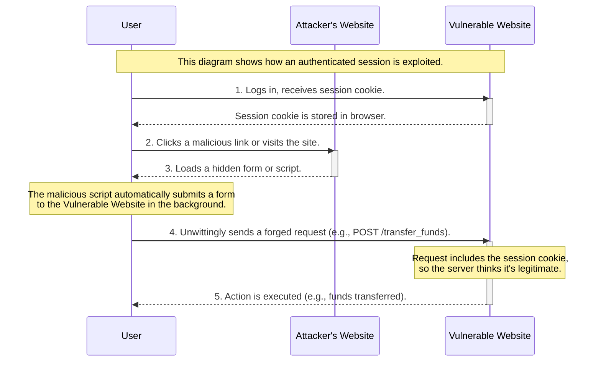
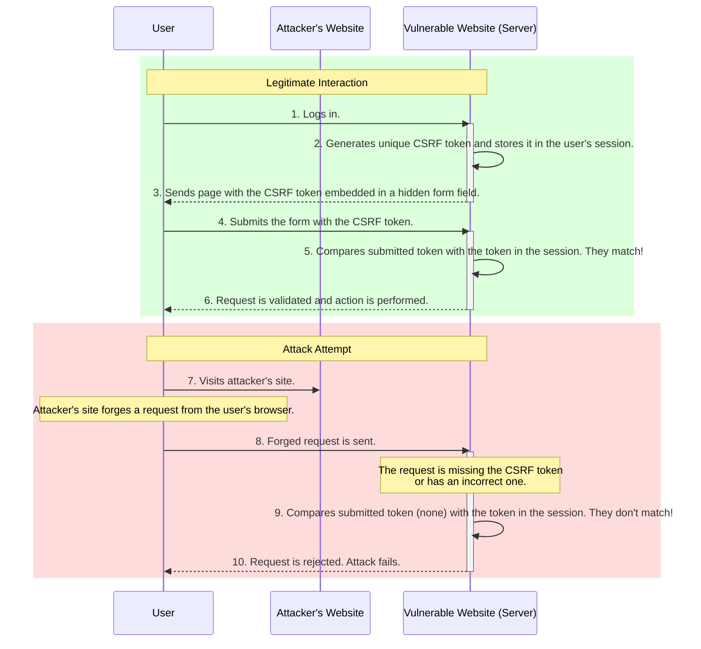
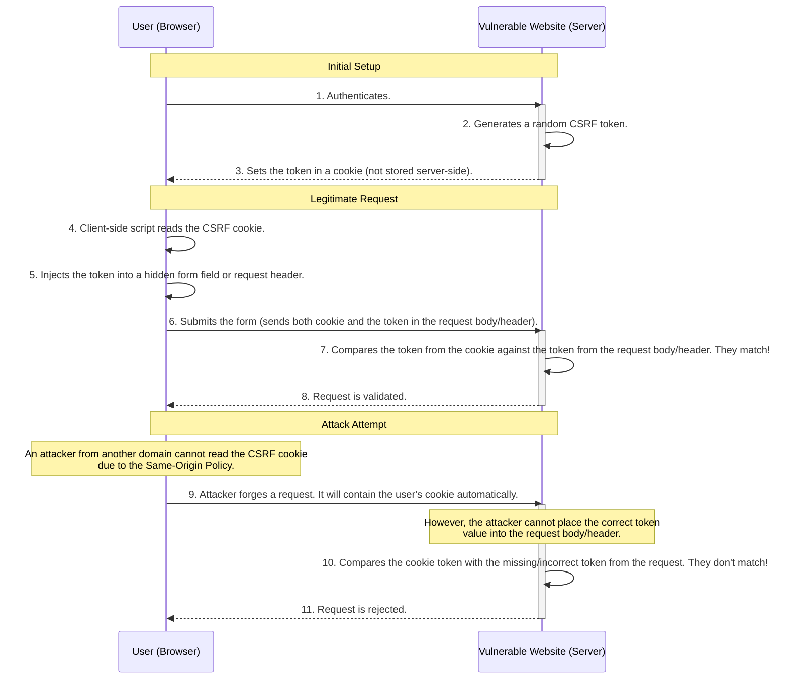
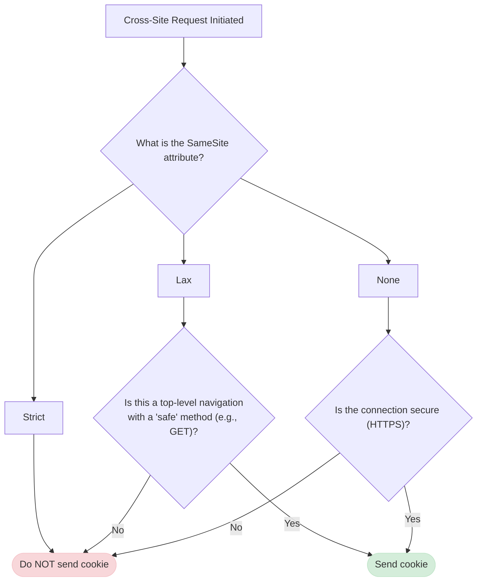

### The Anatomy of a CSRF Attack

```mermaid
sequenceDiagram
    participant User
    participant Attacker's Website
    participant Vulnerable Website

    Note over User, Vulnerable Website: This diagram shows how an authenticated session is exploited.

    User->>Vulnerable Website: 1. Logs in, receives session cookie.
    activate Vulnerable Website
    Vulnerable Website-->>User: Session cookie is stored in browser.
    deactivate Vulnerable Website

    User->>Attacker's Website: 2. Clicks a malicious link or visits the site.
    activate Attacker's Website
    Attacker's Website-->>User: 3. Loads a hidden form or script.
    deactivate Attacker's Website

    Note over User: The malicious script automatically submits a form<br/>to the Vulnerable Website in the background.
    User->>Vulnerable Website: 4. Unwittingly sends a forged request (e.g., POST /transfer_funds).
    activate Vulnerable Website
    Note over Vulnerable Website: Request includes the session cookie,<br/>so the server thinks it's legitimate.
    Vulnerable Website-->>User: 5. Action is executed (e.g., funds transferred).
    deactivate Vulnerable Website
```

### The Synchronizer Token Pattern (Anti-CSRF Tokens)

```mermaid
sequenceDiagram
    participant User
    participant Attacker's Website
    participant Vulnerable Website (Server)

    rect rgb(220, 255, 220)
        Note over User, Vulnerable Website (Server): Legitimate Interaction
        User->>Vulnerable Website (Server): 1. Logs in.
        activate Vulnerable Website (Server)
        Vulnerable Website (Server)->>Vulnerable Website (Server): 2. Generates unique CSRF token and stores it in the user's session.
        Vulnerable Website (Server)-->>User: 3. Sends page with the CSRF token embedded in a hidden form field.
        deactivate Vulnerable Website (Server)

        User->>Vulnerable Website (Server): 4. Submits the form with the CSRF token.
        activate Vulnerable Website (Server)
        Vulnerable Website (Server)->>Vulnerable Website (Server): 5. Compares submitted token with the token in the session. They match!
        Vulnerable Website (Server)-->>User: 6. Request is validated and action is performed.
        deactivate Vulnerable Website (Server)
    end

    rect rgb(255, 220, 220)
        Note over User, Vulnerable Website (Server): Attack Attempt
        User->>Attacker's Website: 7. Visits attacker's site.
        
        Note over User: Attacker's site forges a request from the user's browser.
        User->>Vulnerable Website (Server): 8. Forged request is sent.
        activate Vulnerable Website (Server)
        
        Note over Vulnerable Website (Server): The request is missing the CSRF token<br/>or has an incorrect one.
        Vulnerable Website (Server)->>Vulnerable Website (Server): 9. Compares submitted token (none) with the token in the session. They don't match!
        Vulnerable Website (Server)-->>User: 10. Request is rejected. Attack fails.
        deactivate Vulnerable Website (Server)
    end
```

### The Double Submit Cookie Pattern

```mermaid
sequenceDiagram
    participant User (Browser)
    participant Vulnerable Website (Server)

    Note over User (Browser), Vulnerable Website (Server): Initial Setup
    User (Browser)->>Vulnerable Website (Server): 1. Authenticates.
    activate Vulnerable Website (Server)
    Vulnerable Website (Server)->>Vulnerable Website (Server): 2. Generates a random CSRF token.
    Vulnerable Website (Server)-->>User (Browser): 3. Sets the token in a cookie (not stored server-side).
    deactivate Vulnerable Website (Server)

    Note over User (Browser), Vulnerable Website (Server): Legitimate Request
    User (Browser)->>User (Browser): 4. Client-side script reads the CSRF cookie.
    User (Browser)->>User (Browser): 5. Injects the token into a hidden form field or request header.
    User (Browser)->>Vulnerable Website (Server): 6. Submits the form (sends both cookie and the token in the request body/header).
    activate Vulnerable Website (Server)
    Vulnerable Website (Server)->>Vulnerable Website (Server): 7. Compares the token from the cookie against the token from the request body/header. They match!
    Vulnerable Website (Server)-->>User (Browser): 8. Request is validated.
    deactivate Vulnerable Website (Server)

    Note over User (Browser), Vulnerable Website (Server): Attack Attempt
    Note over User (Browser): An attacker from another domain cannot read the CSRF cookie<br/>due to the Same-Origin Policy.
    User (Browser)->>Vulnerable Website (Server): 9. Attacker forges a request. It will contain the user's cookie automatically.
    activate Vulnerable Website (Server)
    Note over Vulnerable Website (Server): However, the attacker cannot place the correct token<br/>value into the request body/header.
    Vulnerable Website (Server)->>Vulnerable Website (Server): 10. Compares the cookie token with the missing/incorrect token from the request. They don't match!
    Vulnerable Website (Server)-->>User (Browser): 11. Request is rejected.
    deactivate Vulnerable Website (Server)
```

### SameSite Cookie Attribute Flow

```mermaid
graph TD
    A[Cross-Site Request Initiated] --> B{What is the SameSite attribute?};
    B --> C[Strict];
    B --> D[Lax];
    B --> E[None];

    %% CORRECTED LOGIC FOR STRICT
    C --> H([Do NOT send cookie]);

    D --> K{"Is this a top-level navigation<br/>with a 'safe' method (e.g., GET)?"};
    K -- Yes --> J([Send cookie]);
    K -- No --> H;

    E --> N{"Is the connection secure (HTTPS)?"};
    N -- Yes --> J;
    N -- No --> H;

    style J fill:#d4edda,stroke:#c3e6cb
    style H fill:#f8d7da,stroke:#f5c6cb
```
