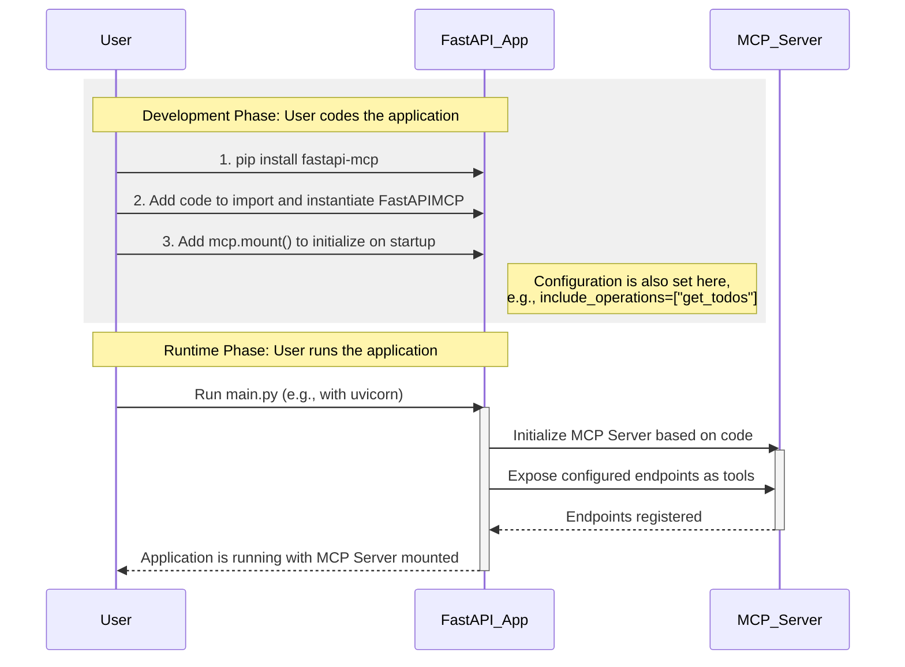

### Integrating MCP with FastAPI

```mermaid
sequenceDiagram
    participant User
    participant FastAPI_App
    participant MCP_Server

    rect rgb(240, 240, 240)
        note over User, FastAPI_App: Development Phase: User codes the application
        User->>FastAPI_App: 1. pip install fastapi-mcp
        User->>FastAPI_App: 2. Add code to import and instantiate FastAPIMCP
        User->>FastAPI_App: 3. Add mcp.mount() to initialize on startup
        Note right of FastAPI_App: Configuration is also set here,<br>e.g., include_operations=["get_todos"]
    end

    note over User, FastAPI_App: Runtime Phase: User runs the application
    User->>FastAPI_App: Run main.py (e.g., with uvicorn)

    activate FastAPI_App
    FastAPI_App->>MCP_Server: Initialize MCP Server based on code
    activate MCP_Server
    FastAPI_App->>MCP_Server: Expose configured endpoints as tools
    MCP_Server-->>FastAPI_App: Endpoints registered
    deactivate MCP_Server
    FastAPI_App-->>User: Application is running with MCP Server mounted
    deactivate FastAPI_App
```
