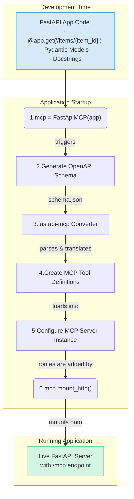

### Runtime Request Lifecycle

```mermaid
sequenceDiagram
    participant AI Agent (MCP Client)
    participant FastAPIMCP Server (at /mcp)
    participant FastAPI App (Internal Router)
    participant API Endpoint Logic (@app.get)

    AI Agent->>+FastAPIMCP Server (at /mcp): 1. Request: `tools/call` (name: "get_item", args: {"item_id": 1})

    Note over FastAPIMCP Server (at /mcp): Looks up "get_item" in its internal operation map. <br/> Finds it maps to GET /items/{item_id}.

    FastAPIMCP Server (at /mcp)->>+FastAPI App (Internal Router): 2. Programmatic ASGI Request (NOT a network call) <br/> Simulates `GET /items/1`

    FastAPI App (Internal Router)->>+API Endpoint Logic (@app.get): 3. Routes the request internally to the correct function.

    API Endpoint Logic (@app.get)-->>-FastAPI App (Internal Router): 4. Executes logic and returns data (e.g., a Pydantic model).

    FastAPI App (Internal Router)-->>-FastAPIMCP Server (at /mcp): 5. Internal response is sent back.

    Note over FastAPIMCP Server (at /mcp): Formats the API response into the <br/> required MCP `CallToolResult` structure.

    FastAPIMCP Server (at /mcp)-->>-AI Agent (MCP Client): 6. Result: `CallToolResult` with the item data.
```

### Application Startup and Tool Generation



Source: [https://github.com/tadata-org/fastapi_mcp](https://github.com/tadata-org/fastapi_mcp)
