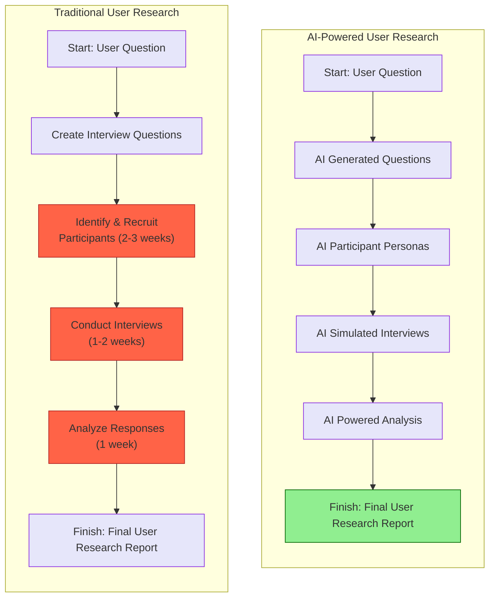
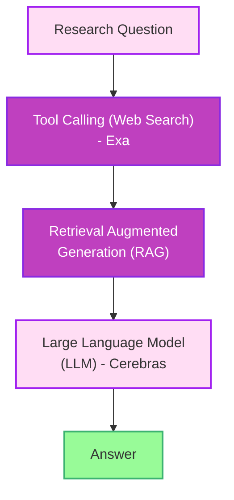
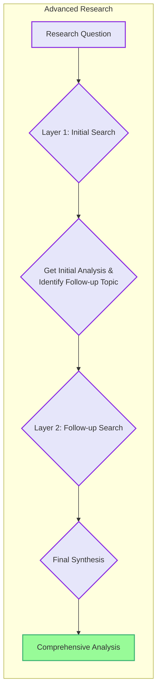
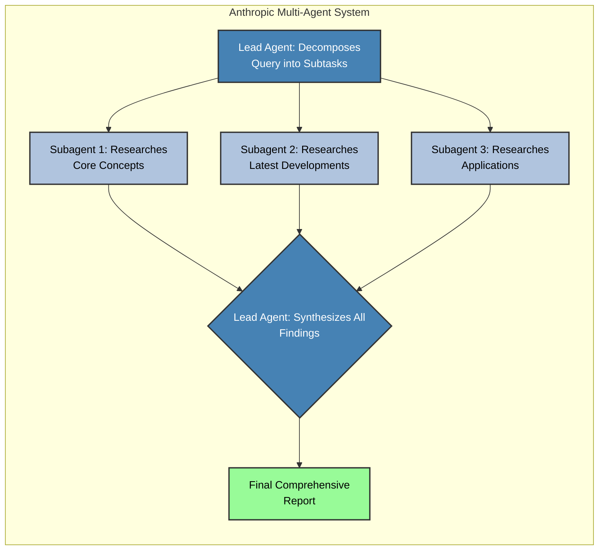

### Traditional vs. AI-Powered User Research Process

### AI-Powered Deep Research Workflow

### Advanced Multi-Layer Research Process

### Anthropic Multi-Agent System

Source: [How to Build Advanced AI Agents](https://www.youtube.com/watch?v=B0TJC4lmzEM)
