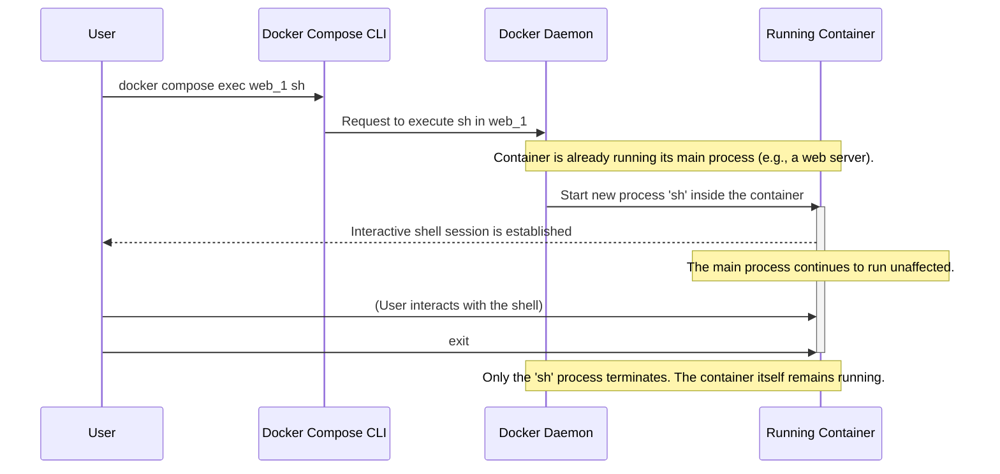
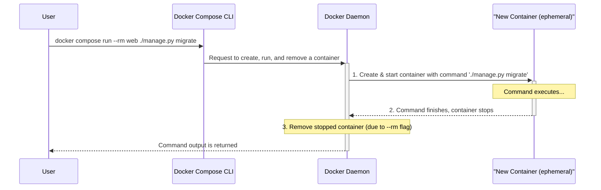

### docker compose exec

```mermaid
sequenceDiagram
    participant User
    participant Docker Compose CLI
    participant Docker Daemon
    participant Running Container

    User->>Docker Compose CLI: docker compose exec web_1 sh
    Docker Compose CLI->>Docker Daemon: Request to execute sh in web_1
    Note over Docker Daemon, Running Container: Container is already running its main process (e.g., a web server).
    Docker Daemon->>Running Container: Start new process 'sh' inside the container
    activate Running Container
    Running Container-->>User: Interactive shell session is established
    Note over Running Container: The main process continues to run unaffected.
    User->>Running Container: (User interacts with the shell)
    User->>Running Container: exit
    deactivate Running Container
    Note over Docker Daemon, Running Container: Only the 'sh' process terminates. The container itself remains running.
```

### docker compose run

```mermaid
sequenceDiagram
    participant User
    participant Docker Compose CLI
    participant Docker Daemon
    participant "New Container (ephemeral)"

    User->>Docker Compose CLI: docker compose run --rm web ./manage.py migrate

    # The Daemon becomes active to handle the entire run/remove lifecycle
    Docker Compose CLI->>+Docker Daemon: Request to create, run, and remove a container
    
    # The Daemon creates a new container, which becomes active for the command's duration
    Docker Daemon->>+"New Container (ephemeral)": 1. Create & start container with command './manage.py migrate'
    
    Note over "New Container (ephemeral)": Command executes...
    
    # The container finishes its task, signals completion, and is no longer active
    "New Container (ephemeral)"-->>-Docker Daemon: 2. Command finishes, container stops
    
    Note over Docker Daemon: 3. Remove stopped container (due to --rm flag)
    
    # The Daemon's work is complete; it returns output and becomes inactive
    Docker Daemon-->>User: Command output is returned
    deactivate Docker Daemon
```
