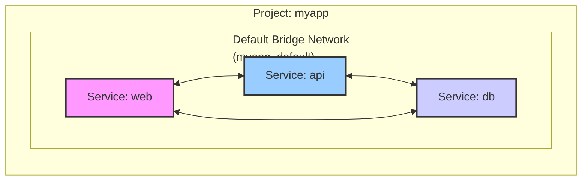
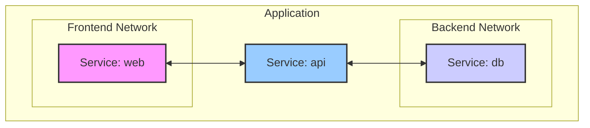
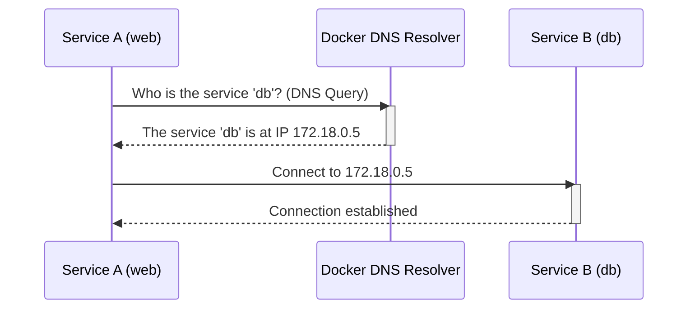
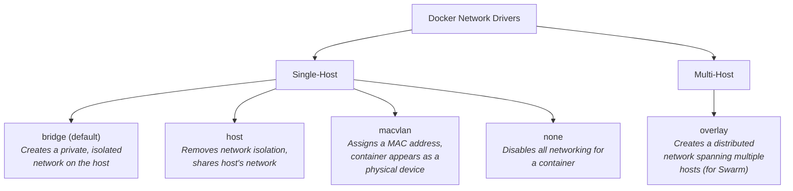

### Docker Compose Default Network

```mermaid
graph LR
    subgraph "Project: myapp"
        subgraph "Default Bridge Network<br>(myapp_default)"
            web[Service: web]
            api[Service: api]
            db[Service: db]
        end
    end

    web <--> api
    api <--> db
    web <--> db

    style web fill:#f9f,stroke:#333,stroke-width:2px
    style api fill:#9cf,stroke:#333,stroke-width:2px
    style db fill:#ccf,stroke:#333,stroke-width:2px
```

### Custom Networks for Segmentation

```mermaid
graph TD
    subgraph "Application"
        subgraph "Frontend Network"
            web[Service: web]
        end

        subgraph "Backend Network"
            db[Service: db]
        end

        %% Define the shared API service outside the network subgraphs
        api[Service: api]

        %% Define the connections
        web <--> api
        api <--> db
    end

    %% Apply styles to match the original image
    style web fill:#f9f,stroke:#333,stroke-width:2px
    style db fill:#ccf,stroke:#333,stroke-width:2px
    style api fill:#9cf,stroke:#333,stroke-width:2px
```

### Service Discovery via Docker's DNS

```mermaid
sequenceDiagram
    participant web as Service A (web)
    participant dns as Docker DNS Resolver
    participant db as Service B (db)

    web->>dns: Who is the service 'db'? (DNS Query)
    activate dns
    %% Changed to a dashed arrow for a reply message
    dns-->>web: The service 'db' is at IP 172.18.0.5
    deactivate dns

    web->>db: Connect to 172.18.0.5
    activate db
    db-->>web: Connection established
    deactivate db
```

### Overview of Docker Network Drivers

```mermaid
graph TD
    A[Docker Network Drivers] --> B[Single-Host];
    A --> C[Multi-Host];

    B --> B1["bridge (default)<br><i>Creates a private, isolated<br>network on the host</i>"];
    B --> B2["host<br><i>Removes network isolation,<br>shares host's network</i>"];
    B --> B3["macvlan<br><i>Assigns a MAC address,<br>container appears as a<br>physical device</i>"];
    B --> B4["none<br><i>Disables all networking for<br>a container</i>"];

    C --> C1["overlay<br><i>Creates a distributed<br>network spanning multiple<br>hosts (for Swarm)</i>"];
```
