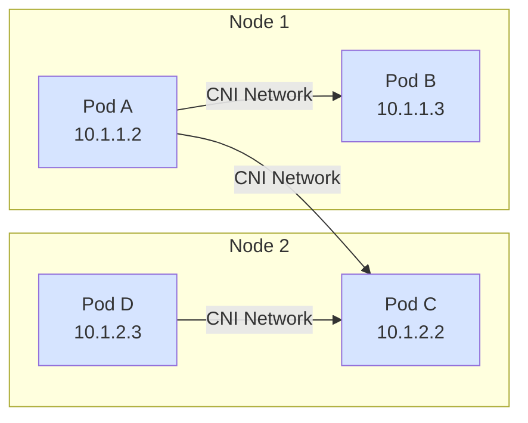
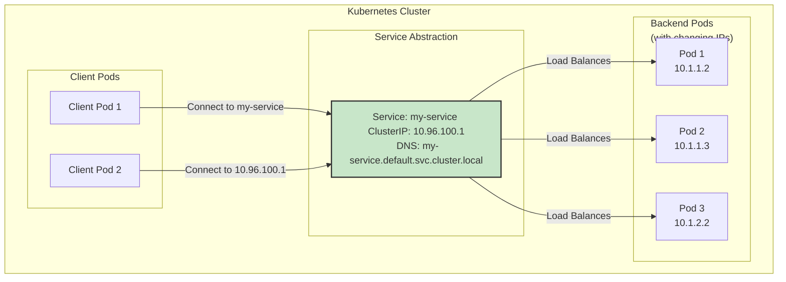
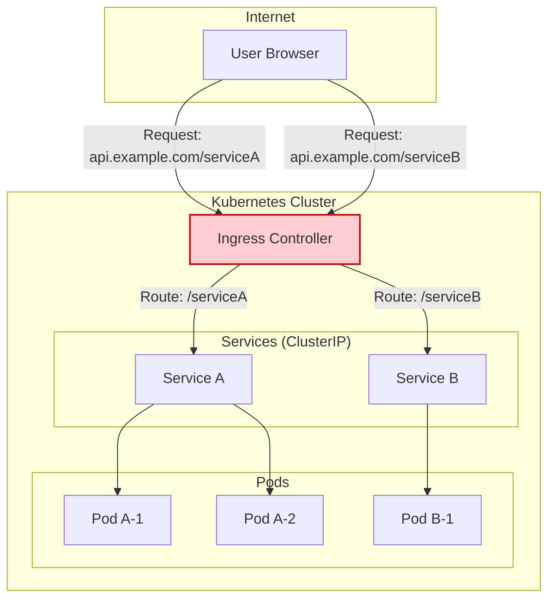

### Pod-to-Pod Communication

```mermaid
graph LR
    subgraph Node 2
        PodD[Pod D <br> 10.1.2.3]
        PodC[Pod C <br> 10.1.2.2]
    end

    subgraph Node 1
        PodA[Pod A <br> 10.1.1.2]
        PodB[Pod B <br> 10.1.1.3]
    end

    PodA -- "CNI Network" --> PodC
    PodA -- "CNI Network" --> PodB
    PodD -- "CNI Network" --> PodC

    style PodA fill:#d6e4ff
    style PodB fill:#d6e4ff
    style PodC fill:#d6e4ff
    style PodD fill:#d6e4ff
```

### Kubernetes Service (ClusterIP)

```mermaid
graph TD
    subgraph "Kubernetes Cluster"
        subgraph "Client Pods"
            ClientA[Client Pod 1]
            ClientB[Client Pod 2]
        end

        subgraph "Service Abstraction"
            MyService[Service: my-service <br> ClusterIP: 10.96.100.1 <br> DNS: my-service.default.svc.cluster.local]
        end

        subgraph "Backend Pods<br>(with changing IPs)"
            Pod1[Pod 1 <br> 10.1.1.2]
            Pod2[Pod 2 <br> 10.1.1.3]
            Pod3[Pod 3 <br> 10.1.2.2]
        end
    end

    ClientA -- "Connect to my-service" --> MyService
    ClientB -- "Connect to 10.96.100.1" --> MyService
    MyService -- "Load Balances" --> Pod1
    MyService -- "Load Balances" --> Pod2
    MyService -- "Load Balances" --> Pod3

    style MyService fill:#c8e6c9,stroke:#333,stroke-width:2px
```

### Kubernetes Ingress

```mermaid
graph TD
    subgraph "Internet"
        User[User Browser]
    end

    subgraph "Kubernetes Cluster"
        Ingress[Ingress Controller]

        subgraph "Services (ClusterIP)"
            ServiceA[Service A]
            ServiceB[Service B]
        end

        subgraph "Pods"
            PodA1[Pod A-1]
            PodA2[Pod A-2]
            PodB1[Pod B-1]
        end
    end

    User -- "Request: api.example.com/serviceA" --> Ingress
    User -- "Request: api.example.com/serviceB" --> Ingress

    Ingress -- "Route: /serviceA" --> ServiceA
    Ingress -- "Route: /serviceB" --> ServiceB

    ServiceA --> PodA1
    ServiceA --> PodA2
    ServiceB --> PodB1

    style Ingress fill:#ffcdd2,stroke:#b71c1c,stroke-width:2px
```
