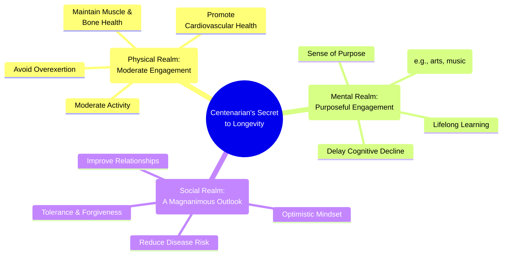
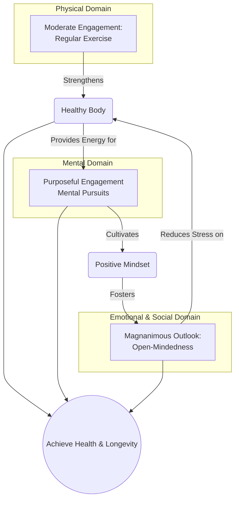
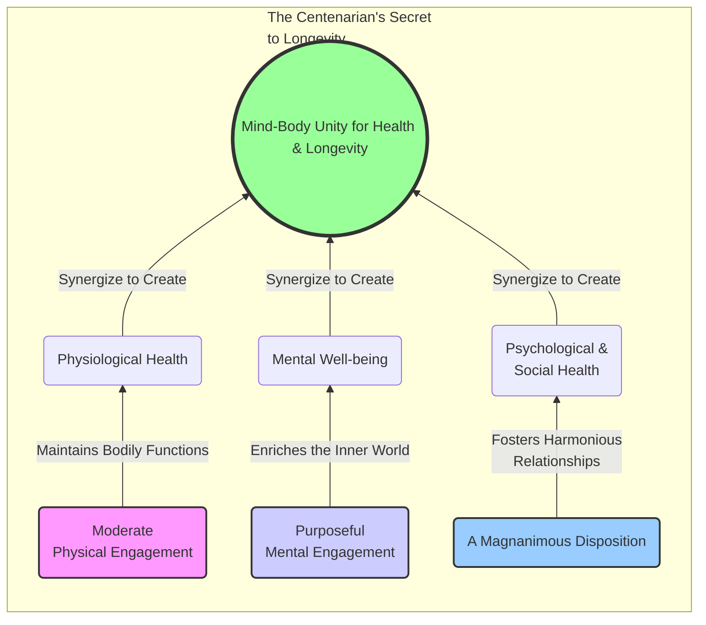

### A Tripartite Framework for Longevity

```mermaid
mindmap
  root((Centenarian's Secret<br>to Longevity))
    (Physical Realm:<br>Moderate Engagement)
      ::icon(fa fa-person-running)
      Moderate Activity
      Maintain Muscle &<br>Bone Health
      Promote<br>Cardiovascular Health
      Avoid Overexertion
    (Mental Realm:<br>Purposeful Engagement)
      ::icon(fa fa-brain)
      Sense of Purpose
      Hobbies (e.g., arts, music)
      Lifelong Learning
      Delay Cognitive Decline
    (Social Realm:<br>A Magnanimous Outlook)
      ::icon(fa fa-handshake)
      Optimistic Mindset
      Tolerance & Forgiveness
      Reduce Disease Risk
      Improve Relationships
```

### A Virtuous Cycle of Holistic Health

```mermaid
graph TD
    A[Moderate Engagement:<br>Regular Exercise] -->|Strengthens| B(Healthy Body);
    B -->|Provides Energy for| C[Purposeful Engagement<br> Mental Pursuits];
    C -->|Cultivates| D(Positive Mindset);
    D -->|Fosters| E[Magnanimous Outlook:<br>Open-Mindedness];
    E -->|Reduces Stress on| B;
    B & C & E --> F((Achieve Health & Longevity));

    subgraph Physical Domain
        A
    end
    subgraph Mental Domain
        C
    end
    subgraph Emotional & Social Domain
        E
    end
```

### An Integrated Model of Well-being

```mermaid
graph BT
    subgraph "The Centenarian's Secret<br>to Longevity"
        direction BT
        A("Moderate<br>Physical Engagement") -- Maintains Bodily Functions --> B("Physiological Health");
        C("Purposeful<br>Mental Engagement") -- Enriches the Inner World --> D("Mental Well-being");
        E("A Magnanimous Disposition") -- Fosters Harmonious<br>Relationships --> F("Psychological &<br>Social Health");
        B & D & F -- Synergize to Create --> G((Mind-Body Unity for Health & Longevity));
    end

    style A fill:#f9f,stroke:#333,stroke-width:2px
    style C fill:#ccf,stroke:#333,stroke-width:2px
    style E fill:#9cf,stroke:#333,stroke-width:2px
    style G fill:#9f9,stroke:#333,stroke-width:4px
```
