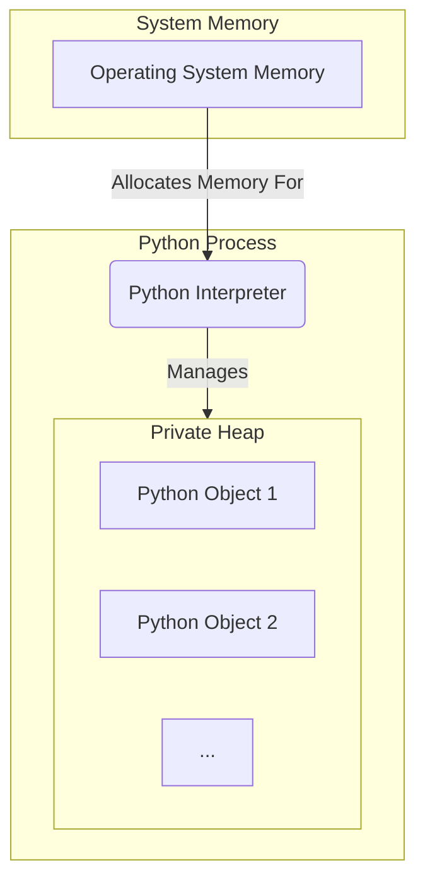
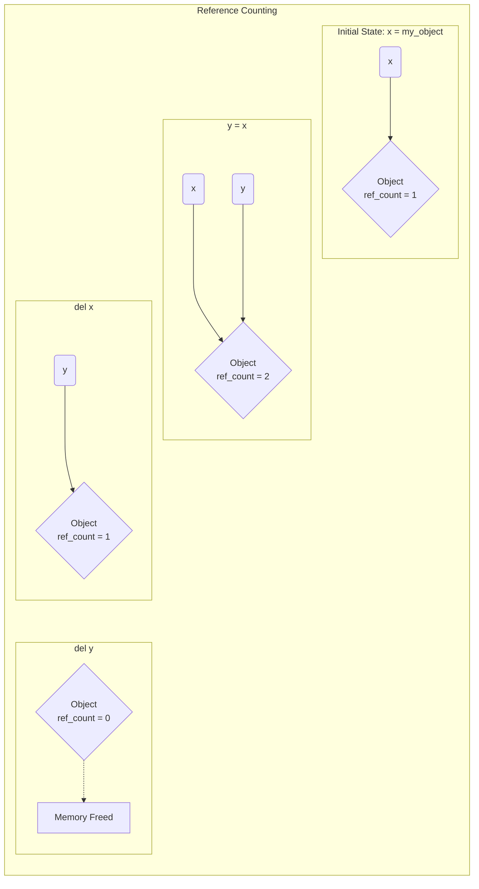
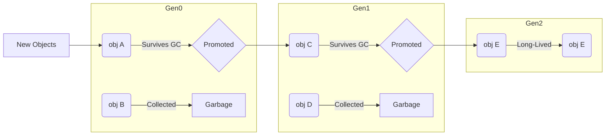

### Python's Private Heap

### Reference Counting

### 3. Generational Garbage Collection

This diagram shows the three generations of the garbage collector and how objects can move between them or be collected.

