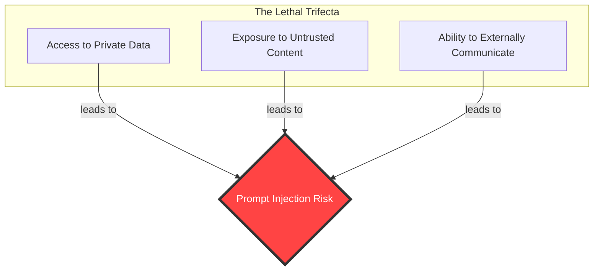
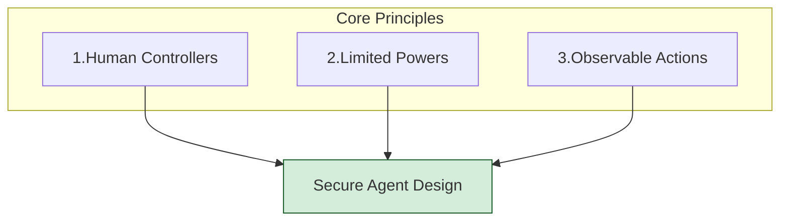
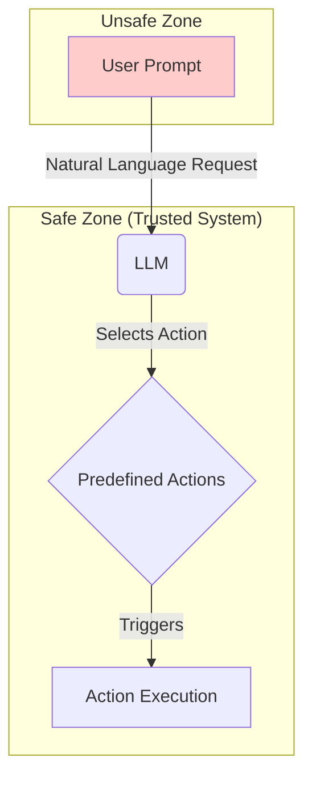
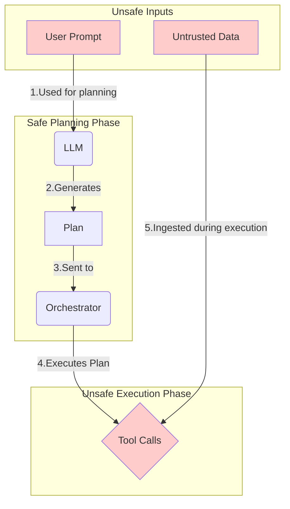
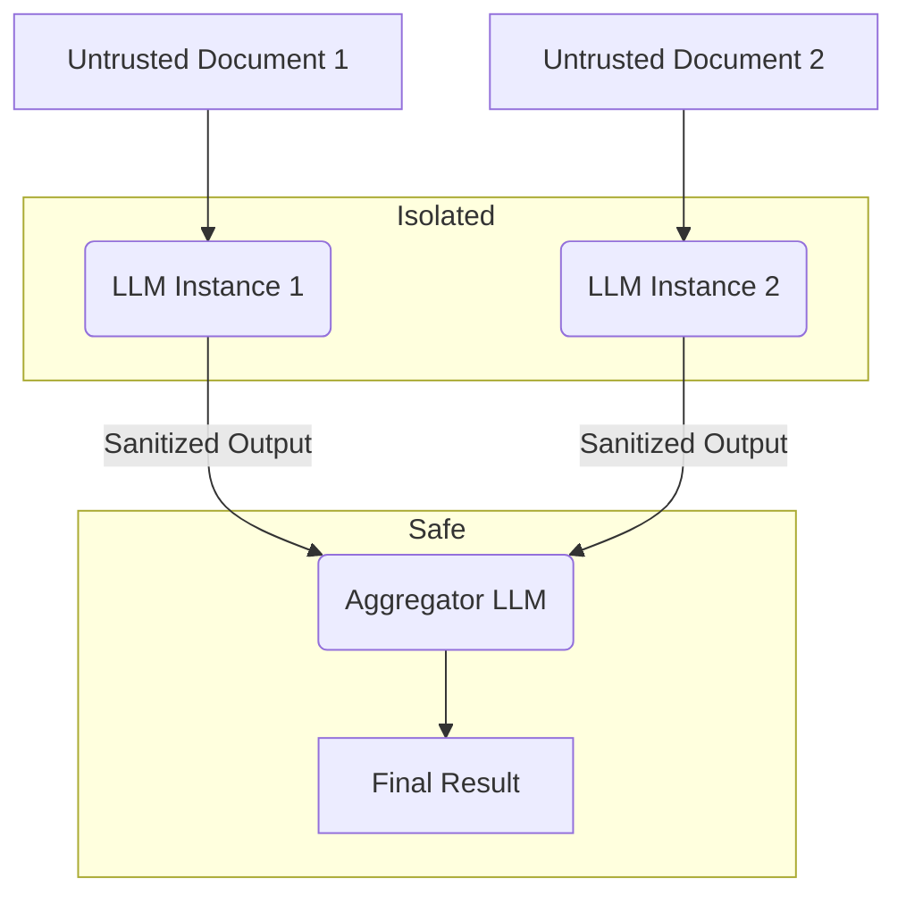
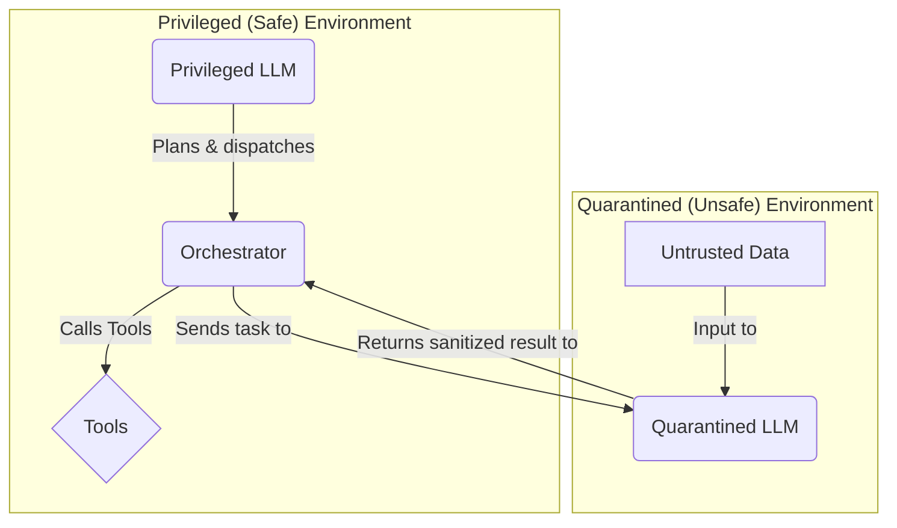
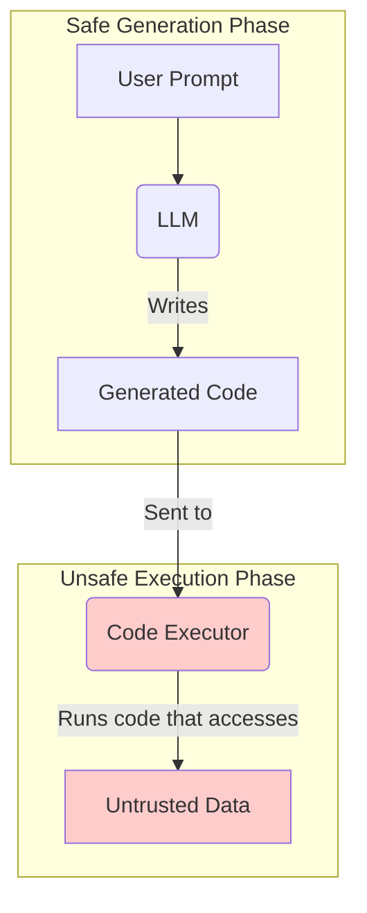
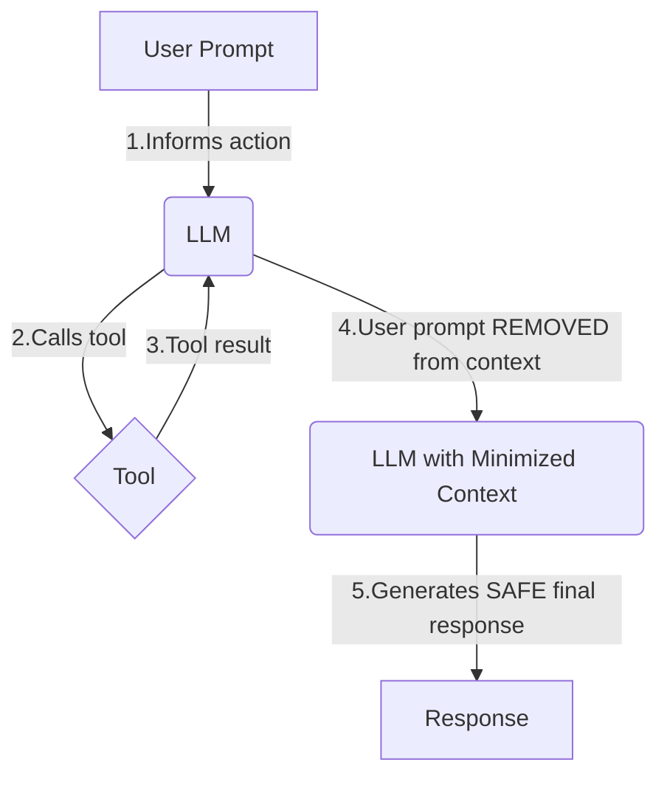

Large Language Model (LLM) agents are becoming incredibly powerful. They can manage our calendar, analyze our data, and automate complex tasks. But this power comes with a serious risk: **prompt injection**. A malicious actor can trick our agent into performing unintended actions, like leaking our private data.

So, how do we build agents that can resist prompt injection?

It starts with understanding the core problem (the theory) and then applying proven architectural solutions (the practice).

### Part 1: The Theory - Why Are LLM Agents Vulnerable?

An LLM agent only becomes a true security risk when three specific capabilities are combined. We call this **The Lethal Trifecta**.

#### 1.1 The Lethal Trifecta

Imagine our agent's capabilities as three separate circles. When they overlap, we create a danger zone where prompt injection attacks can thrive.

1.  **Access to Private Data:** The agent can read our emails, files, and databases.
2.  **Exposure to Untrusted Content:** The agent processes text from external sources, like an incoming email or a webpage, which could contain a hidden malicious instruction.
3.  **Ability to Externally Communicate:** The agent can send emails, make API calls, or write to a database—actions that could be used to exfiltrate our data.

The goal of secure design is to build walls between these three capabilities. To do that, we follow three core principles.

#### 1.2 The Three Core Principles of Safe Design

These are the philosophical rules for building responsible agents.

1.  **Well-Defined Human Controllers:** A human must be in charge. The agent is a tool, not an autonomous entity.
2.  **Limited Powers:** The agent should only have the minimum permissions necessary to do its job. It shouldn't be able to do *everything*.
3.  **Observable Actions:** The agent's plans and actions must be transparent and easy to review. No "black box" behavior.

Now, let's move from theory to practice. How do we actually implement these principles and break the trifecta?

---

### Part 2: The Practice - Six Patterns to Break the Trifecta

These six design patterns are architectural blueprints for building safer agents. Each one is a different strategy for building walls between the circles of the Lethal Trifecta.

#### 2.1 The Action-Selector Pattern

**What it is:** The simplest pattern. The LLM doesn't generate a free-form response; it acts like a smart switch, choosing one action from a small, pre-defined list written by a developer.

**How it Breaks the Trifecta:** It severely restricts the **Ability to Externally Communicate**. An attacker can't make the agent say or do something novel; they can only try to trick it into picking the wrong pre-approved action.

#### 2.2 The Plan-Then-Execute Pattern

**What it is:** The agent first creates a step-by-step plan *before* it looks at any untrusted data. Then, it executes that plan without deviation.

**How it Breaks the Trifecta:** It builds a wall between **Exposure to Untrusted Content** and the agent's decision-making. A prompt injection can't change the *sequence of actions* (e.g., add a step to "email data to attacker"), because the plan is already locked in.

#### 2.3 The LLM Map-Reduce Pattern

**What it is:** For tasks involving many documents, this pattern uses "worker" LLMs to process each piece of untrusted data in isolation. These workers can only output clean, structured data (e.g., a number or a "yes/no"). A final "manager" LLM then works only with this sanitized data.

**How it Breaks the Trifecta:** It isolates **Exposure to Untrusted Content**. The powerful "manager" LLM that has other capabilities never touches the raw, dangerous data, preventing it from being hijacked.

#### 2.4 The Dual LLM Pattern

**What it is:** The most robust separation. You have two types of LLMs:
*   A **Privileged LLM** has access to tools and private data but is forbidden from ever touching untrusted content.
*   A **Quarantined LLM** touches the untrusted content but has no access to tools or data.

**How it Breaks the Trifecta:** This pattern physically severs all links. The agent with dangerous permissions (**Privileged**) is completely shielded from the one that handles dangerous input (**Quarantined**).

#### 2.5 The Code-Then-Execute Pattern

**What it is:** A more advanced version of "Plan-Then-Execute." Instead of a simple plan, the LLM writes a formal computer program to solve the task. That program is then executed.

**How it Breaks the Trifecta:** Like the plan-then-execute pattern, it builds a strong wall between **Exposure to Untrusted Content** and the agent's core logic. The program's logic is finalized before it ever touches untrusted data from the outside world.

#### 2.6 The Context-Minimization Pattern

**What it is:** The agent uses the user's prompt to perform an action (like a database search). Then, before generating its final response, it **forgets the original prompt**.

**How it Breaks the Trifecta:** It breaks the link temporally. The agent's **Ability to Externally Communicate** (writing the final response) is used only *after* the **Exposure to Untrusted Content** (the malicious prompt) has been wiped from its short-term memory.

### Conclusion

Building safe LLM agents isn't about finding a single magic bullet. It's about intentional, defensive design. By understanding the core risks defined by the **Lethal Trifecta** and applying these **six practical patterns**, we can build walls that separate an agent's powerful capabilities from the dangers of untrusted input. This is how we move from hype to building robust, reliable, and secure AI systems.

Source: [Design Patterns for Securing LLM Agents against Prompt Injections](https://arxiv.org/abs/2506.08837)
