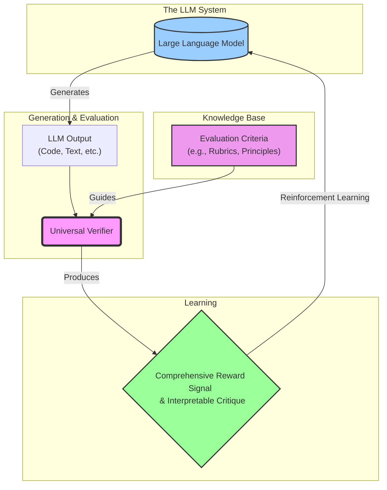
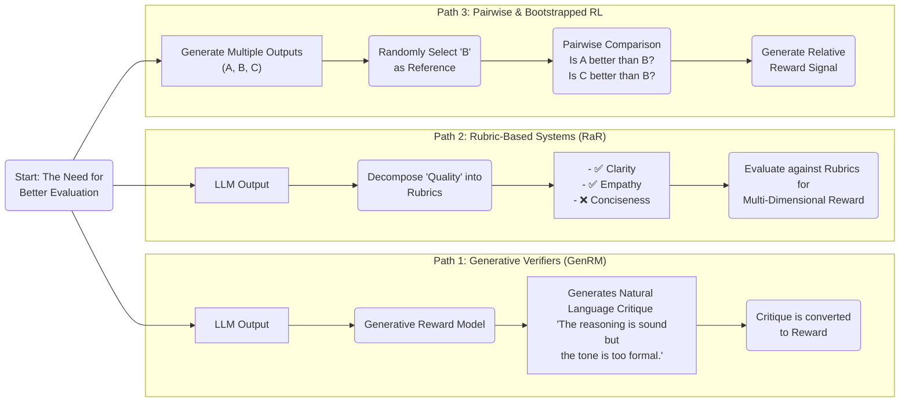
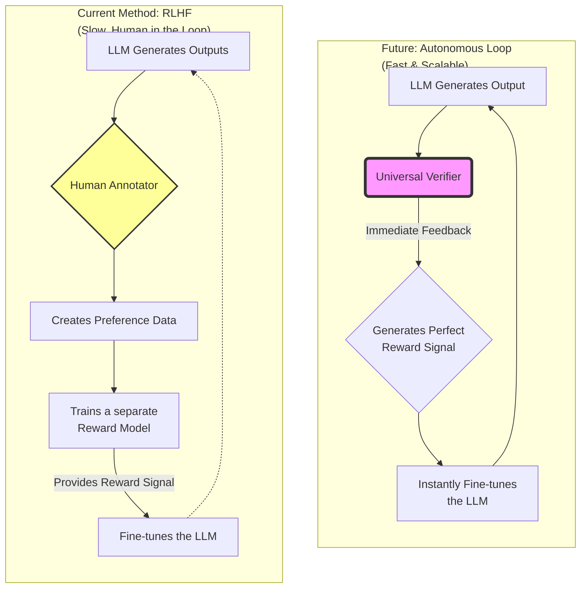
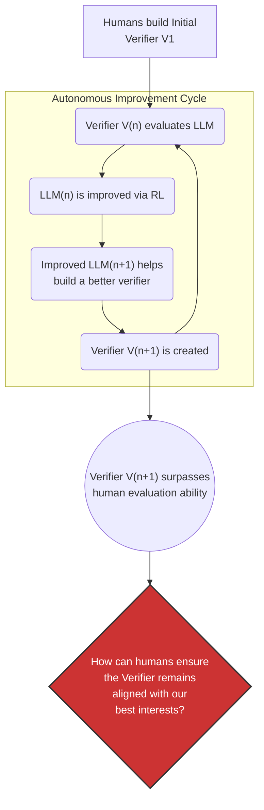

### The Core Concept of a Universal Verifier

### Current Paths to Building a Universal Verifier

### Impact on LLM Evolution: The Self-Improvement Loop

### The Core Challenge: Who Verifies the Verifier?

### Sources

- [DeepSeek-R1: Incentivizing Reasoning Capability in LLMs via Reinforcement Learning](https://arxiv.org/abs/2501.12948)
- [Generative Verifiers: Reward Modeling as Next-Token Prediction](https://arxiv.org/abs/2408.15240)
- [Rubrics as Rewards: Reinforcement Learning Beyond Verifiable Domains](https://arxiv.org/abs/2507.17746)
- [Reinforcement Learning with Rubric Anchors](https://arxiv.org/abs/2508.12790)
- [Writing-Zero: Bridge the Gap Between Non-verifiable Tasks and Verifiable Rewards](https://arxiv.org/abs/2506.00103)
- [Learning to Reason without External Rewards](https://arxiv.org/abs/2505.19590)
