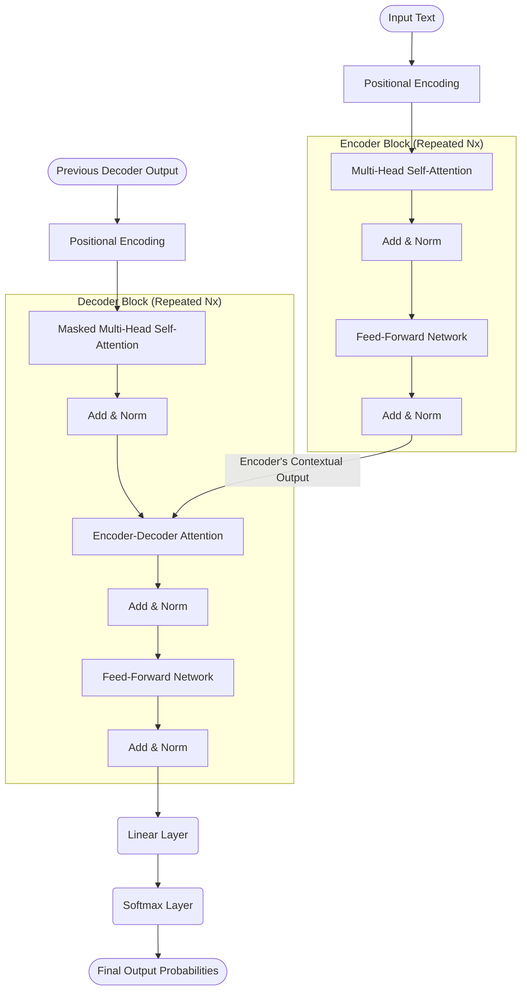

### LLM: High-Level Transformer Architecture

```mermaid
graph TD
    Input([Input Text]) --> PE1[Positional Encoding]
    PE1 --> Enc_MultiHead

    subgraph "Encoder Block (Repeated Nx)"
        Enc_MultiHead[Multi-Head Self-Attention] --> AddNorm1[Add & Norm]
        AddNorm1 --> Enc_FFN[Feed-Forward Network]
        Enc_FFN --> AddNorm2[Add & Norm]
    end

    PrevOutput([Previous Decoder Output]) --> PE2[Positional Encoding]
    PE2 --> Dec_MaskedMultiHead

    subgraph "Decoder Block (Repeated Nx)"
        Dec_MaskedMultiHead[Masked Multi-Head Self-Attention] --> AddNorm3[Add & Norm]
        AddNorm3 --> Dec_EncDecAtt[Encoder-Decoder Attention]
        Dec_EncDecAtt --> AddNorm4[Add & Norm]
        AddNorm4 --> Dec_FFN[Feed-Forward Network]
        Dec_FFN --> AddNorm5[Add & Norm]
    end

    AddNorm2 -- Encoder's Contextual Output --> Dec_EncDecAtt
    AddNorm5 --> FinalOutput(Linear Layer) --> Softmax(Softmax Layer) --> Output([Final Output Probabilities])
```
