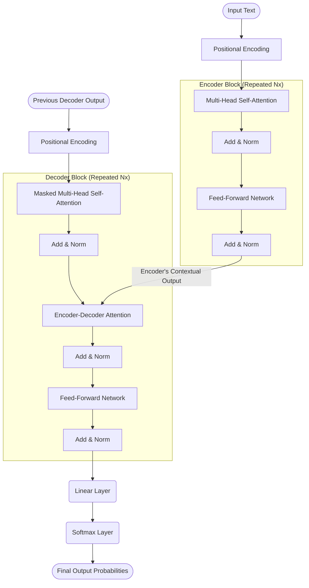
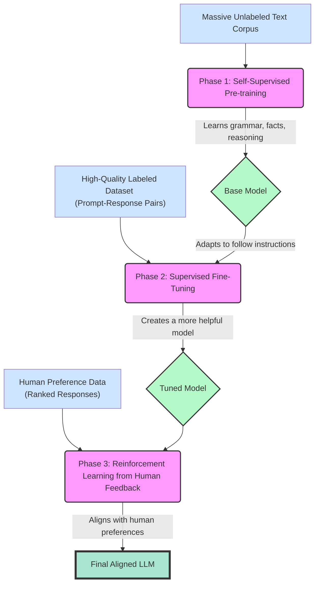
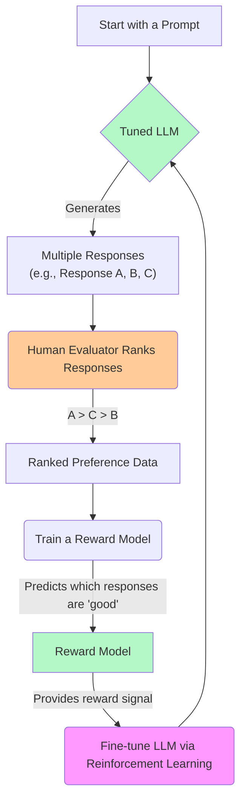

### High-Level Transformer Architecture

```mermaid
graph TD
    Input([Input Text]) --> PE1[Positional Encoding]
    PE1 --> Enc_MultiHead

    subgraph "Encoder Block (Repeated Nx)"
        Enc_MultiHead[Multi-Head Self-Attention] --> AddNorm1[Add & Norm]
        AddNorm1 --> Enc_FFN[Feed-Forward Network]
        Enc_FFN --> AddNorm2[Add & Norm]
    end

    PrevOutput([Previous Decoder Output]) --> PE2[Positional Encoding]
    PE2 --> Dec_MaskedMultiHead

    subgraph "Decoder Block (Repeated Nx)"
        Dec_MaskedMultiHead[Masked Multi-Head Self-Attention] --> AddNorm3[Add & Norm]
        AddNorm3 --> Dec_EncDecAtt[Encoder-Decoder Attention]
        Dec_EncDecAtt --> AddNorm4[Add & Norm]
        AddNorm4 --> Dec_FFN[Feed-Forward Network]
        Dec_FFN --> AddNorm5[Add & Norm]
    end

    AddNorm2 -- Encoder's Contextual Output --> Dec_EncDecAtt
    AddNorm5 --> FinalOutput(Linear Layer) --> Softmax(Softmax Layer) --> Output([Final Output Probabilities])
```

### The Three-Stage LLM Training Process

```mermaid
graph TD;
    A[Massive Unlabeled Text Corpus] --> B(Phase 1: Self-Supervised Pre-training);
    B -- Learns grammar, facts, reasoning --> C{Base Model};

    D["High-Quality Labeled Dataset <br/>(Prompt-Response Pairs)"] --> E(Phase 2: Supervised Fine-Tuning);
    C -- Adapts to follow instructions --> E;
    E -- Creates a more helpful model --> F{Tuned Model};

    %% --- Start of Refinement ---
    I["Human Preference Data <br/>(Ranked Responses)"] --> G(Phase 3: Reinforcement Learning from Human Feedback);
    %% --- End of Refinement ---

    F --> G;
    G -- Aligns with human preferences --> H[Final Aligned LLM];

    %% --- Styling ---
    style A fill:#cde4ff
    style D fill:#cde4ff
    style I fill:#cde4ff
    style B fill:#f9f,stroke:#333,stroke-width:2px
    style E fill:#f9f,stroke:#333,stroke-width:2px
    style G fill:#f9f,stroke:#333,stroke-width:2px
    style C fill:#b4f8c8,stroke:#333,stroke-width:2px
    style F fill:#b4f8c8,stroke:#333,stroke-width:2px
    style H fill:#a8e6cf,stroke:#333,stroke-width:4px
```

### The RLHF (Reinforcement Learning from Human Feedback) Loop

```mermaid
graph TD;
    A[Start with a Prompt] --> B{Tuned LLM};
    B -- Generates --> C["Multiple Responses <br/> (e.g., Response A, B, C)"];
    C --> D(Human Evaluator Ranks Responses);
    D -- "A > C > B" --> E[Ranked Preference Data];
    E --> F(Train a Reward Model);
    F -- Predicts which responses are 'good' --> G[Reward Model];
    G -- Provides reward signal --> H(Fine-tune LLM via Reinforcement Learning);
    H --> B;

    style B fill:#b4f8c8
    style G fill:#b4f8c8
    style D fill:#ffcc99
    style H fill:#f9f
```
