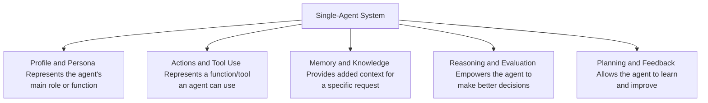

```mermaid
graph TD;
    A[Single-Agent System] --> B[Profile and Persona <br/> Represents the agent's main role or function];
    A --> C[Actions and Tool Use <br/> Represents a function/tool an agent can use];
    A --> D[Memory and Knowledge <br/> Provides added context for a specific request];
    A --> E[Reasoning and Evaluation <br/> Empowers the agent to make better decisions];
    A --> F[Planning and Feedback <br/> Allows the agent to learn and improve];
```
