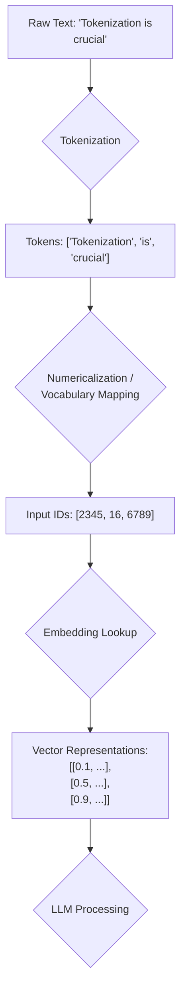
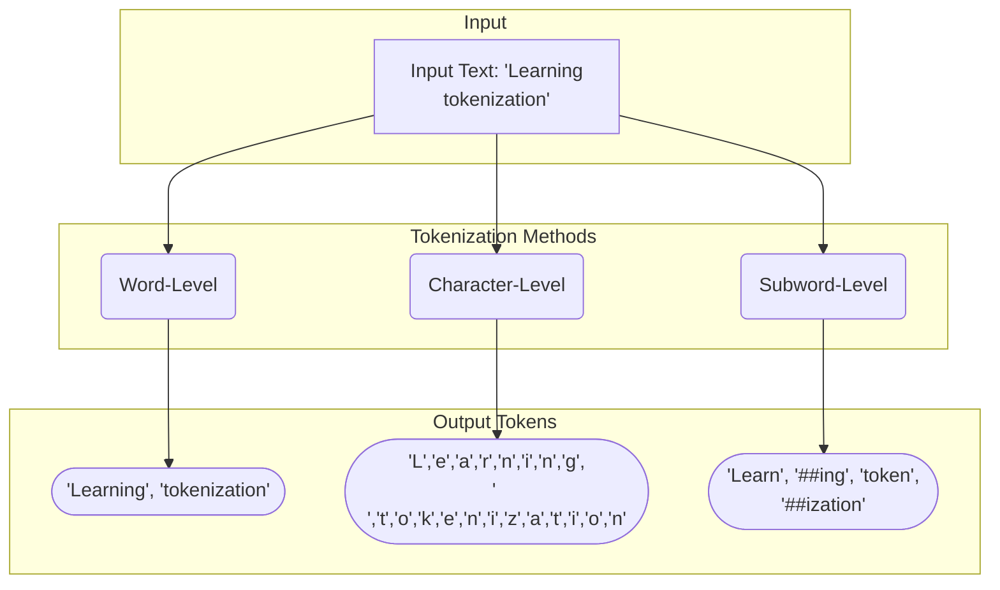
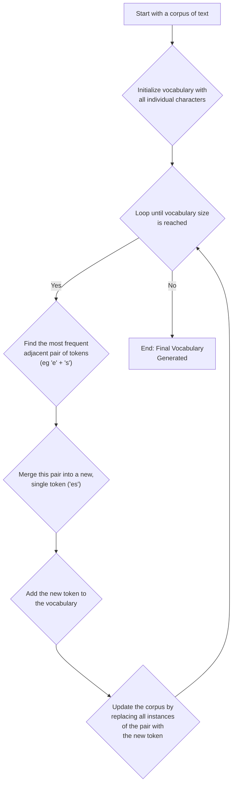
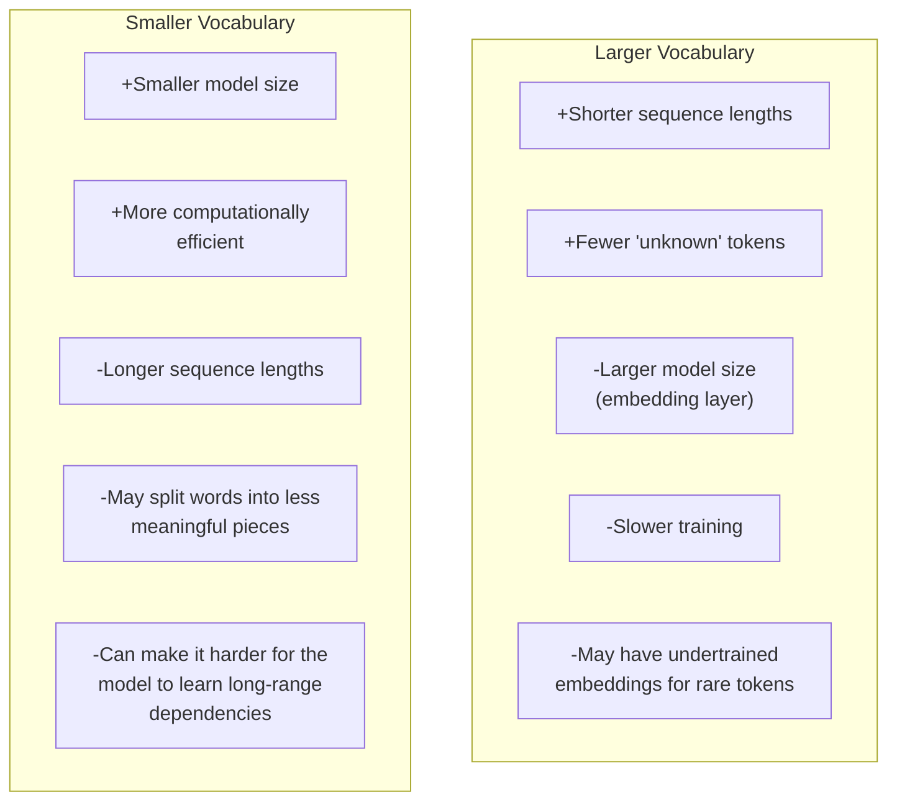

### The Overall NLP Pipeline

```mermaid
graph TD
    A[Raw Text: 'Tokenization is<br>crucial'] --> B{Tokenization};
    B --> C["Tokens: ['Tokenization', 'is',<br>'crucial']"];
    C --> D{Numericalization /<br>Vocabulary Mapping};
    D --> E["Input IDs: [2345, 16, 6789]"];
    E --> F{Embedding Lookup};
    F --> G["Vector Representations:<br>[[0.1, ...],<br>[0.5, ...],<br>[0.9, ...]]"];
    G --> H{LLM Processing};
```

### Comparison of Tokenization Methods

```mermaid
graph TD
    subgraph Input
        A["Input Text: 'Learning<br>tokenization'"]
    end

    subgraph Tokenization Methods
        B(Word-Level)
        C(Character-Level)
        D(Subword-Level)
    end

    subgraph Output Tokens
        B_out(['Learning', 'tokenization'])
        C_out(['L','e','a','r','n','i','n','g',<br>' ','t','o','k','e','n','i','z','a','t','i','o','n'])
        D_out(['Learn', '##ing', 'token',<br>'##ization'])
    end

    A --> B --> B_out
    A --> C --> C_out
    A --> D --> D_out
```

### Byte-Pair Encoding (BPE) Algorithm Flow

```mermaid
graph TD
    A[Start with a corpus of text] --> B{Initialize vocabulary with<br>all individual characters};
    B --> C{Loop until vocabulary size<br>is reached};
    C -- Yes --> D{"Find the most frequent<br>adjacent pair of tokens<br>(eg 'e' + 's')"};
    D --> E{"Merge this pair into a new,<br>single token ('es')"};
    E --> F{Add the new token to<br>the vocabulary};
    F --> G{Update the corpus by<br>replacing all instances<br>of the pair with<br>the new token};
    G --> C;
    C -- No --> H[End: Final Vocabulary<br>Generated];
```

### Vocabulary Size Trade-offs

```mermaid
graph TD
    subgraph Larger Vocabulary
        direction LR
        A_Pro1["+Shorter sequence lengths"]
        A_Pro2["+Fewer 'unknown' tokens"]
        A_Con1["-Larger model size<br>(embedding layer)"]
        A_Con2["-Slower training"]
        A_Con3["-May have undertrained<br>embeddings for rare tokens"]
    end

    subgraph Smaller Vocabulary
        direction LR
        B_Pro1["+Smaller model size"]
        B_Pro2["+More computationally<br>efficient"]
        B_Con1["-Longer sequence lengths"]
        B_Con2["-May split words into less<br>meaningful pieces"]
        B_Con3["-Can make it harder for the<br>model to learn long-range<br>dependencies"]
    end
```
