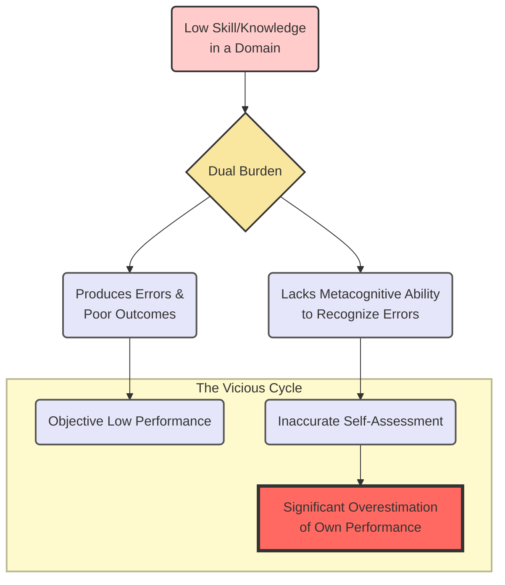
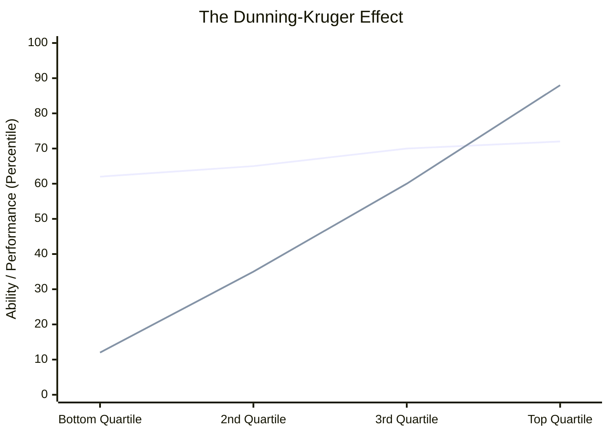
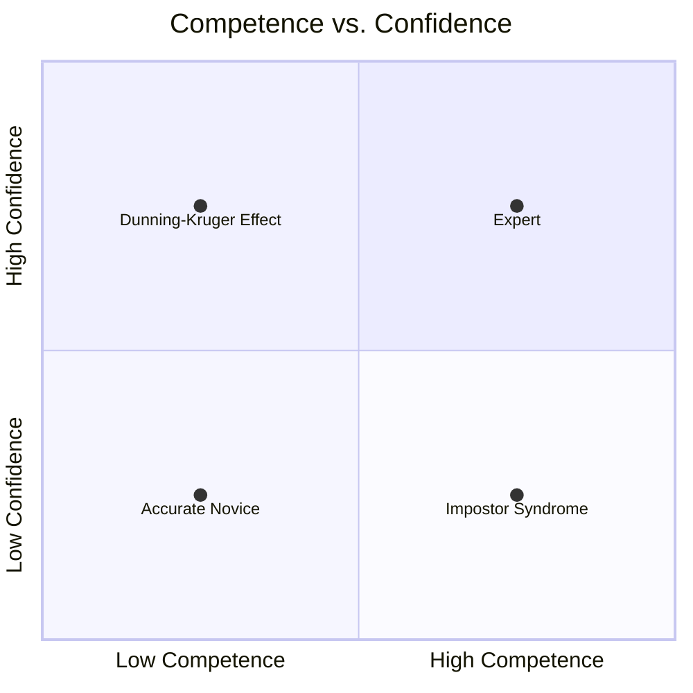
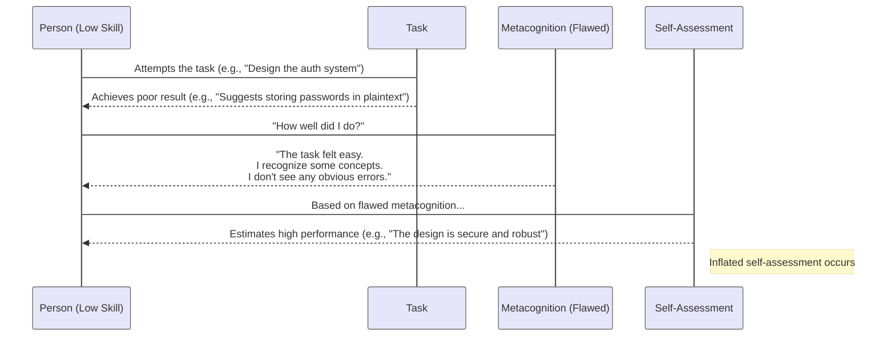

## A Note to Myself: Am I Confident, or Just Unaware?

As engineers, we live and breathe confidence. We have to. We estimate complex tasks, design systems that can't fail, and argue passionately for a specific tech stack. Confidence is part of the job.

But lately, I've been thinking about the nature of the confidence. Is it built on a solid foundation of expertise, or is it floating on a cloud of ignorance? I suspect I've fallen into the trap of not knowing what I don't know, and it's a cognitive bias with a name: the **Dunning-Kruger effect**.

This is a reminder to myself about what it is, how it manifests in my work, and what I can do about it.

### The Core Problem: The Dual Burden

The Dunning-Kruger effect isn't about being unintelligent. It's about a quirk in how the human brain works. In 1999, psychologists Dunning and Kruger found that for any given skill, people with low ability not only perform poorly but also **lack the very skill needed to recognize their own poor performance.**

It's a "dual burden": our incompetence robs us of the metacognitive ability to see our own incompetence.

This flowchart breaks down that vicious cycle. A lack of knowledge leads to bad outcomes, but it *also* leads to an inability to even recognize them, resulting in a dangerous overestimation of our own skills.

### The Journey of a Developer: The Famous Graph

We've all lived this graph. Think about the first time we learned a new framework or a cloud technology.

1.  **The "Perceived Ability" Line (The Flat, High Line):** This is the "Peak of Mount Stupid." I've done the tutorial for Kubernetes. I've deployed a "hello world" app. I think, "This is easy! I've got this. I can run our entire production workload on it." My actual performance is in the bottom quartile, but my perceived ability is sky-high.
2.  **The Crash:** As I start working on a real project, I hit a wall. I learn about service meshes, ingress controllers, RBAC policies, and observability. I realize the universe of things I don't know is terrifyingly vast. This is the painful, humbling drop into the "Valley of Despair."
3.  **The Climb (The "Actual Performance" Line):** As I solve real problems, my actual skill grows. More importantly, my awareness of the landscape grows with it. YIou start to understand the trade-offs and can accurately estimate what I know and what I don't. This is the long, slow "Slope of Enlightenment."

Interestingly, the graph shows that true experts (Top Quartile) sometimes slightly *underestimate* their ability, because they assume difficult tasks are just as easy for others.

### Where Do I Sit? The Competence/Confidence Matrix

It's useful to visualize this as a quadrant chart. Where we are on this chart changes depending on the domain. I might be an expert in API design but a complete novice in machine learning. The danger is thinking my expertise in one area automatically translates to another.

*   **Top-Left:** The danger zone. I don't know enough to be scared. This is where I propose a simple solution for a complex problem and confidently tell the product manager it'll be "done in a week."
*   **Bottom-Right:** The "Impostor Syndrome" zone. I're highly competent, but I'm so aware of the infinite depth of my field that I feel like a fraud. Many great senior engineers live here.

### A Real-World Scenario: The Process of Miscalibration

Let's see how this plays out in a technical design meeting.

The engineer in this diagram isn't malicious. Their flawed metacognition is telling them everything is fine. They don't have the specific knowledge of cryptography and security to see the gaping holes in their own design. They see "storing user credentials" and their brain registers familiarity, which it mistakes for expertise.

### My Toolkit for Staying Humble and Getting Better

Recognizing this bias is the first step. Here are the practical things I'm trying to do to actively fight it:

1.  **Embrace "I don't know."** It's the most powerful phrase in an engineer's vocabulary. It opens the door to learning; false confidence slams it shut.
2.  **Seek Aggressive Peer Review.** Don't ask, "Does this look okay?" Ask, "What are the three biggest flaws in this design? What am I missing? What's the weakest part of this code?" Assume I've missed something, and ask for help finding it.
3.  **Find a Mentor.** Find someone whose expertise I trust and who can give me blunt, honest feedback. Their external perspective is the perfect antidote to my internal blind spots.
4.  **Teach What I Learn.** The fastest way to find out what I *don't* know is to try to explain it to someone else. The gaps in my understanding become immediately obvious.
5.  **Keep a "Why I Was Wrong" Journal.** When a production bug is traced back to a decision I made, I write it down. Not to assign blame, but to analyze the flawed assumption. This actively trains my metacognition.

Ultimately, this isn't about feeling bad about ourselves. It's about building the self-awareness required for true mastery. The goal is to close the gap between our perceived ability and our actual ability, and build a career on a foundation of genuine, hard-won competence.
