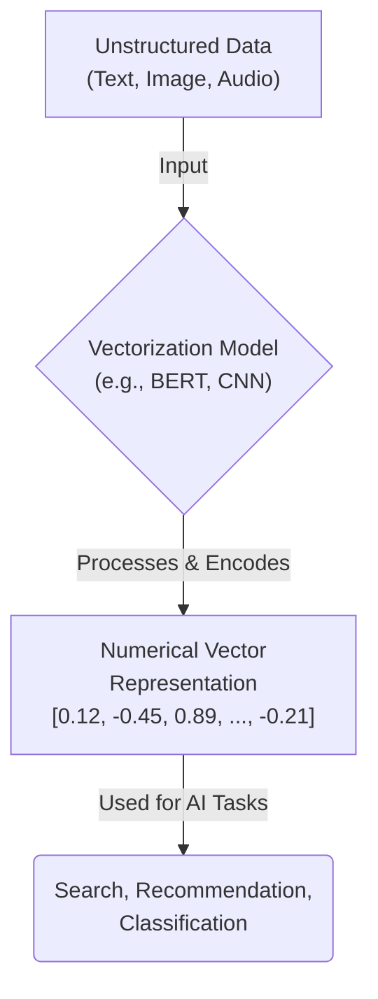
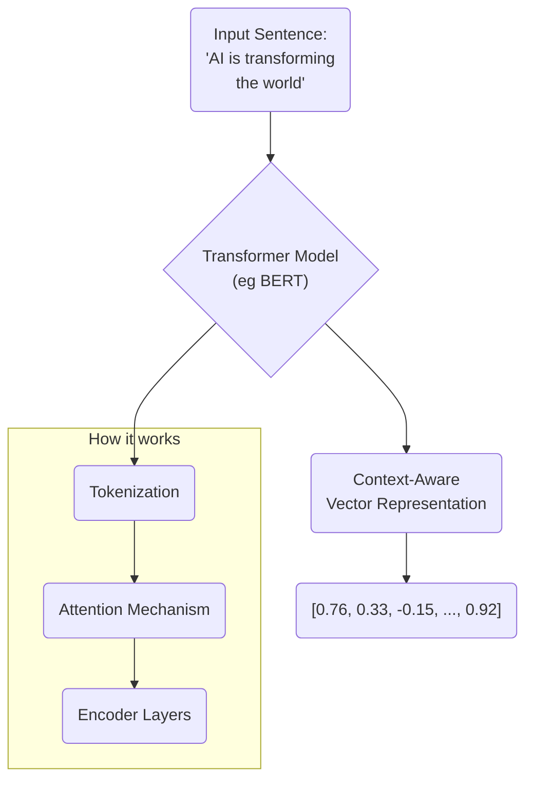
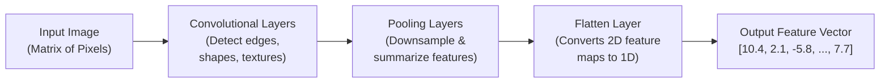

### The General Vectorization Process

### Text Vectorization Example (Contextual Embeddings)

### Image Vectorization via a Convolutional Neural Network (CNN)

### Semantic Similarity in a Vector Space

```mermaid
%% --- Diagram 1: Similarity Measurement --- %%
graph LR;
    subgraph "Similarity Measurement"
        A["Distance(King, Queen) <br> is small"];
        B["Distance(King, Man) <br> is small"];
        C["Distance(King, Woman) <br> is large"];
    end

%% --- Diagram 2: Vector Operations & Relationships --- %%

    subgraph "Vector Operations & Relationships"
        op1["vector('King') - vector('Man')"] --> op2["+vector('Woman')"] --> op3["≈ vector('Queen')"];
    end

%% --- Diagram 3: High-Dimensional Vector Space --- %%
    subgraph "High-Dimensional <br> Vector Space"
        Man["vector('Man')"]
        King["vector('King')"]
        Woman["vector('Woman')"]
        Queen["vector('Queen')"]

        Man -- "Royal Relationship" --> King;
        Man -- "Gender Relationship" --> Woman;
        Woman -- "Royal Relationship" --> Queen;
        King -- "Gender Relationship" --> Queen;
    end
```

