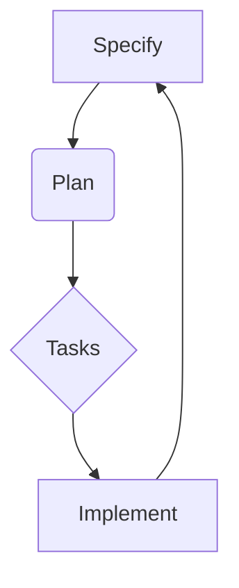
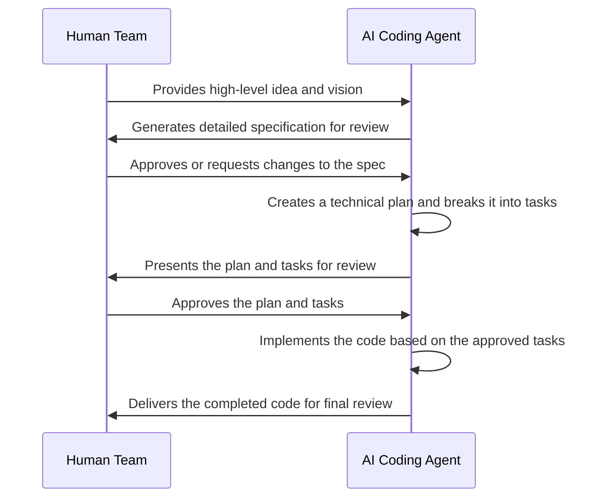
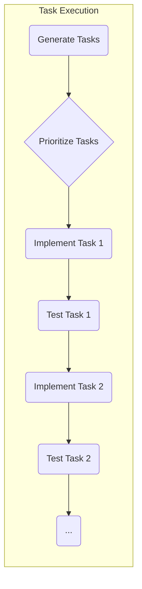

### The Four Phases of Spec-Driven Development

```mermaid
graph TD
    A[Specify] --> B(Plan)
    B --> C{Tasks}
    C --> D[Implement]
    D --> A
```

### High-Level SDD Workflow with Team Roles

```mermaid
sequenceDiagram
    participant Human Team
    participant AI Coding Agent

    Human Team->>AI Coding Agent: Provides high-level idea and vision
    AI Coding Agent->>Human Team: Generates detailed specification for review
    Human Team->>AI Coding Agent: Approves or requests changes to the spec
    AI Coding Agent->>AI Coding Agent: Creates a technical plan and breaks it into tasks
    AI Coding Agent->>Human Team: Presents the plan and tasks for review
    Human Team->>AI Coding Agent: Approves the plan and tasks
    AI Coding Agent->>AI Coding Agent: Implements the code based on the approved tasks
    AI Coding Agent->>Human Team: Delivers the completed code for final review
```

### Detailed Task Execution in SDD

```mermaid
graph LR
    subgraph "Task Execution"
        A(Generate Tasks) --> B{Prioritize Tasks}
        B --> C(Implement Task 1)
        C --> D(Test Task 1)
        D --> E(Implement Task 2)
        E --> F(Test Task 2)
        F --> G(...)
    end
```
