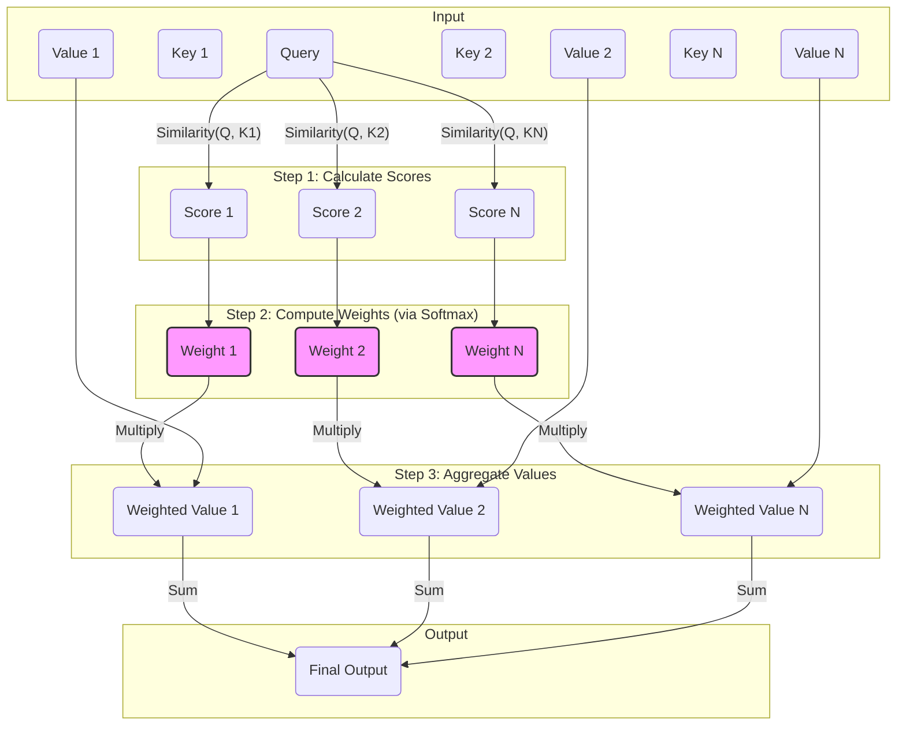
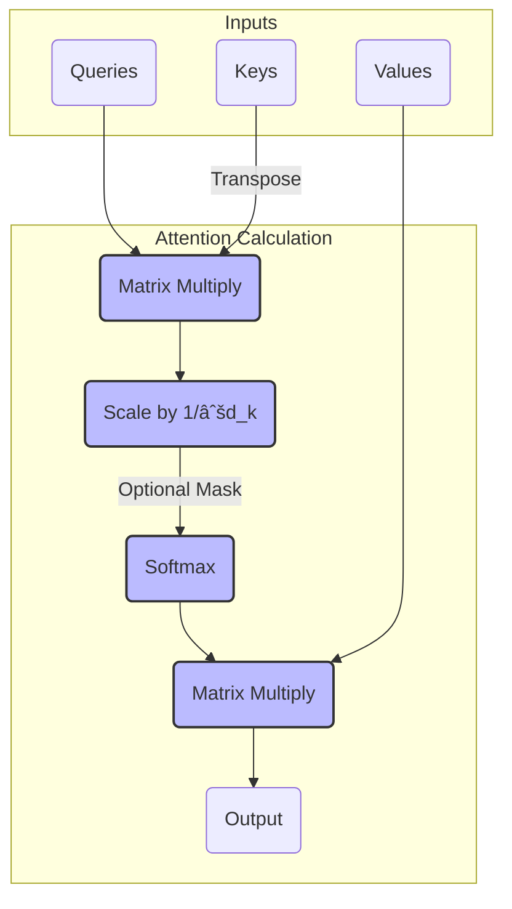
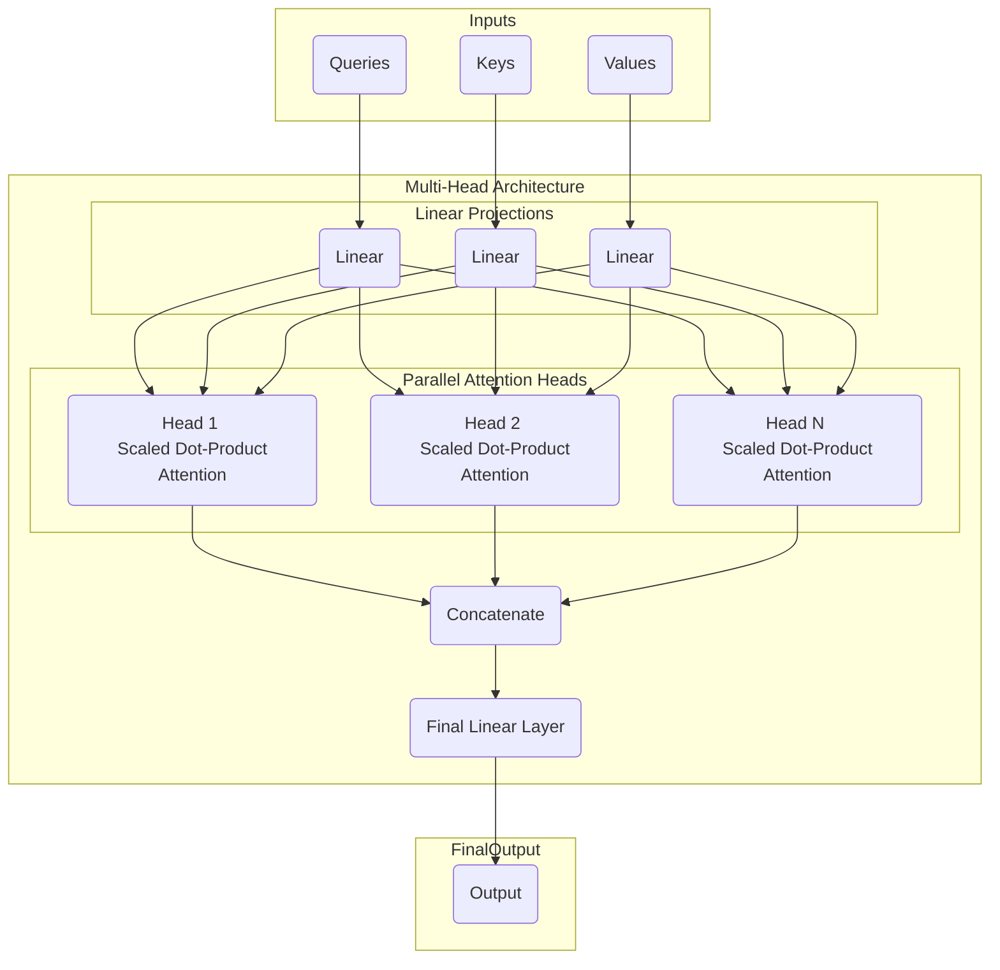
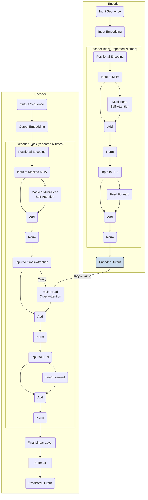

### Basic Attention Mechanism

```mermaid
graph TD
    subgraph Input
        direction LR
        Q(Query)
        K1(Key 1)
        V1(Value 1)
        K2(Key 2)
        V2(Value 2)
        KN(Key N)
        VN(Value N)
    end

    subgraph "Step 1: Calculate Scores"
        direction LR
        S1(Score 1)
        S2(Score 2)
        SN(Score N)
    end

    %% This subgraph title is now more specific
    subgraph "Step 2: Compute Weights (via Softmax)"
        direction LR
        W1(Weight 1)
        W2(Weight 2)
        WN(Weight N)
    end

    subgraph "Step 3: Aggregate Values"
        direction LR
        WV1(Weighted Value 1)
        WV2(Weighted Value 2)
        WVN(Weighted Value N)
    end

    subgraph Output
        O(Final Output)
    end

    %% Connections
    Q -- "Similarity(Q, K1)" --> S1
    Q -- "Similarity(Q, K2)" --> S2
    Q -- "Similarity(Q, KN)" --> SN

    S1 --> W1
    S2 --> W2
    SN --> WN
    style W1 fill:#f9f,stroke:#333,stroke-width:2px
    style W2 fill:#f9f,stroke:#333,stroke-width:2px
    style WN fill:#f9f,stroke:#333,stroke-width:2px

    W1 -- "Multiply" --> WV1
    V1 --> WV1
    W2 -- "Multiply" --> WV2
    V2 --> WV2
    WN -- "Multiply" --> WVN
    VN --> WVN

    WV1 -- "Sum" --> O
    WV2 -- "Sum" --> O
    WVN -- "Sum" --> O
```

### Scaled Dot-Product Attention

```mermaid
graph TD
    subgraph Inputs
        Q(Queries)
        K(Keys)
        V(Values)
    end

    subgraph "Attention Calculation"
        MatMul(Matrix Multiply)
        Scale(Scale by 1/√d_k)
        Softmax(Softmax)
        MatMul2(Matrix Multiply)
        Output(Output)
    end

    Q --> MatMul
    K -->|Transpose| MatMul
    MatMul --> Scale
    Scale -->|Optional Mask| Softmax
    Softmax --> MatMul2
    V --> MatMul2
    MatMul2 --> Output

    style MatMul fill:#bbf,stroke:#333,stroke-width:2px
    style Scale fill:#bbf,stroke:#333,stroke-width:2px
    style Softmax fill:#bbf,stroke:#333,stroke-width:2px
    style MatMul2 fill:#bbf,stroke:#333,stroke-width:2px
```

### Multi-Head Attention

```mermaid
graph TD
    subgraph Inputs
        direction LR
        Q(Queries)
        K(Keys)
        V(Values)
    end

    subgraph "Multi-Head Architecture"
        direction TB
        subgraph "Linear Projections"
            direction LR
            ProjQ(Linear)
            ProjK(Linear)
            ProjV(Linear)
        end

        subgraph "Parallel Attention Heads"
            direction LR
            Head1(Head 1 <br> Scaled Dot-Product Attention)
            Head2(Head 2 <br> Scaled Dot-Product Attention)
            HeadN(Head N <br> Scaled Dot-Product Attention)
        end

        Concat(Concatenate)
        LinearOut(Final Linear Layer)
    end

    subgraph FinalOutput
        O(Output)
    end

    %% Connections
    Q --> ProjQ
    K --> ProjK
    V --> ProjV

    ProjQ --> Head1
    ProjK --> Head1
    ProjV --> Head1

    ProjQ --> Head2
    ProjK --> Head2
    ProjV --> Head2

    ProjQ --> HeadN
    ProjK --> HeadN
    ProjV --> HeadN

    Head1 --> Concat
    Head2 --> Concat
    HeadN --> Concat

    Concat --> LinearOut
    LinearOut --> O
```

### Self-Attention in an Encoder-Decoder Model

```mermaid
graph TD
    subgraph Encoder
        direction TB
        Input(Input Sequence) --> InputEmbed(Input Embedding)
        %% CORRECT PLACEMENT: Positional Encoding is added once, before the blocks.
        InputEmbed --> E_PosEnc(Positional Encoding)

        subgraph EncoderBlock ["Encoder Block (repeated N times)"]
            %% The first block takes the Positional Encoding as input
            E_PosEnc --> E_AddNorm1_Input(Input to MHA)
            E_AddNorm1_Input --> E_MHA(Multi-Head <br> Self-Attention)
            E_MHA --> E_AddNorm1_Output(Add)
            E_AddNorm1_Input --> E_AddNorm1_Output
            E_AddNorm1_Output --> E_Norm1(Norm)

            E_Norm1 --> E_AddNorm2_Input(Input to FFN)
            E_AddNorm2_Input --> E_FFN(Feed Forward)
            E_FFN --> E_AddNorm2_Output(Add)
            E_AddNorm2_Input --> E_AddNorm2_Output
            E_AddNorm2_Output --> E_Norm2(Norm)
        end
        E_Norm2 --> EncOut(Encoder Output)
    end

    subgraph Decoder
        direction TB
        Output(Output Sequence) --> OutputEmbed(Output Embedding)
        %% CORRECT PLACEMENT: Positional Encoding is added once, before the blocks.
        OutputEmbed --> D_PosEnc(Positional Encoding)

        subgraph DecoderBlock ["Decoder Block (repeated N times)"]
            D_PosEnc --> D_AddNorm1_Input(Input to Masked MHA)
            D_AddNorm1_Input --> D_MHA(Masked Multi-Head <br> Self-Attention)
            D_MHA --> D_AddNorm1_Output(Add)
            D_AddNorm1_Input --> D_AddNorm1_Output
            D_AddNorm1_Output --> D_Norm1(Norm)

            D_Norm1 --> D_AddNorm2_Input(Input to Cross-Attention)
            D_AddNorm2_Input -- "Query" --> CrossAttn(Multi-Head <br> Cross-Attention)
            EncOut -- "Key & Value" --> CrossAttn
            CrossAttn --> D_AddNorm2_Output(Add)
            D_AddNorm2_Input --> D_AddNorm2_Output
            D_AddNorm2_Output --> D_Norm2(Norm)

            D_Norm2 --> D_AddNorm3_Input(Input to FFN)
            D_AddNorm3_Input --> D_FFN(Feed Forward)
            D_FFN --> D_AddNorm3_Output(Add)
            D_AddNorm3_Input --> D_AddNorm3_Output
            D_AddNorm3_Output --> D_Norm3(Norm)
        end
        D_Norm3 --> FinalLinear(Final Linear Layer)
        FinalLinear --> Softmax
        Softmax --> PredictedOutput(Predicted Output)
    end

    style EncOut fill:#cde,stroke:#333,stroke-width:2px
```
