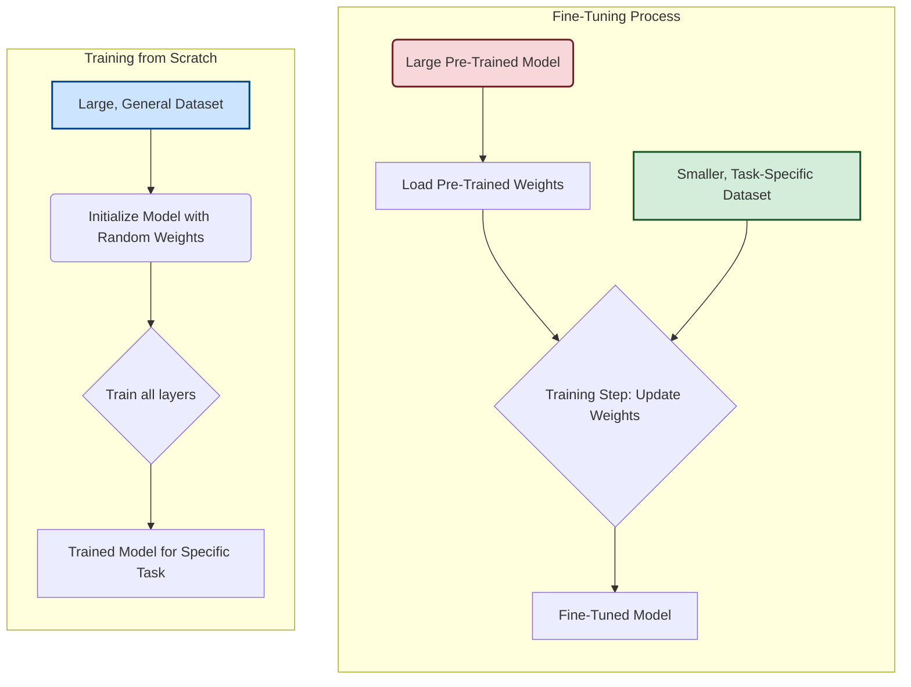
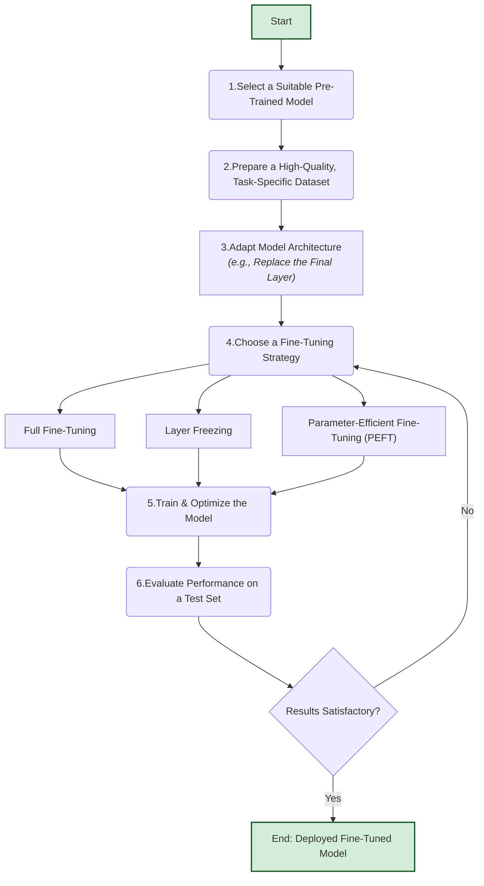
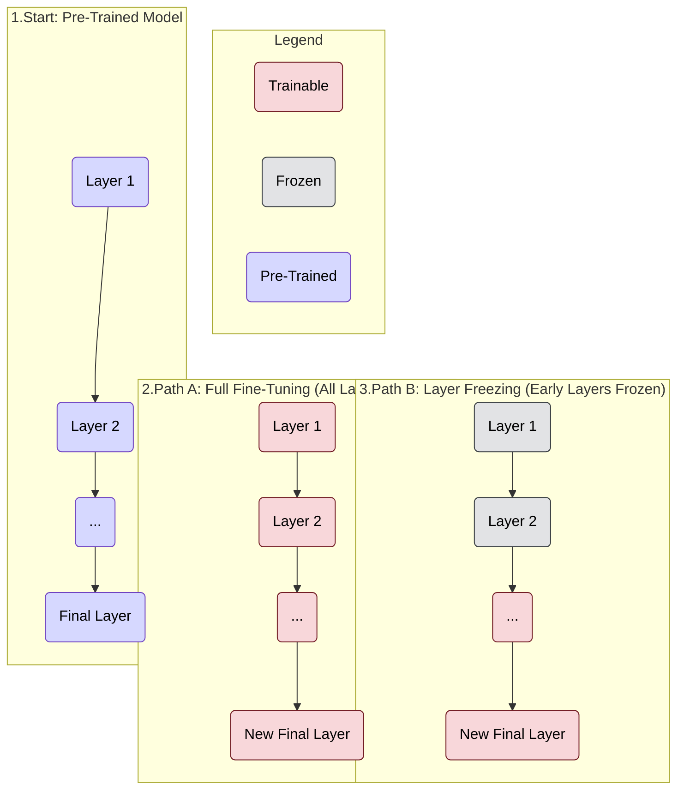
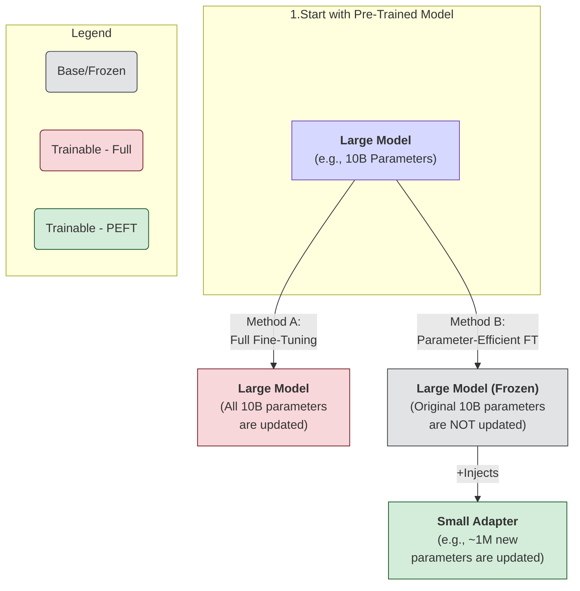

### High-Level Overview: Training from Scratch vs. Fine-Tuning

```mermaid
graph TD
    subgraph "Fine-Tuning Process"
        direction TB
        E(Large Pre-Trained Model) --> F[Load Pre-Trained Weights];
        G[Smaller, Task-Specific Dataset];
        
        F & G --> H{Training Step: Update Weights};
        H --> I[Fine-Tuned Model];
    end

    subgraph "Training from Scratch"
        direction TB
        A[Large, General Dataset] --> B(Initialize Model with Random Weights);
        B --> C{Train all layers};
        C --> D[Trained Model for Specific Task];
    end

    %% Styling
    style E fill:#f8d7da,stroke:#721c24,stroke-width:2px
    style G fill:#d4edda,stroke:#155724,stroke-width:2px
    style A fill:#cde4ff,stroke:#004085,stroke-width:2px
```

### The Fine-Tuning Workflow

```mermaid
graph TD
    A[Start] --> B(1.Select a Suitable Pre-Trained Model);
    B --> C(2.Prepare a High-Quality, Task-Specific Dataset);
    C --> D["3.Adapt Model Architecture<br/><i>(e.g., Replace the Final Layer)</i>"];
    D --> F(4.Choose a Fine-Tuning Strategy);
    F --> G[Full Fine-Tuning];
    F --> H[Layer Freezing];
    F --> I["Parameter-Efficient Fine-Tuning (PEFT)"];
    G --> J(5.Train & Optimize the Model);
    H --> J;
    I --> J;
    J --> K(6.Evaluate Performance on a Test Set);
    K --> L{Results Satisfactory?};
    L -- No --> F;
    L -- Yes --> M[End: Deployed Fine-Tuned Model];

    %% Styling
    style A fill:#d4edda,stroke:#155724,stroke-width:2px
    style M fill:#d4edda,stroke:#155724,stroke-width:2px
```

### Layer Freezing vs. Full Fine-Tuning

```mermaid
graph TB
    %% Define styles for all layer types
    classDef base fill:#d6d8ff,stroke:#6f42c1,color:#000
    classDef trainable fill:#f8d7da,stroke:#721c24,color:#000
    classDef frozen fill:#e2e3e5,stroke:#383d41,color:#000
    subgraph "Legend"
        L1(Trainable);
        L2(Frozen);
        L3(Pre-Trained);
    end
    subgraph "3.Path B: Layer Freezing (Early Layers Frozen)"
        direction TB
        C1(Layer 1) --> C2(Layer 2) --> C3(...) --> Cn(New Final Layer)
    end
    subgraph "2.Path A: Full Fine-Tuning (All Layers Trainable)"
        direction TB
        B1(Layer 1) --> B2(Layer 2) --> B3(...) --> Bn(New Final Layer)
    end
    subgraph "1.Start: Pre-Trained Model"
        direction TB
        A1(Layer 1) --> A2(Layer 2) --> A3(...) --> An(Final Layer)
    end
    class A1,A2,A3,An base
    class B1,B2,B3,Bn trainable
    class C1,C2 frozen
    class C3,Cn trainable
    
    %% Invisible links to enforce order and branching
    A1 ~~~ B1
    A1 ~~~ C1

    class L1 trainable;
    class L2 frozen;
    class L3 base;
```

### Parameter-Efficient Fine-Tuning (PEFT)

```mermaid
graph TB
    %% Define styles for clarity
    classDef frozen fill:#e2e3e5,stroke:#383d41
    classDef trainable_full fill:#f8d7da,stroke:#721c24
    classDef trainable_peft fill:#d4edda,stroke:#155724
    classDef base fill:#d6d8ff,stroke:#6f42c1

    subgraph "1.Start with Pre-Trained Model"
        A["<b>Large Model</b><br/>(e.g., 10B Parameters)"]
    end
    class A base

    A -- "Method A:<br/>Full Fine-Tuning" --> B["<b>Large Model</b><br/>(All 10B parameters<br/>are updated)"]
    A -- "Method B:<br/>Parameter-Efficient FT" --> C["<b>Large Model (Frozen)</b><br/>(Original 10B parameters<br/>are NOT updated)"]
    C -- "+Injects" --> D["<b>Small Adapter</b><br/>(e.g., ~1M new<br/>parameters are updated)"]

    %% Apply styles
    class B trainable_full
    class C frozen
    class D trainable_peft

    subgraph "Legend"
        L1(Base/Frozen);
        L2(Trainable - Full);
        L3(Trainable - PEFT);
    end
    class L1 frozen; class L2 trainable_full; class L3 trainable_peft
```
