### The Core Paradigm Shift: From Syntax to Semantics

```mermaid
graph TD
    subgraph "Traditional LLM for Code"
        direction TB
        A["Input: Massive Corpus of Static Code"] --> B{"Training Goal: Predict the next token"};
        B --> C["<strong>Result:</strong> Learns what code 'looks like' (Syntax)"];
        C --> D["🔴 Limitation: Prone to logical errors; doesn't understand runtime behavior."];
    end

    subgraph "Code World Model (CWM)"
        direction TB
        E["Input: Code + <strong>Execution Data</strong> (Traces & Agentic Actions)"] --> F{"Training Goal: Predict the outcome of an action"};
        F --> G["<strong>Result:</strong> Learns what code 'does' (Semantics)"];
        G --> H["✅ Advantage: Reasons about execution, enables self-correction and robust problem-solving."];
    end

    style C fill:#fde0e0,stroke:#333
    style G fill:#e0f2f1,stroke:#333
    style F stroke-width:3px,stroke-dasharray: 5 5, stroke: #4a90e2
```

### The CWM Multi-Stage Training Pipeline

### The Fuel for Innovation: CWM's Unique Mid-Training Data

### The Resulting Capability: An Agentic Problem-Solving Loop

Sources:

- [https://ai.meta.com/research/publications/cwm-an-open-weights-llm-for-research-on-code-generation-with-world-models/](https://ai.meta.com/research/publications/cwm-an-open-weights-llm-for-research-on-code-generation-with-world-models/)
- [https://github.com/facebookresearch/cwm](https://github.com/facebookresearch/cwm)
