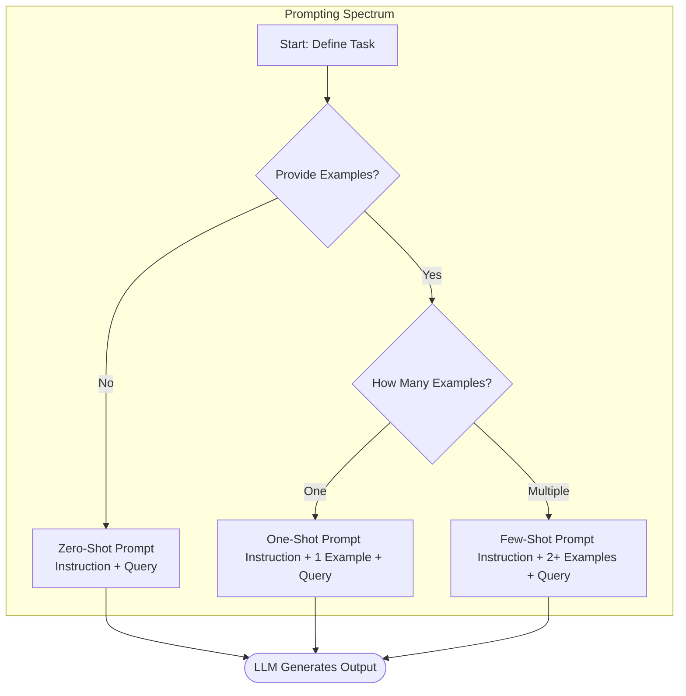
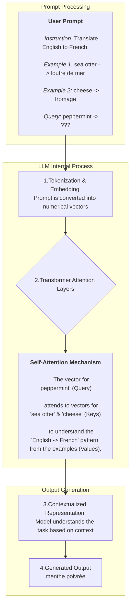
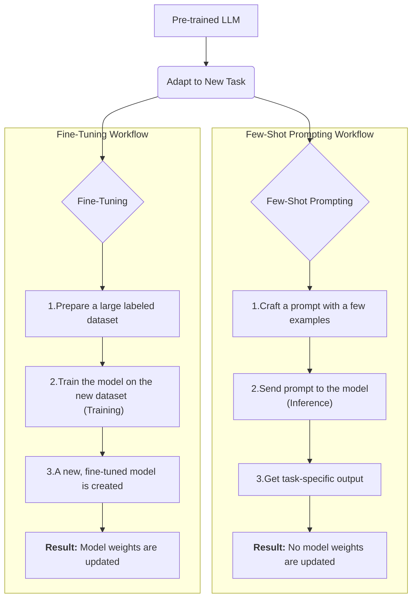
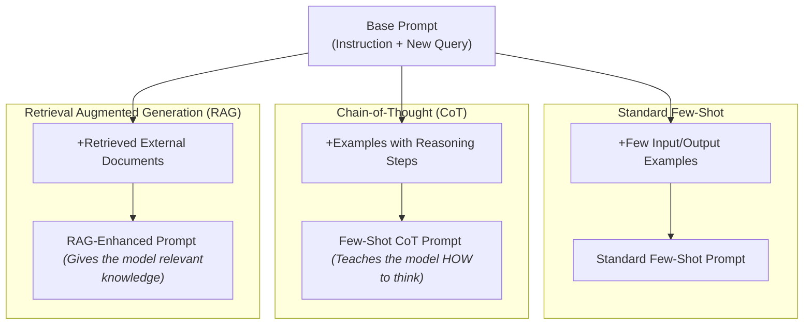

### The Spectrum of Prompting: Zero, One, and Few-Shot

```mermaid
graph TD
    subgraph Prompting Spectrum
        A[Start: Define Task] --> B{Provide Examples?};
        B -- No --> C[Zero-Shot Prompt <br>Instruction + Query];
        B -- Yes --> D{How Many Examples?};
        D -- One --> E[One-Shot Prompt <br>Instruction + 1 Example + Query];
        D -- Multiple --> F[Few-Shot Prompt <br>Instruction + 2+ Examples + Query];
    end
    C --> G([LLM Generates Output]);
    E --> G;
    F --> G;
```

### How In-Context Learning Works (Simplified)

```mermaid
graph TD
    subgraph Prompt Processing
        A["
        <b>User Prompt</b><br>
        <i>Instruction:</i> Translate English to French.<br>
        <i>Example 1:</i> sea otter -> loutre de mer<br>
        <i>Example 2:</i> cheese -> fromage<br>
        <i>Query:</i> peppermint -> ???
        "]
    end

    subgraph LLM Internal Process
        B[1.Tokenization & Embedding <br>Prompt is converted into numerical vectors]
        C{2.Transformer Attention Layers}
        D["
        <b>Self-Attention Mechanism</b><br>
        The vector for 'peppermint' (Query)<br>
        attends to vectors for 'sea otter' & 'cheese' (Keys)<br>
        to understand the 'English -> French' pattern from the examples (Values).
        "]
    end

    subgraph Output Generation
        E[3.Contextualized Representation <br>Model understands the task based on context]
        F[4.Generated Output <br>menthe poivrée]
    end

    A --> B --> C --> D --> E --> F
```

### Few-Shot Prompting vs. Fine-Tuning

```mermaid
graph TD
    A[Pre-trained LLM] --> B(Adapt to New Task);

    B --> C{Few-Shot Prompting};
    B --> D{Fine-Tuning};

    subgraph "Few-Shot Prompting Workflow"
        C --> C1[1.Craft a prompt with a few examples];
        C1 --> C2["2.Send prompt to the model <br> (Inference)"];
        C2 --> C3[3.Get task-specific output];
        C3 --> C4[<b>Result:</b> No model weights are updated];
    end

    subgraph "Fine-Tuning Workflow"
        D --> D1[1.Prepare a large labeled dataset];
        D1 --> D2["2.Train the model on the new dataset <br> (Training)"];
        D2 --> D3[3.A new, fine-tuned model is created];
        D3 --> D4[<b>Result:</b> Model weights are updated];
    end
```

### Advanced Few-Shot Techniques

```mermaid
graph TD
    A["Base Prompt <br> (Instruction + New Query)"]

    subgraph "Standard Few-Shot"
        B[+Few Input/Output Examples] --> C[Standard Few-Shot Prompt]
    end

    subgraph "Chain-of-Thought (CoT)"
        D[+Examples with Reasoning Steps] --> E["Few-Shot CoT Prompt <br> <i>(Teaches the model HOW to think)</i>"]
    end

    subgraph "Retrieval Augmented Generation (RAG)"
        F[+Retrieved External Documents] --> G["RAG-Enhanced Prompt <br> <i>(Gives the model relevant knowledge)</i>"]
    end

    A --> B
    A --> D
    A --> F
```
