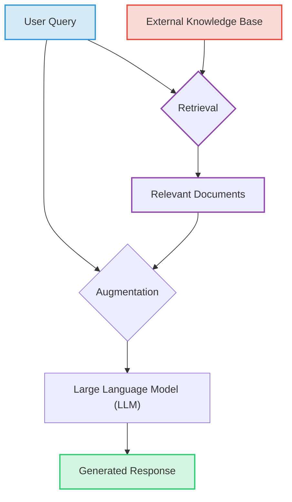
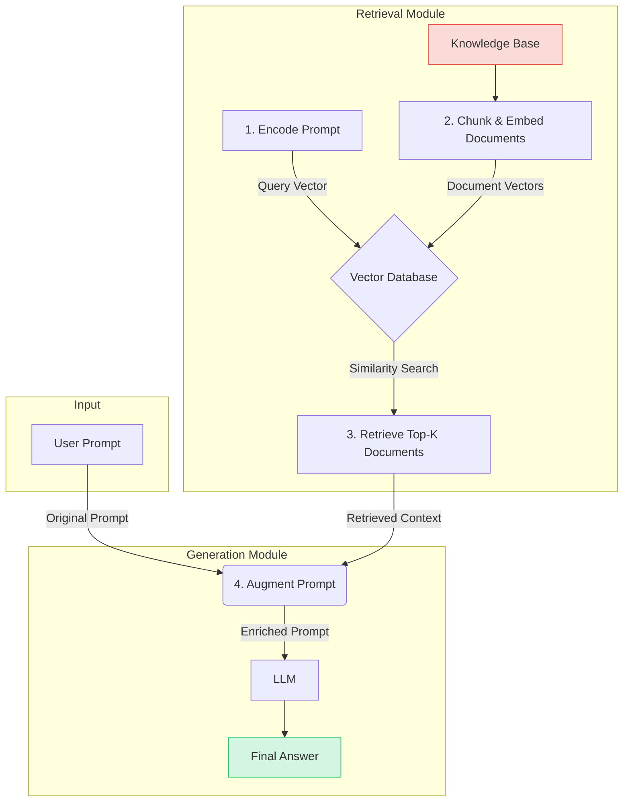
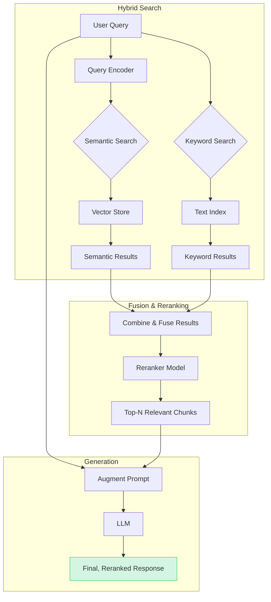

### Basic RAG Workflow

```mermaid
graph TD
    A[User Query] --> B{Retrieval};
    C[External Knowledge Base] --> B;
    B --> D[Relevant Documents];
    
    A --> E{Augmentation};
    D --> E;
    
    E --> F["Large Language Model (LLM)"];
    F --> G[Generated Response];

    style A fill:#D6EAF8,stroke:#3498DB,stroke-width:2px
    style C fill:#FADBD8,stroke:#E74C3C,stroke-width:2px
    style G fill:#D5F5E3,stroke:#2ECC71,stroke-width:2px
    style B E fill:#E8DAEF,stroke:#8E44AD,stroke-width:2px
    style D F fill:#D2B4DE,stroke:#8E44AD,stroke-width:2px
```

### Detailed RAG Architecture

```mermaid
graph TD
    subgraph "Input"
        direction TB
        A[User Prompt]
    end

    subgraph "Retrieval Module"
        direction TB
        B[1. Encode Prompt] -- Query Vector --> C{Vector Database};
        D[Knowledge Base] --> E[2. Chunk & Embed Documents];
        E -- Document Vectors --> C;
        C -- Similarity Search --> F[3. Retrieve Top-K Documents];
    end

    subgraph "Generation Module"
        direction TB
        G(4. Augment Prompt);
        A -- Original Prompt --> G;
        F -- Retrieved Context --> G;
        G -- Enriched Prompt --> H[LLM];
        H --> I[Final Answer];
    end

    style D fill:#FADBD8,stroke:#E74C3C
    style I fill:#D5F5E3,stroke:#2ECC71
```

### Advanced RAG: Hybrid Search and Reranking

```mermaid
graph TD
    A[User Query] --> B[Query Encoder];

    subgraph "Hybrid Search"
        B --> C{Semantic Search};
        C --> D[Vector Store];
        D --> E[Semantic Results];

        A --> F{Keyword Search};
        F --> G[Text Index];
        G --> H[Keyword Results];
    end

    subgraph "Fusion & Reranking"
        E --> I[Combine & Fuse Results];
        H --> I;
        I --> J[Reranker Model];
        J --> K[Top-N Relevant Chunks];
    end

    subgraph "Generation"
        A --> L[Augment Prompt];
        K --> L;
        L --> M[LLM];
        M --> N[Final, Reranked Response];
    end

    style N fill:#D5F5E3,stroke:#2ECC71
```
