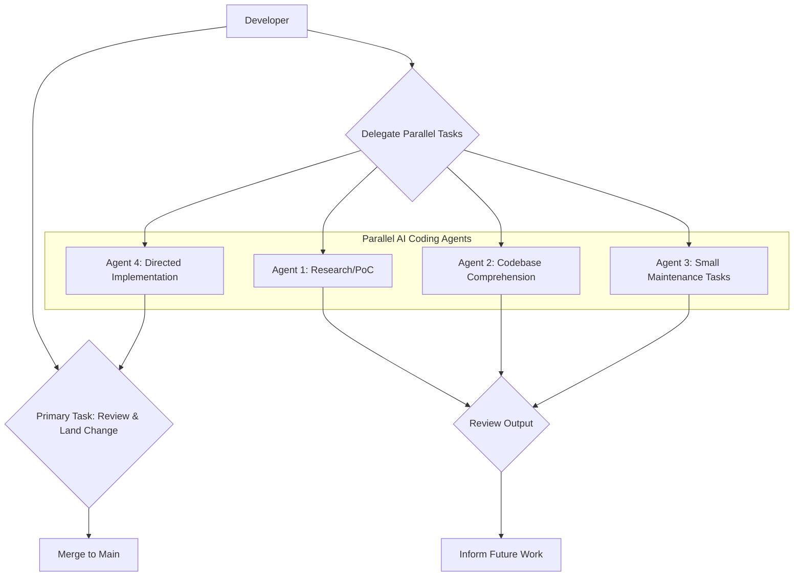
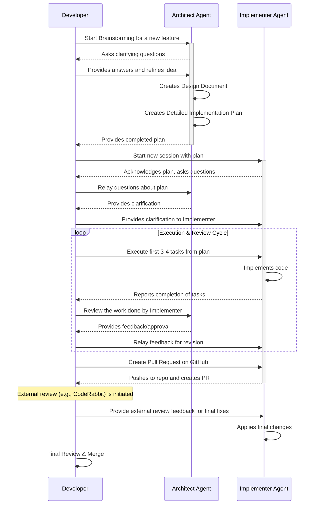
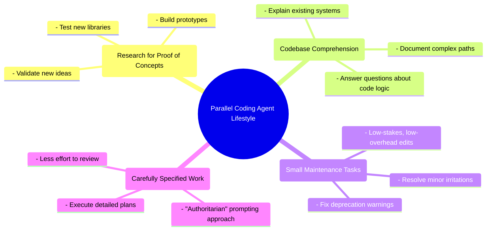

### High-Level Parallel Workflow

### The "Architect and Implementer" Workflow

### Key Patterns Mind Map

Sources:

- [https://simonwillison.net/2025/Oct/5/parallel-coding-agents/](https://simonwillison.net/2025/Oct/5/parallel-coding-agents/)
- [https://blog.fsck.com/2025/10/05/how-im-using-coding-agents-in-september-2025/](https://blog.fsck.com/2025/10/05/how-im-using-coding-agents-in-september-2025/)
