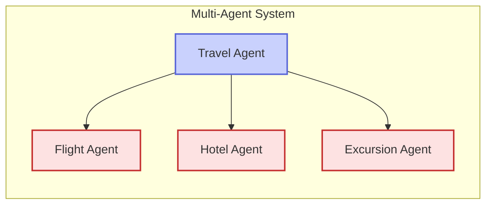
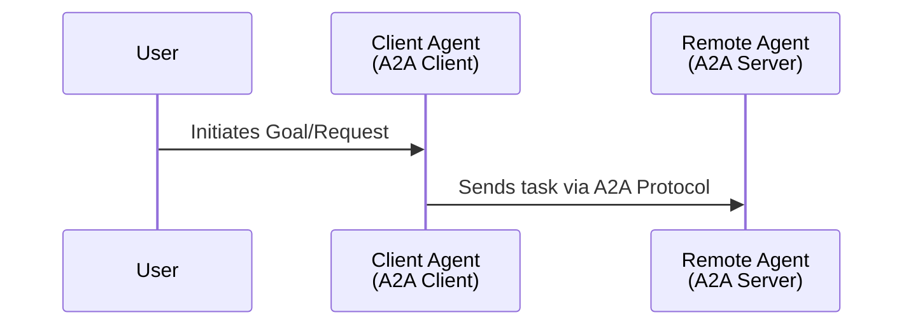
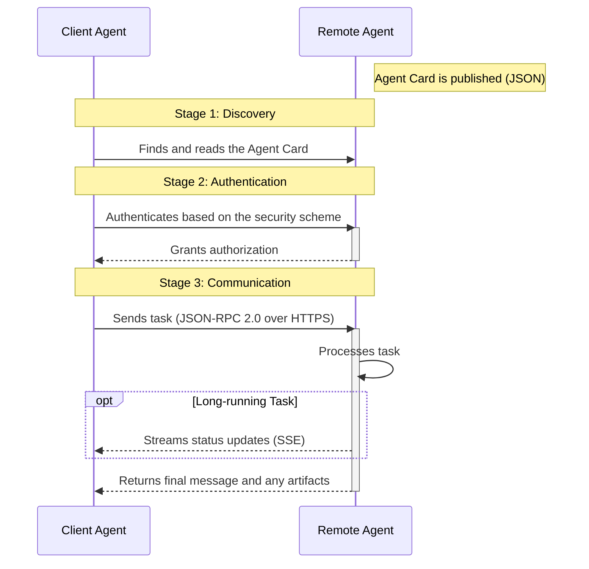

### Multi-Agent Collaboration Example

```mermaid
graph TD;
    subgraph "Multi-Agent System"
        direction TB
        TravelAgent["Travel Agent"];
        FlightAgent["Flight Agent"];
        HotelAgent["Hotel Agent"];
        ExcursionAgent["Excursion Agent"];
    end

    TravelAgent --> FlightAgent;
    TravelAgent --> HotelAgent;
    TravelAgent --> ExcursionAgent;

    %% Define style classes
    classDef primaryAgent fill:#c9d1fd,stroke:#5a67d8,stroke-width:2px;
    classDef secondaryAgent fill:#fde2e2,stroke:#c53030,stroke-width:2px;

    %% Apply classes to nodes
    class TravelAgent primaryAgent;
    class FlightAgent,HotelAgent,ExcursionAgent secondaryAgent;
```

### Core Actors in A2A Interactions

```mermaid
sequenceDiagram
    participant User
    participant ClientAgent as Client Agent<br>(A2A Client)
    participant RemoteAgent as Remote Agent<br>(A2A Server)

    User->>ClientAgent: Initiates Goal/Request
    ClientAgent->>RemoteAgent: Sends task via A2A Protocol
```

### The Three Stages of A2A Communication

```mermaid
sequenceDiagram
    participant Client as Client Agent
    participant Remote as Remote Agent

    Note right of Remote: Agent Card is published (JSON)

    Note over Client,Remote: Stage 1: Discovery
    Client->>Remote: Finds and reads the Agent Card

    Note over Client,Remote: Stage 2: Authentication
    Client->>Remote: Authenticates based on the security scheme
    activate Remote
    Remote-->>Client: Grants authorization
    deactivate Remote

    Note over Client,Remote: Stage 3: Communication
    Client->>Remote: Sends task (JSON-RPC 2.0 over HTTPS)
    activate Remote
    Remote->>Remote: Processes task
    
    opt Long-running Task
        Remote-->>Client: Streams status updates (SSE)
    end
    
    Remote-->>Client: Returns final message and any artifacts
    deactivate Remote
```
