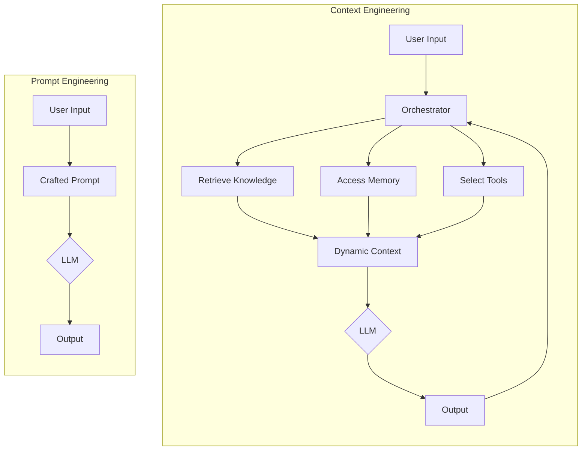
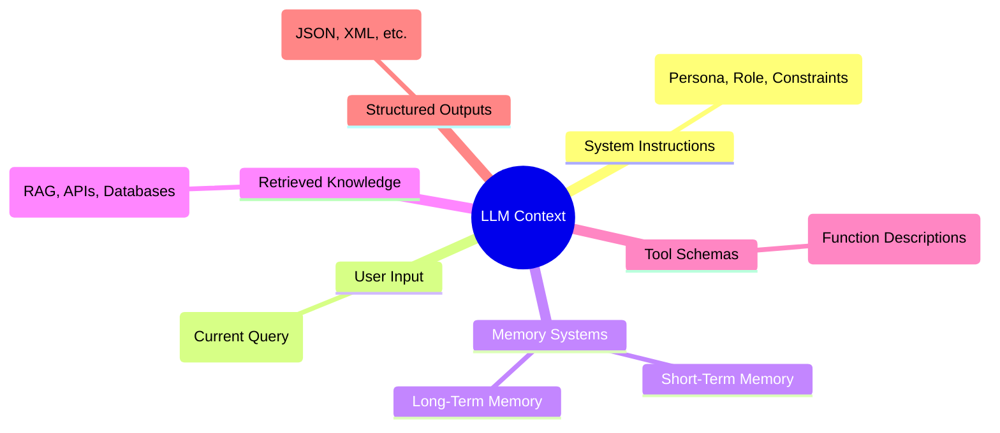
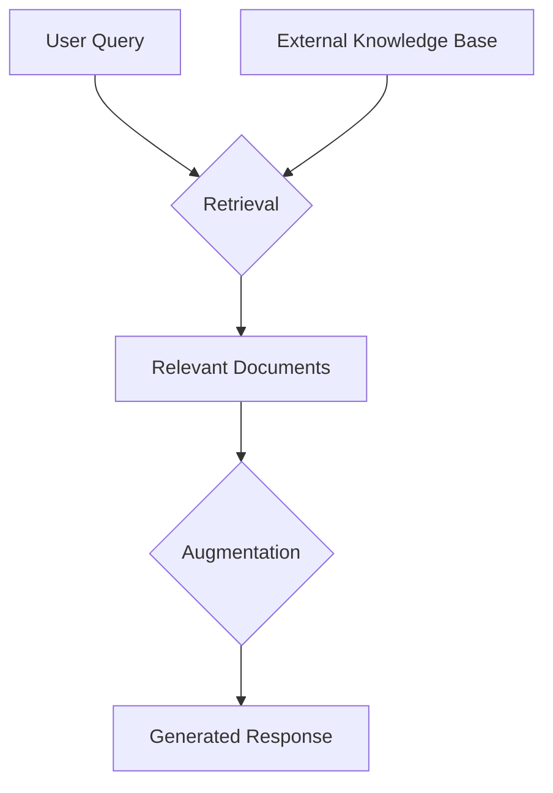
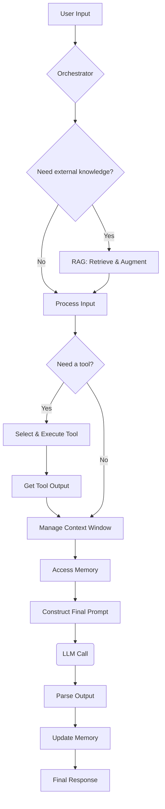

### Prompt Engineering vs. Context Engineering

```mermaid
graph TD
    subgraph "Context Engineering"
        direction TB
        E[User Input] --> F[Orchestrator];
        F --> G[Retrieve Knowledge];
        F --> H[Access Memory];
        F --> I[Select Tools];
        G --> J[Dynamic Context];
        H --> J;
        I --> J;
        J --> K{LLM};
        K --> L[Output];
        L --> F;
    end

    subgraph "Prompt Engineering"
        direction TB
        A[User Input] --> B[Crafted Prompt];
        B --> C{LLM};
        C --> D[Output];
    end
```

### Core Components of the LLM's Context

```mermaid
mindmap
  root((LLM Context))
    ::icon(fa fa-brain)
    System Instructions
      (Persona, Role, Constraints)
    User Input
      (Current Query)
    Memory Systems
      Short-Term Memory
      Long-Term Memory
    Retrieved Knowledge
      (RAG, APIs, Databases)
    Tool Schemas
      (Function Descriptions)
    Structured Outputs
      (JSON, XML, etc.)
```

### Retrieval-Augmented Generation (RAG) Flow

```mermaid
graph TB
    A[User Query] --> B{Retrieval};
    C[External Knowledge Base] --> B;
    B --> D[Relevant Documents];
    D --> E{Augmentation};
    E --> F[Generated Response];
```

### Advanced Context Engineering Workflow

```mermaid
graph TD
    A[User Input] --> B{Orchestrator};
    B --> C{Need external knowledge?};
    C -- Yes --> D[RAG: Retrieve & Augment];
    C -- No --> E[Process Input];
    D --> E;
    E --> F{Need a tool?};
    F -- Yes --> G[Select & Execute Tool];
    G --> H[Get Tool Output];
    H --> I;
    F -- No --> I[Manage Context Window];
    I --> J[Access Memory];
    J --> K[Construct Final Prompt];
    K --> L(LLM Call);
    L --> M[Parse Output];
    M --> N[Update Memory];
    N --> O[Final Response];
```
