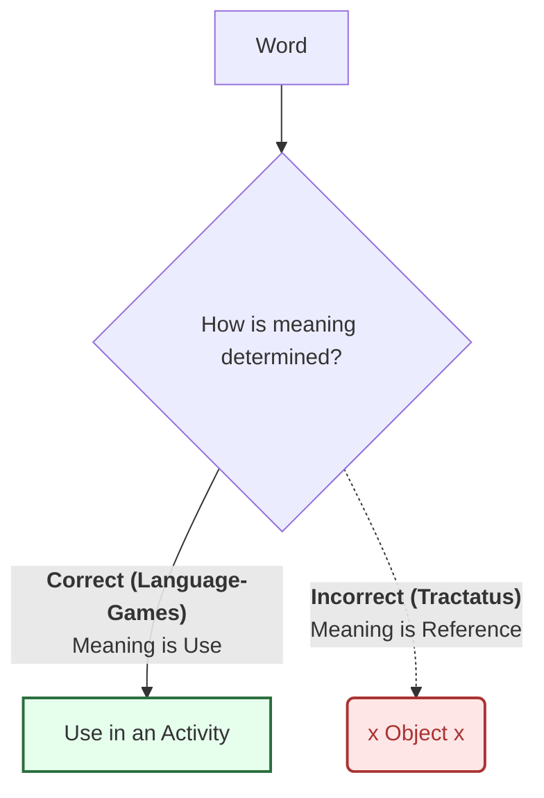
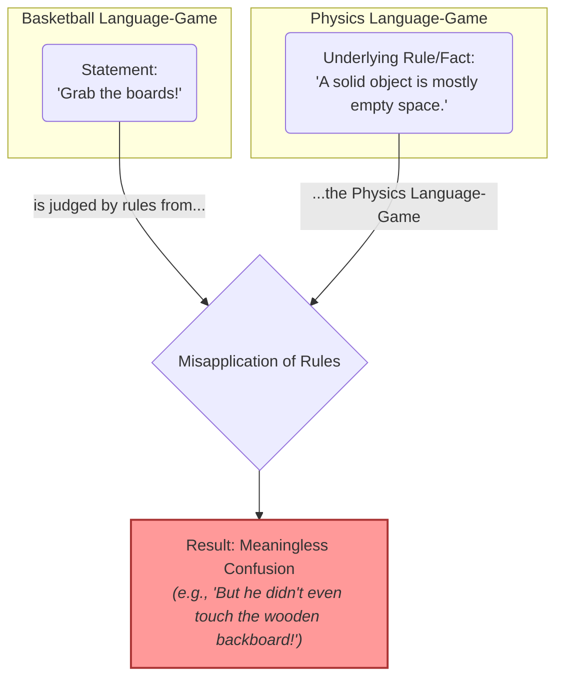
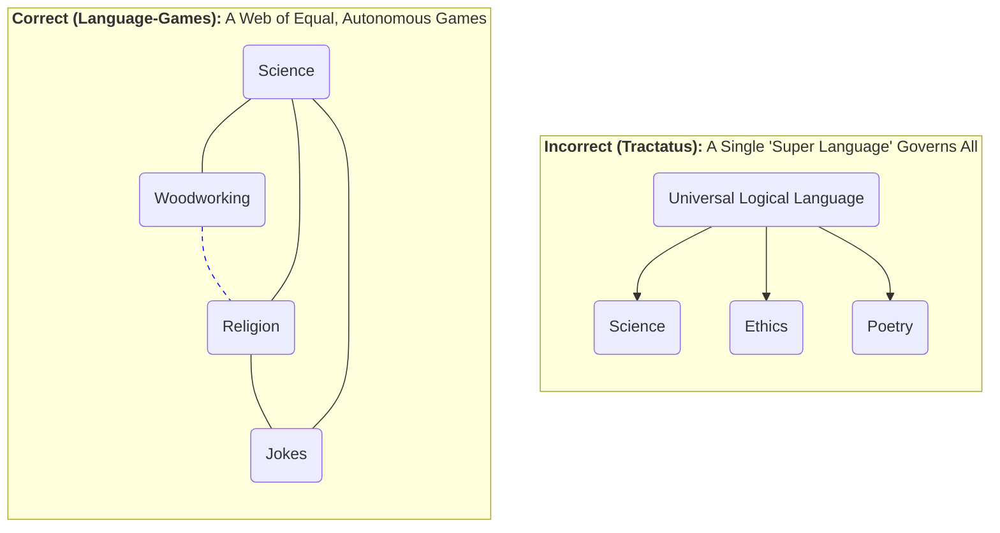
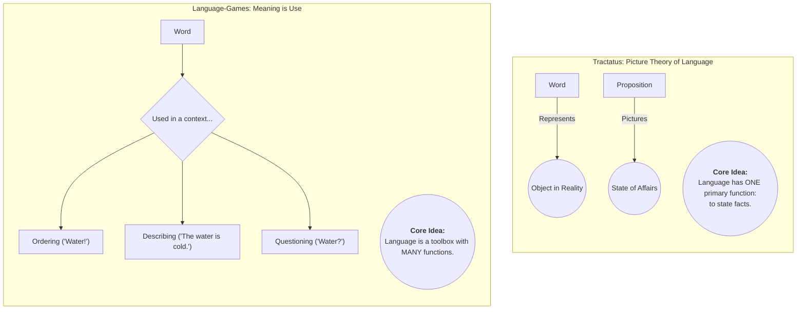
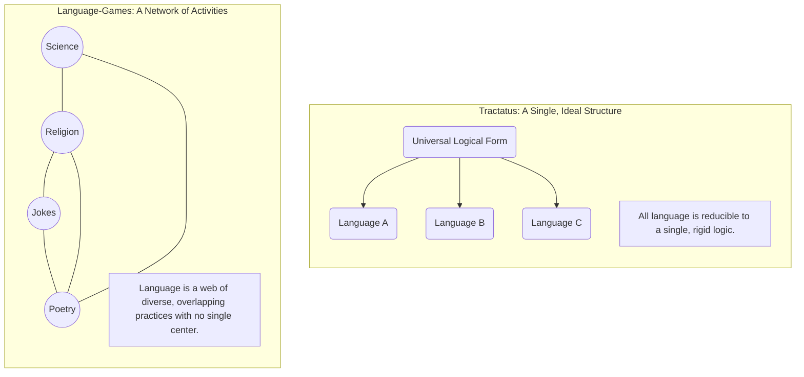
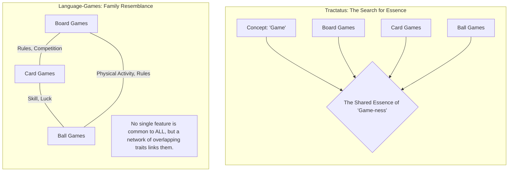
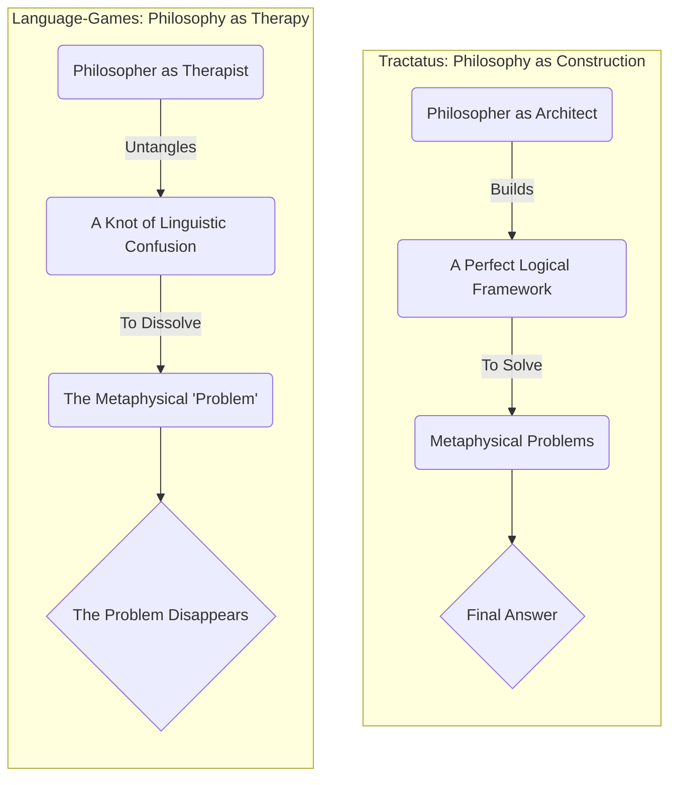

### The Meaning of a Word

### Mixing Language Games

### No Super Language

### The Function of Language: Picture vs. Toolbox

### The Structure of Language: A Single Logic vs. Countless Games

### The Nature of Concepts: Essence vs. Family Resemblance

### The Role of Philosophy: Architect vs. Therapist

