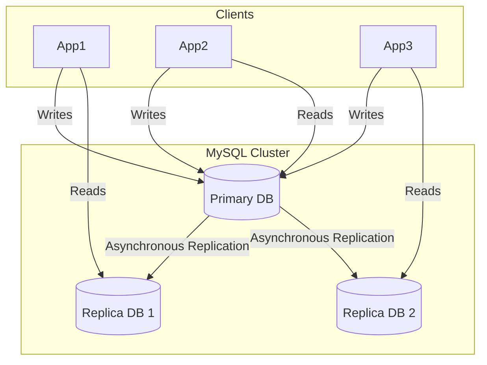
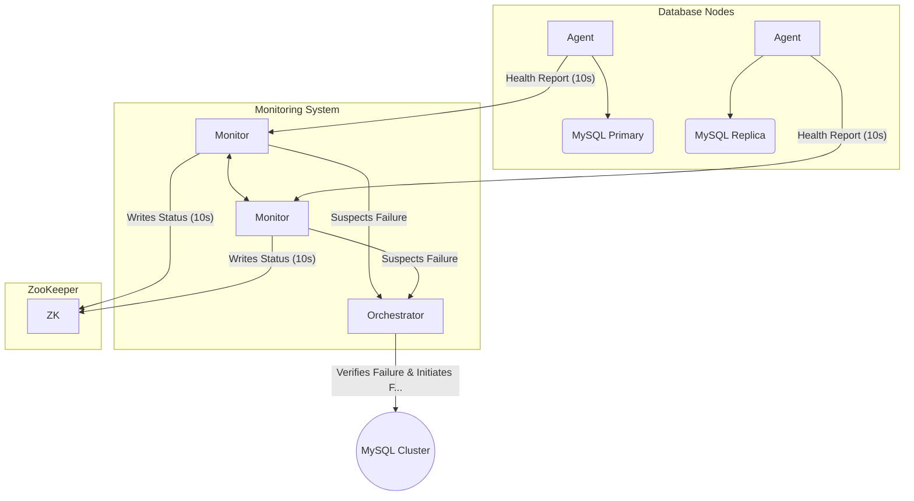
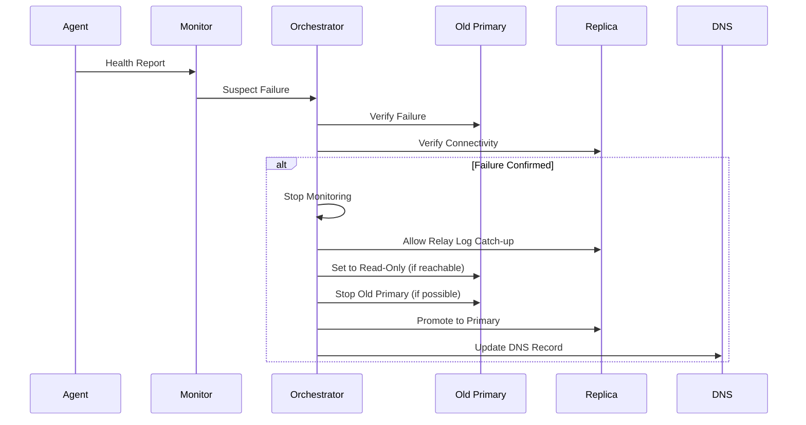
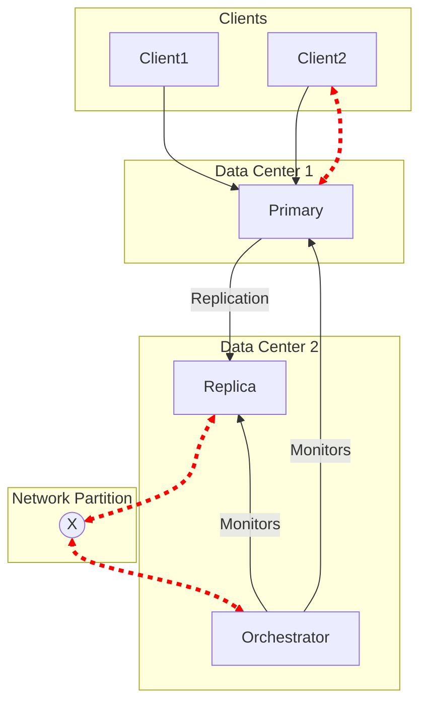
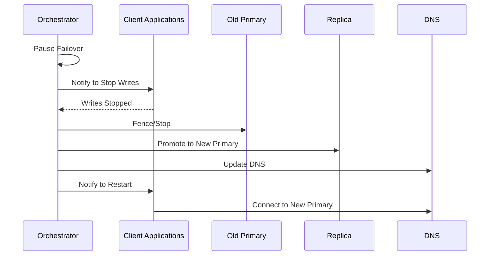

### High-Availability Model

### Failure Detection Architecture

### Failover Workflow

### Split-Brain Scenario

### Split-Brain Prevention

Sources:

- [How Flipkart Built a Highly Available MySQL Cluster for 150+ Million Users](https://blog.bytebytego.com/p/how-flipkart-built-a-highly-available)
