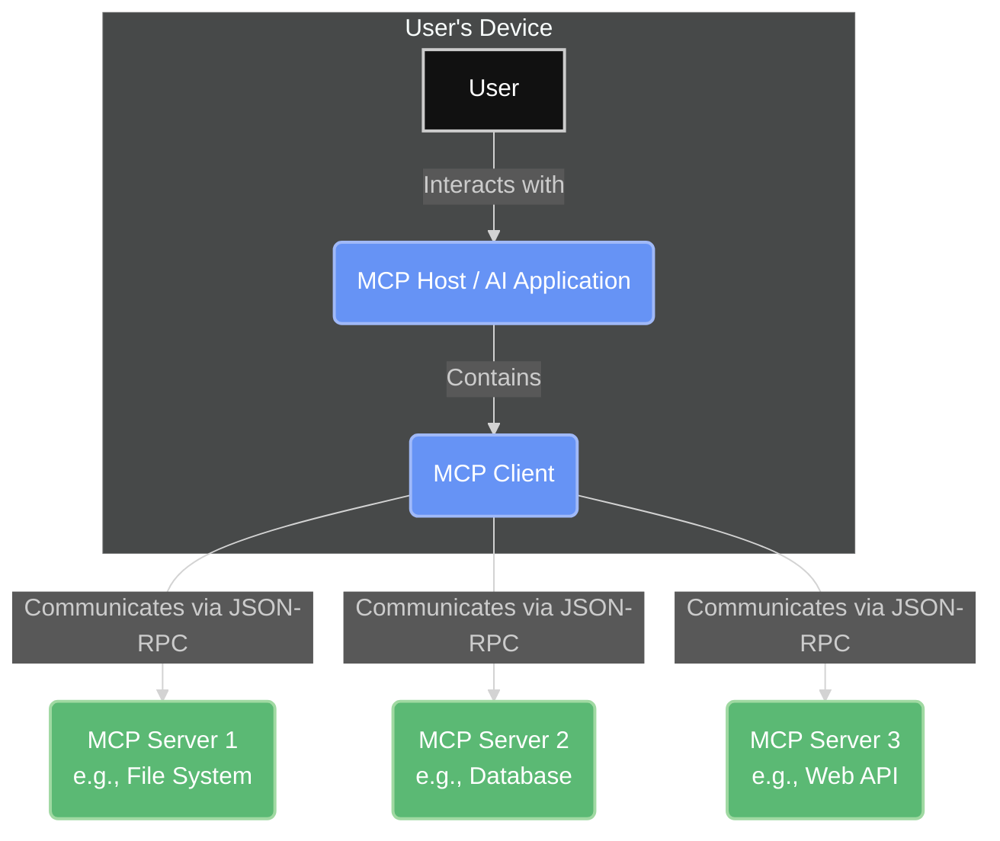
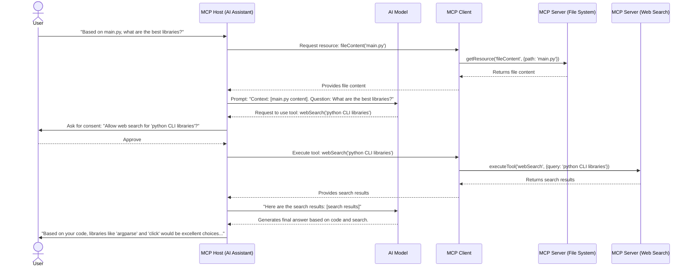

### MCP Architecture

```mermaid
%%{init: {'theme': 'dark'}}%%
graph TD
    subgraph User's Device
        User -- "Interacts with" --> Host(MCP Host / AI Application)
        Host -- "Contains" --> Client(MCP Client)
    end

    Client -- "Communicates via JSON-RPC" --> Server1(MCP Server 1<br>e.g., File System)
    Client -- "Communicates via JSON-RPC" --> Server2(MCP Server 2<br>e.g., Database)
    Client -- "Communicates via JSON-RPC" --> Server3(MCP Server 3<br>e.g., Web API)

    %% Styling to better match the image %%
    style User fill:#111,stroke:#ccc,stroke-width:2px,color:#fff
    style Host fill:#6693F5,stroke:#A0B9F8,stroke-width:2px,color:#fff
    style Client fill:#6693F5,stroke:#A0B9F8,stroke-width:2px,color:#fff
    style Server1 fill:#5BB974,stroke:#A0D9A2,stroke-width:2px,color:#fff
    style Server2 fill:#5BB974,stroke:#A0D9A2,stroke-width:2px,color:#fff
    style Server3 fill:#5BB974,stroke:#A0D9A2,stroke-width:2px,color:#fff
```

### Interaction Flow: AI Coding Assistant

```mermaid
sequenceDiagram
    actor User
    participant Host as MCP Host (AI Assistant)
    participant Model as AI Model
    participant Client as MCP Client
    participant FSS as MCP Server (File System)
    participant WSS as MCP Server (Web Search)

    User->>Host: "Based on main.py, what are the best libraries?"

    Host->>Client: Request resource: fileContent('main.py')
    Client->>FSS: getResource('fileContent', {path: 'main.py'})
    FSS-->>Client: Returns file content
    Client-->>Host: Provides file content

    Host->>Model: Prompt: "Context: [main.py content]. Question: What are the best libraries?"
    Model-->>Host: Request to use tool: webSearch('python CLI libraries')

    Host->>User: Ask for consent: "Allow web search for 'python CLI libraries'?"
    User-->>Host: Approve

    Host->>Client: Execute tool: webSearch('python CLI libraries')
    Client->>WSS: executeTool('webSearch', {query: 'python CLI libraries'})
    WSS-->>Client: Returns search results
    Client-->>Host: Provides search results

    Host->>Model: "Here are the search results: [search results]"
    Model-->>Host: Generates final answer based on code and search.

    Host->>User: "Based on your code, libraries like 'argparse' and 'click' would be excellent choices..."
```
