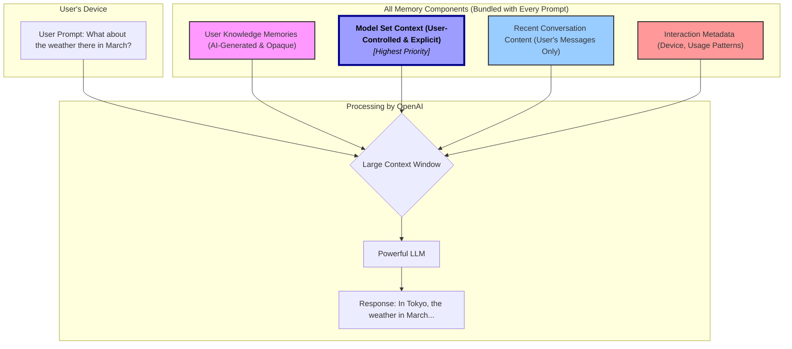
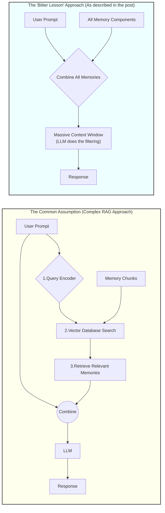

### The Layered Architecture of ChatGPT's Memory

### The "Bitter Lesson" Approach vs. The Common RAG Assumption

Sources:

- [ChatGPT Memory and the Bitter Lesson](https://www.shloked.com/writing/chatgpt-memory-bitter-lesson)
