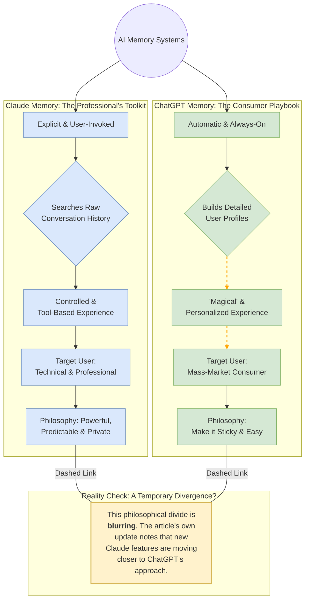
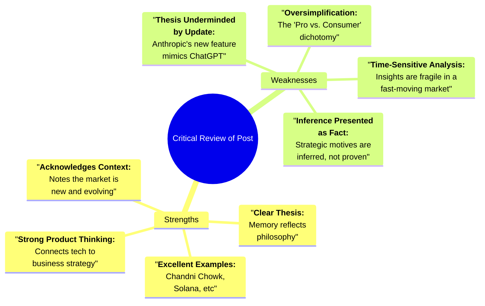

### The Divergent Philosophies of AI Memory

```mermaid
graph TD
    subgraph "Claude Memory: The Professional's Toolkit"
        direction TB
        B1[Explicit & User-Invoked] --> B2{"Searches Raw<br>Conversation History"};
        B2 --> B3["Controlled &<br>Tool-Based Experience"];
        B3 --> B4["Target User:<br>Technical & Professional"];
        B4 --> B5["Philosophy: Powerful,<br>Predictable & Private"];
    end

    subgraph "ChatGPT Memory: The Consumer Playbook"
        direction TB
        A1[Automatic & Always-On] --> A2{"Builds Detailed<br>User Profiles"};
        A2 --> A3["'Magical' &<br>Personalized Experience"];
        A3 --> A4["Target User:<br>Mass-Market Consumer"];
        A4 --> A5["Philosophy:<br>Make it Sticky & Easy"];
    end

    %% Central Concept and Connections
    Start((AI Memory Systems)) --> B1;
    Start --> A1;

    %% --- Critical Analysis Layer ---
    subgraph "Reality Check: A Temporary Divergence?"
        direction LR
        Critique["This philosophical divide is<br><b>blurring</b>. The article's own<br>update notes that new<br>Claude features are moving<br>closer to ChatGPT's approach."]
    end

    %% Link the critique to the core concept
    B5 -- Dashed Link --- Critique;
    A5 -- Dashed Link --- Critique;
    linkStyle 5 stroke-dasharray: 5 5, stroke:orange, stroke-width:2px;
    linkStyle 6 stroke-dasharray: 5 5, stroke:orange, stroke-width:2px;
    
    %% Styling
    style Critique fill:#FFF2CC,stroke:#D6B656,stroke-width:2px
    style B1 fill:#DAE8FC,stroke:#6C8EBF
    style B2 fill:#DAE8FC,stroke:#6C8EBF
    style B3 fill:#DAE8FC,stroke:#6C8EBF
    style B4 fill:#DAE8FC,stroke:#6C8EBF
    style B5 fill:#DAE8FC,stroke:#6C8EBF
    style A1 fill:#D5E8D4,stroke:#82B366
    style A2 fill:#D5E8D4,stroke:#82B366
    style A3 fill:#D5E8D4,stroke:#82B366
    style A4 fill:#D5E8D4,stroke:#82B366
    style A5 fill:#D5E8D4,stroke:#82B366
```

### Critical Analysis of the Blog Post

```mermaid
mindmap
  root((Critical Review of Post))
    ::icon(fa fa-balance-scale)
    Strengths
      ::icon(fa fa-thumbs-up)
      "<b>Clear Thesis:</b><br>Memory reflects<br>philosophy"
      "<b>Excellent Examples:</b><br>Chandni Chowk,<br>Solana, etc"
      "<b>Strong Product Thinking:</b><br>Connects tech to<br>business strategy"
      "<b>Acknowledges Context:</b><br>Notes the market is<br>new and evolving"
    Weaknesses
      ::icon(fa fa-thumbs-down)
      "<b>Thesis Underminded<br>by Update:</b><br>Anthropic's new feature<br>mimics ChatGPT"
      "<b>Oversimplification:</b><br>The 'Pro vs. Consumer'<br>dichotomy"
      "<b>Time-Sensitive Analysis:</b><br>Insights are fragile in a<br>fast-moving market"
      "<b>Inference Presented<br>as Fact:</b><br>Strategic motives are<br>inferred, not proven"
```

Sources:

- [Claude Memory: A Different Philosophy](https://www.shloked.com/writing/claude-memory)
