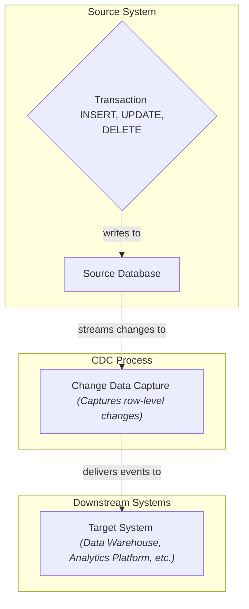
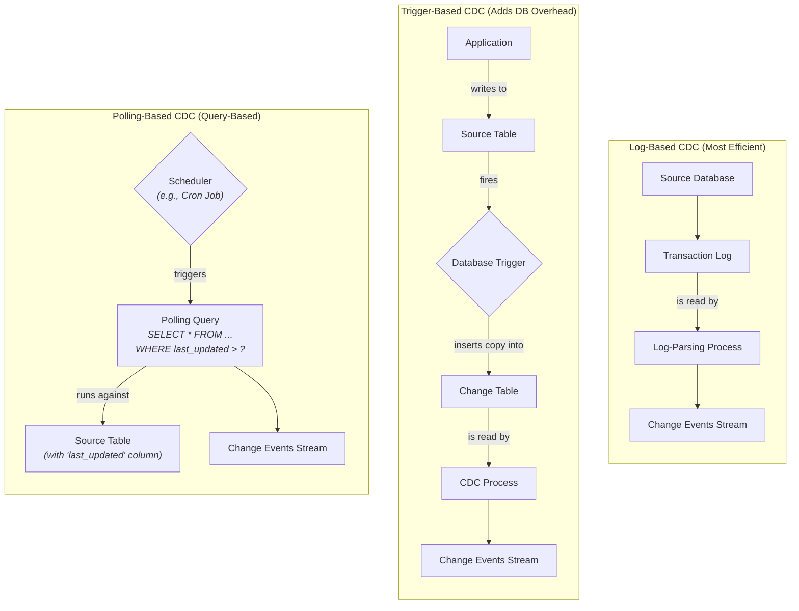
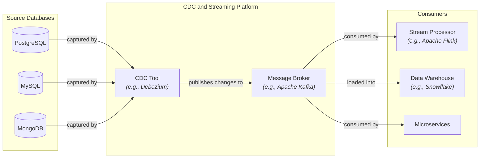

### High-Level Overview of CDC

```mermaid
graph TD
    subgraph Source System
        B{Transaction <br/> INSERT, UPDATE, DELETE}
        A[Source Database]
    end

    subgraph CDC Process
        C["Change Data Capture <br/><i>(Captures row-level changes)</i>"]
    end

    subgraph Downstream Systems
        D["Target System <br/><i>(Data Warehouse, Analytics Platform, etc.)</i>"]
    end

    B -- writes to --> A
    A -- streams changes to --> C
    C -- delivers events to --> D
```

### Comparison of CDC Methodologies

```mermaid
graph TD
    subgraph "Log-Based CDC (Most Efficient)"
        direction TB
        A1[Source Database]
        A2[Transaction Log]
        A3[Log-Parsing Process]
        A4[Change Events Stream]

        A1 --> A2
        A2 -- is read by --> A3
        A3 --> A4
    end

    subgraph "Trigger-Based CDC (Adds DB Overhead)"
        direction TB
        B1[Application]
        B2[Source Table]
        B3{Database Trigger}
        B4[Change Table]
        B5[CDC Process]
        B6[Change Events Stream]

        B1 -- writes to --> B2
        B2 -- fires --> B3
        B3 -- inserts copy into --> B4
        B4 -- is read by --> B5
        B5 --> B6
    end

    subgraph "Polling-Based CDC (Query-Based)"
        direction TB
        C2{"Scheduler <br/><i>(e.g., Cron Job)</i>"}
        C3["Polling Query <br/><i>SELECT * FROM ... <br/> WHERE last_updated > ?</i>"]
        C1["Source Table <br/><i>(with 'last_updated' column)</i>"]
        C4[Change Events Stream]

        C2 -- triggers --> C3
        C3 -- runs against --> C1
        C3 --> C4
    end
```

### CDC in a Modern Data Architecture

```mermaid
graph LR
    subgraph Source Databases
        db1[(PostgreSQL)]
        db2[(MySQL)]
        db3[(MongoDB)]
    end

    subgraph CDC and Streaming Platform
        cdc["CDC Tool <br/><i>(e.g., Debezium)</i>"]
        broker["Message Broker <br/><i>(e.g., Apache Kafka)</i>"]
        cdc -- publishes changes to --> broker
    end

    subgraph Consumers
        consumer1["Stream Processor <br/><i>(e.g., Apache Flink)</i>"]
        consumer2["Data Warehouse <br/><i>(e.g., Snowflake)</i>"]
        consumer3[Microservices]
    end

    db1 -- captured by --> cdc
    db2 -- captured by --> cdc
    db3 -- captured by --> cdc

    broker -- consumed by --> consumer1
    broker -- loaded into --> consumer2
    broker -- consumed by --> consumer3
```
