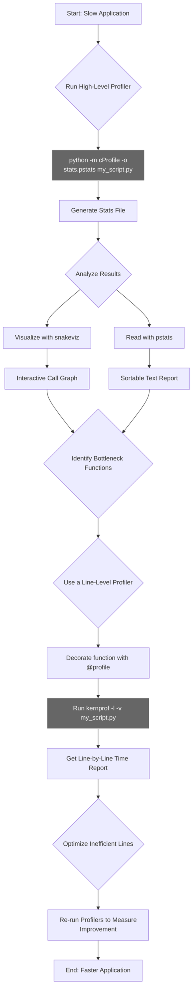
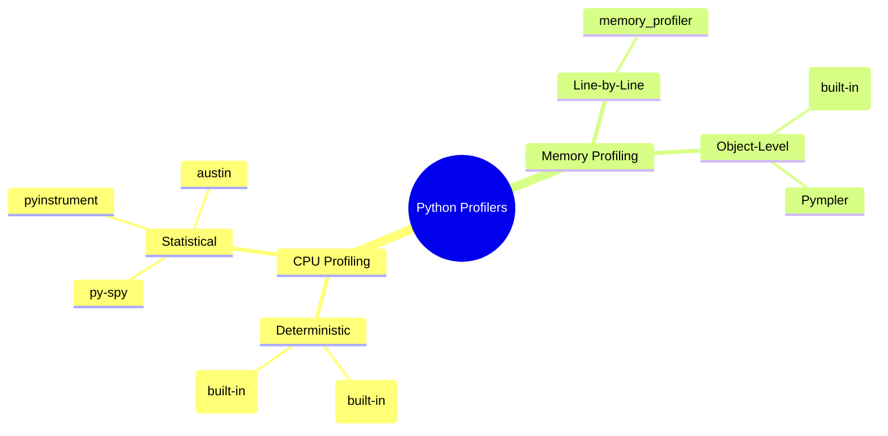
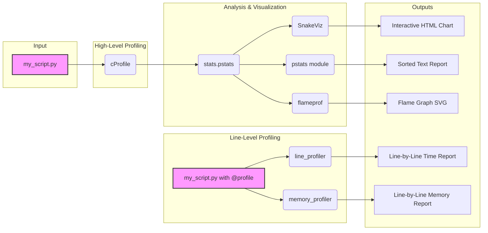

### General Python Profiling Workflow

```mermaid
graph TD
    A[Start: Slow Application] --> B{Run High-Level Profiler};
    B --> B_CMD["python -m cProfile -o <br> stats.pstats my_script.py"];
    B_CMD --> C[Generate Stats File];
    C --> D{Analyze Results};
    
    D --> D_L1[Visualize with snakeviz];
    D_L1 --> D_L2[Interactive Call Graph];
    
    D --> D_R1[Read with pstats];
    D_R1 --> D_R2[Sortable Text Report];
    
    D_L2 --> E{Identify Bottleneck Functions};
    D_R2 --> E;
    
    E --> F{Use a Line-Level Profiler};
    F --> G[Decorate function with @profile];
    G --> H_CMD["Run kernprof -l -v my_script.py"];
    H_CMD --> I[Get Line-by-Line Time Report];
    
    I --> J{Optimize Inefficient Lines};
    J --> K[Re-run Profilers to Measure <br> Improvement];
    K --> L[End: Faster Application];

    %% Styling for the command nodes to match the image
    style B_CMD fill:#666,color:#fff,stroke:#fff,stroke-width:1px
    style H_CMD fill:#666,color:#fff,stroke:#fff,stroke-width:1px
```

### Types of Python Profilers

```mermaid
mindmap
  root((Python Profilers))
    ::icon(fa fa-cogs)
    CPU Profiling
      Deterministic
        ::icon(fa fa-search)
        cProfile (built-in)
        profile (built-in)
      Statistical
        ::icon(fa fa-chart-bar)
        py-spy
        pyinstrument
        austin
    Memory Profiling
      ::icon(fa fa-memory)
      Line-by-Line
        memory_profiler
      Object-Level
        tracemalloc (built-in)
        Pympler
```

### Profiling Tools and Their Outputs

```mermaid
graph LR
    subgraph Input
        A[my_script.py]
    end

    subgraph High-Level Profiling
        B(cProfile)
    end

    subgraph Analysis & Visualization
        C(stats.pstats)
        D(SnakeViz)
        E(pstats module)
        F(flameprof)
    end
    
    subgraph Line-Level Profiling
        G[my_script.py with @profile]
        H(line_profiler)
        I(memory_profiler)
    end

    subgraph Outputs
        J[Interactive HTML Chart]
        K[Sorted Text Report]
        L[Flame Graph SVG]
        M[Line-by-Line Time Report]
        N[Line-by-Line Memory Report]
    end

    A --> B;
    B --> C;
    C --> D;
    C --> E;
    C --> F;
    
    D --> J;
    E --> K;
    F --> L;

    G --> H;
    G --> I;

    H --> M;
    I --> N;

    style A fill:#f9f,stroke:#333,stroke-width:2px
    style G fill:#f9f,stroke:#333,stroke-width:2px
```
