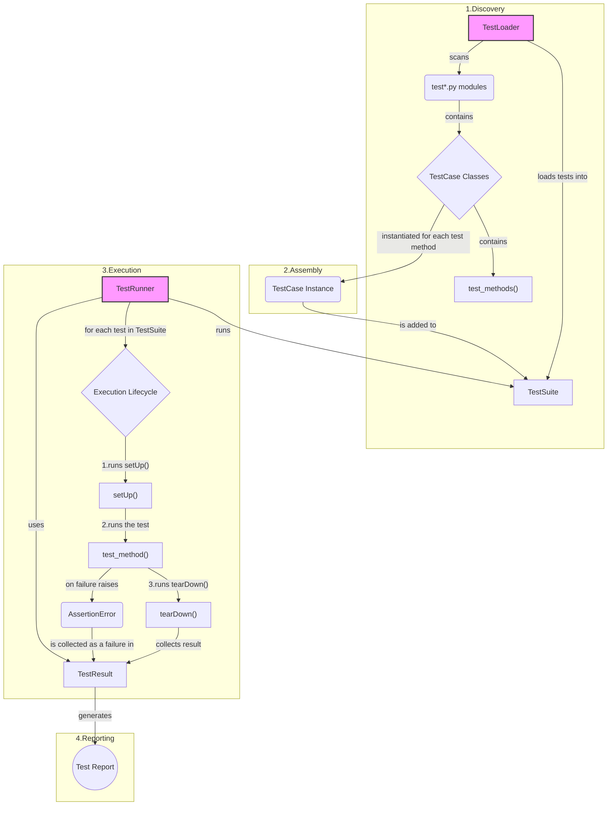
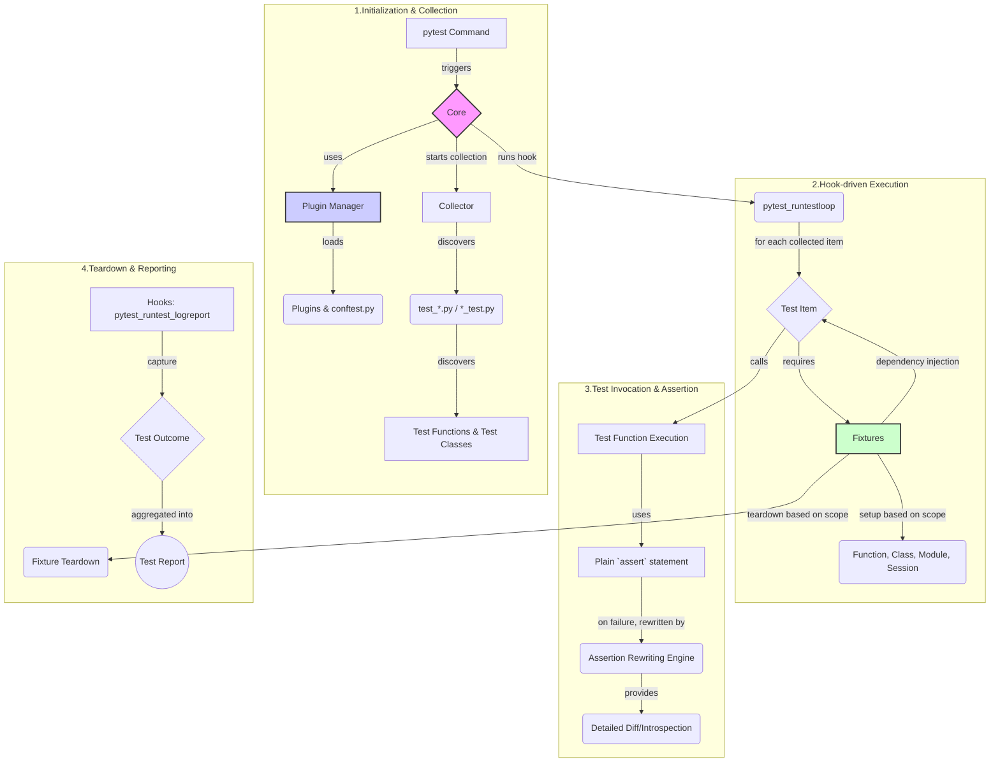

### unittest Architecture and Execution Flow

```mermaid
graph TD
    subgraph "1.Discovery"
        A[TestLoader] -- scans --> B("test*.py modules");
        B -- "contains" --> C{"TestCase Classes"};
        C -- "contains" --> D["test_methods()"];
        A -- "loads tests into" --> E;
    end

    subgraph "2.Assembly"
        C -- "instantiated for each test method" --> F(TestCase Instance);
        F -- "is added to" --> E[TestSuite];
    end

    subgraph "3.Execution"
        G[TestRunner] -- runs --> E;
        G -- "for each test in TestSuite" --> H{"Execution Lifecycle"};
        H -- "1.runs setUp()" --> I["setUp()"];
        I -- "2.runs the test" --> J["test_method()"];
        J -- "3.runs tearDown()" --> K["tearDown()"];
        J -- "on failure raises" --> L(AssertionError);
        K -- "collects result" --> M[TestResult];
        L -- "is collected as a failure in" --> M;
        G -- "uses" --> M;
    end

    subgraph "4.Reporting"
       M -- "generates" --> N((Test Report));
    end

    style A fill:#f9f,stroke:#333,stroke-width:2px
    style G fill:#f9f,stroke:#333,stroke-width:2px
```

### pytest Architecture and Execution Flow

```mermaid
graph TD
    subgraph "1.Initialization & Collection"
        A[pytest Command] -- triggers --> B{Core};
        B -- uses --> C[Plugin Manager];
        C -- loads --> D(Plugins & conftest.py);
        B -- starts collection --> E[Collector];
        E -- discovers --> F(test_*.py / *_test.py);
        F -- discovers --> G[Test Functions & Test Classes];
    end

    subgraph "2.Hook-driven Execution"
        B -- runs hook --> H(pytest_runtestloop);
        H -- for each collected item --> I{Test Item};
        I -- requires --> J[Fixtures];
        J -- dependency injection --> I;
        J -- setup based on scope --> K(Function, Class, Module, Session);
    end

    subgraph "3.Test Invocation & Assertion"
        I -- calls --> L[Test Function Execution];
        L -- uses --> M["Plain `assert` statement"];
        M -- on failure, rewritten by --> N(Assertion Rewriting Engine);
        N -- provides --> O(Detailed Diff/Introspection);
    end

    subgraph "4.Teardown & Reporting"
        P[Hooks: pytest_runtest_logreport] -- capture --> Q{Test Outcome};
        J -- teardown based on scope --> R(Fixture Teardown);
        Q -- aggregated into --> S((Test Report));
    end

    style B fill:#f9f,stroke:#333,stroke-width:2px
    style C fill:#ccf,stroke:#333,stroke-width:2px
    style J fill:#cfc,stroke:#333,stroke-width:2px
```
