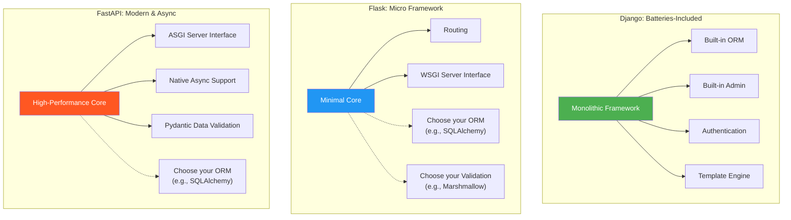
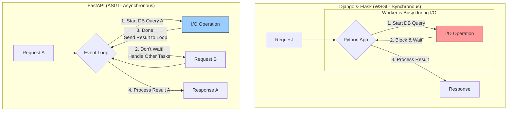
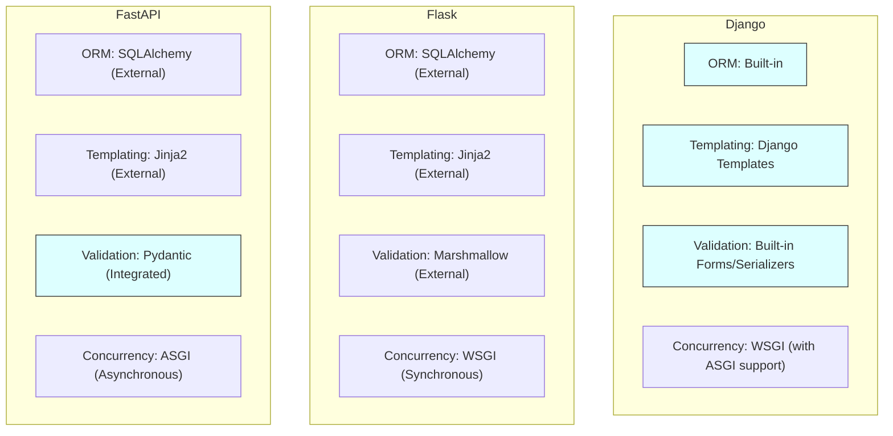
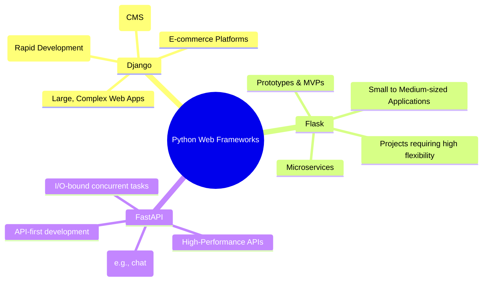

### Architectural Philosophy

```mermaid
graph TD
    subgraph "Django: Batteries-Included"
        A[Monolithic Framework]
        A --> ORM[Built-in ORM]
        A --> Admin[Built-in Admin]
        A --> Auth[Authentication]
        A --> Templating[Template Engine]
    end

    subgraph "Flask: Micro Framework"
        B[Minimal Core]
        B --> Routing[Routing]
        B --> WSGI[WSGI Server Interface]
        B -.-> External_ORM["Choose your ORM <br> (e.g., SQLAlchemy)"]
        B -.-> External_Validation["Choose your Validation <br> (e.g., Marshmallow)"]
    end

    subgraph "FastAPI: Modern & Async"
        C[High-Performance Core]
        C --> ASGI[ASGI Server Interface]
        C --> Async[Native Async Support]
        C --> Validation[Pydantic Data Validation]
        C -.-> External_ORM_FastAPI["Choose your ORM <br> (e.g., SQLAlchemy)"]
    end

    style A fill:#4CAF50,color:#fff
    style B fill:#2196F3,color:#fff
    style C fill:#FF5722,color:#fff
```

### Concurrency Model: WSGI vs. ASGI

```mermaid
graph TD
    subgraph "Django & Flask (WSGI - Synchronous)"
        direction LR
        Request1[Request] --> App_WSGI{Python App}
        App_WSGI -- "1. Start DB Query" --> DBOps_WSGI[I/O Operation]
        DBOps_WSGI -- "2. Block & Wait" --> App_WSGI
        App_WSGI -- "3. Process Result" --> Response1[Response]
        subgraph WorkerThread [Worker is Busy during I/O]
            App_WSGI
            DBOps_WSGI
        end
    end

    subgraph "FastAPI (ASGI - Asynchronous)"
        direction LR
        RequestA[Request A] --> App_ASGI{Event Loop}
        App_ASGI -- "1. Start DB Query A" --> DBOps_ASGI[I/O Operation]
        App_ASGI -- "2. Don't Wait! <br> Handle Other Tasks" --> RequestB[Request B]
        RequestB --> App_ASGI
        DBOps_ASGI -- "3. Done! <br> Send Result to Loop" --> App_ASGI
        App_ASGI -- "4. Process Result A" --> ResponseA[Response A]
    end

    style DBOps_WSGI fill:#f99,stroke:#333
    style DBOps_ASGI fill:#9cf,stroke:#333
```

### Core Component Comparison

```mermaid
graph TD
    subgraph Django
        D_ORM["ORM: Built-in"]
        D_Template["Templating: Django Templates"]
        D_Validation["Validation: Built-in Forms/Serializers"]
        D_Concurrency["Concurrency: WSGI (with ASGI support)"]
    end

    subgraph Flask
        F_ORM["ORM: SQLAlchemy (External)"]
        F_Template["Templating: Jinja2 (External)"]
        F_Validation["Validation: Marshmallow (External)"]
        F_Concurrency["Concurrency: WSGI (Synchronous)"]
    end

    subgraph FastAPI
        FA_ORM["ORM: SQLAlchemy (External)"]
        FA_Template["Templating: Jinja2 (External)"]
        FA_Validation["Validation: Pydantic (Integrated)"]
        FA_Concurrency["Concurrency: ASGI (Asynchronous)"]
    end

    style D_ORM fill:#dff,stroke:#333
    style D_Template fill:#dff,stroke:#333
    style D_Validation fill:#dff,stroke:#333
    style FA_Validation fill:#dff,stroke:#333
```

### Ideal Use Cases Mindmap

```mermaid
mindmap
  root((Python Web Frameworks))
    Django
      ::icon(fa fa-building)
      Large, Complex Web Apps
      Content Management Systems (CMS)
      E-commerce Platforms
      Projects with a deadline (Rapid Development)
    Flask
      ::icon(fa fa-cogs)
      Microservices
      Small to Medium-sized Applications
      Prototypes & MVPs
      Projects requiring high flexibility
    FastAPI
      ::icon(fa fa-rocket)
      High-Performance APIs
      Real-time applications (e.g., chat)
      I/O-bound concurrent tasks
      API-first development
```
