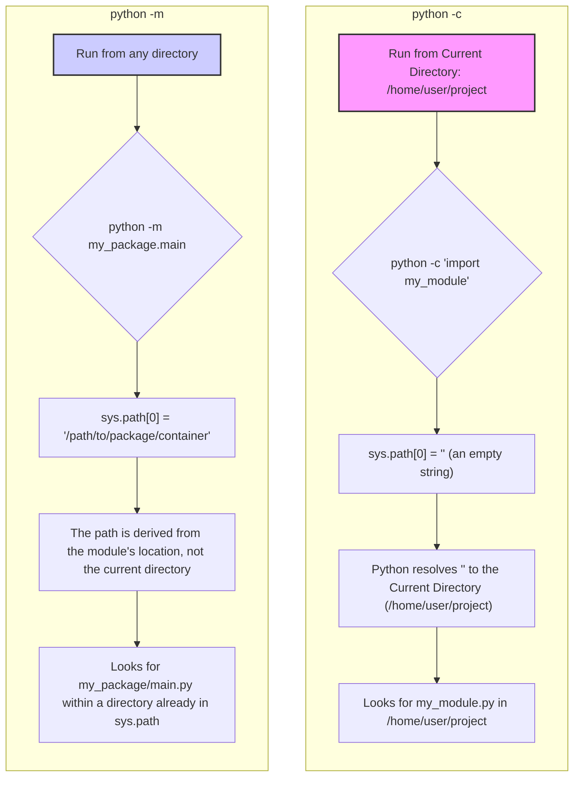
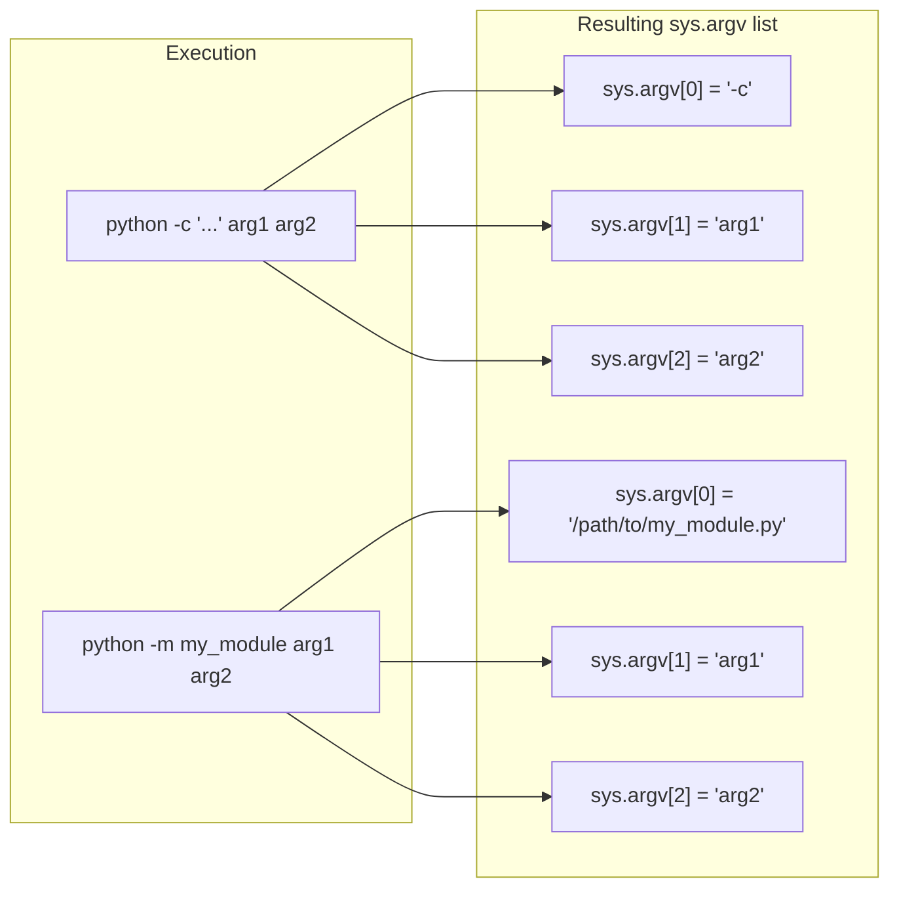
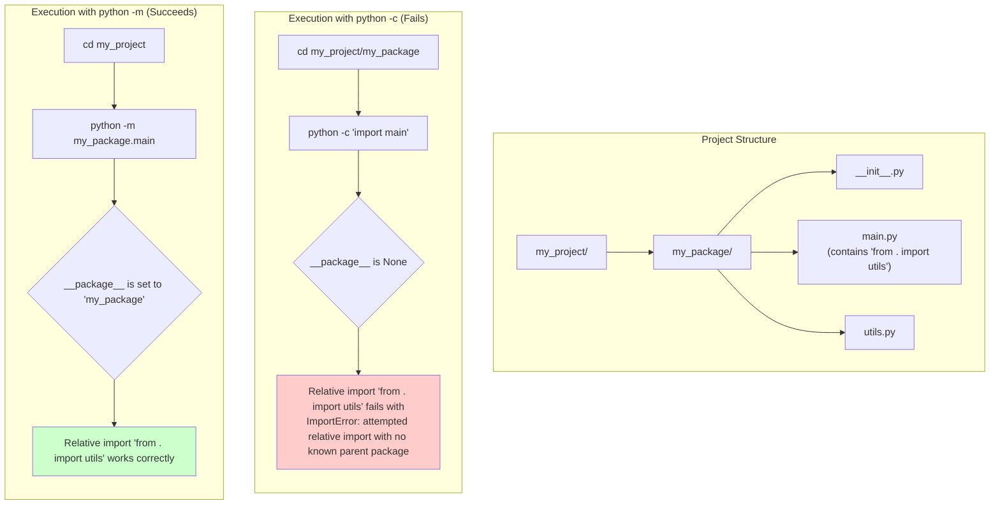
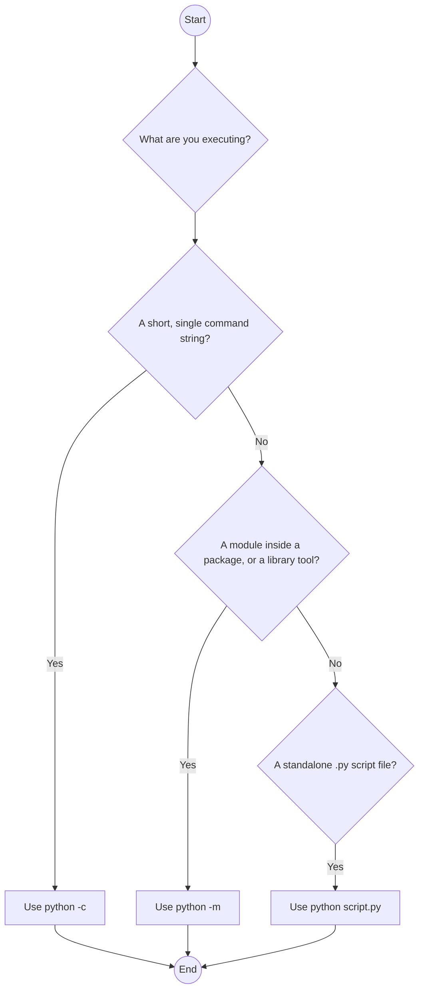

### sys.path Initialization

```mermaid
graph TD
    subgraph python -c
        direction TB

        A[Run from Current Directory: /home/user/project] --> B{python -c 'import my_module'};
        B --> C["sys.path[0] = '' (an empty string)"];
        C --> D["Python resolves '' to the Current Directory </br> (/home/user/project)"];
        D --> E[Looks for my_module.py in /home/user/project];
    end

    subgraph python -m
        direction TB

        F[Run from any directory] --> G{python -m my_package.main};
        G --> H["sys.path[0] = '/path/to/package/container'"];
        H --> I["The path is derived from the module's location, not the current directory"];
        I --> J[Looks for my_package/main.py within a directory already in sys.path];
    end

    style A fill:#f9f,stroke:#333,stroke-width:2px
    style F fill:#ccf,stroke:#333,stroke-width:2px
```

### sys.argv Structure

```mermaid
graph LR
    subgraph Execution
        A["python -c '...' arg1 arg2"]
        B["python -m my_module arg1 arg2"]
    end

    subgraph Resulting sys.argv list
        C["sys.argv[0] = '-c'"]
        D["sys.argv[1] = 'arg1'"]
        E["sys.argv[2] = 'arg2'"]

        F["sys.argv[0] = '/path/to/my_module.py'"]
        G["sys.argv[1] = 'arg1'"]
        H["sys.argv[2] = 'arg2'"]
    end

    A --> C;
    A --> D;
    A --> E;

    B --> F;
    B --> G;
    B --> H;
```

### Module and Package Context

```mermaid
graph TD
    subgraph "Project Structure"
        direction LR
        P["my_project/"] --> M["my_package/"];
        M --> M1["__init__.py"];
        M --> M2["main.py</br>(contains 'from . import utils')"];
        M --> M3["utils.py"];
    end

    subgraph "Execution with python -c (Fails)"
        direction TB
        C1["cd my_project/my_package"] --> C2["python -c 'import main'"];
        C2 --> C3{"__package__ is None"};
        C3 --> C4["Relative import 'from . import utils' fails with</br>ImportError: attempted relative import with no known parent package"];
    end

    subgraph "Execution with python -m (Succeeds)"
        direction TB
        M1_["cd my_project"] --> M2_["python -m my_package.main"];
        M2_ --> M3_{"__package__ is set to 'my_package'"};
        M3_ --> M4_["Relative import 'from . import utils' works correctly"];
    end

    style C4 fill:#ffcccc
    style M4_ fill:#ccffcc
```

### Decision Flowchart: When to Use Which

```mermaid
graph TD
    Start((Start)) --> A{What are you executing?};
    A --> B{A short, single command string?};
    B -- Yes --> C[Use python -c];
    B -- No --> D{A module inside a package, or a library tool?};
    D -- Yes --> E[Use python -m];
    D -- No --> F{A standalone .py script file?};
    F -- Yes --> G[Use python script.py];

    C --> End((End));
    E --> End((End));
    G --> End((End));
```
