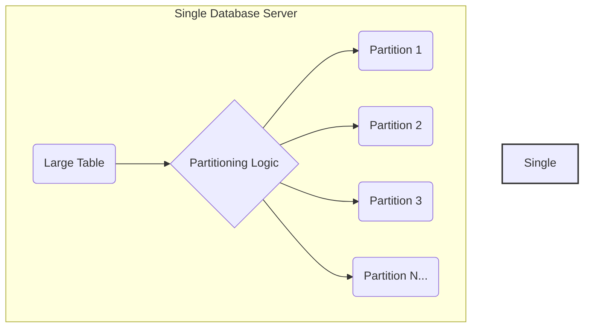
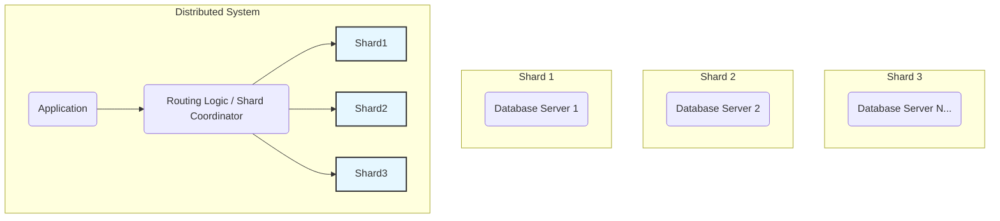

### Database Partitioning Diagram

```mermaid
graph TD
    subgraph Single Database Server
        A(Large Table) --> B{Partitioning Logic};
        B --> P1(Partition 1);
        B --> P2(Partition 2);
        B --> P3(Partition 3);
        B --> P4(Partition N...);
    end

    style Single Database Server fill:#f9f9f9,stroke:#333,stroke-width:2px
```

### Database Sharding Diagram

```mermaid
graph TD
    subgraph Shard 3
        direction LR
        DB3(Database Server N...)
    end
    subgraph Shard 2
        direction LR
        DB2(Database Server 2)
    end
    subgraph Shard 1
        direction LR
        DB1(Database Server 1)
    end
    subgraph Distributed System
        A(Application) --> RL(Routing Logic / Shard Coordinator);
        RL --> Shard1;
        RL --> Shard2;
        RL --> Shard3;
    end

    style Shard1 fill:#e6f7ff,stroke:#333,stroke-width:2px
    style Shard2 fill:#e6f7ff,stroke:#333,stroke-width:2px
    style Shard3 fill:#e6f7ff,stroke:#333,stroke-width:2px
```
