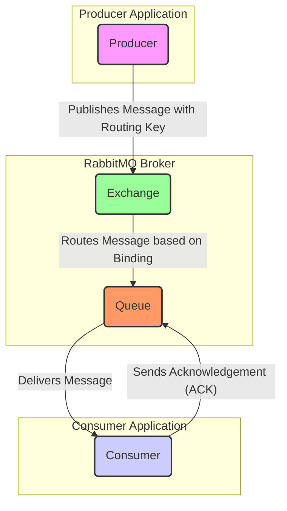
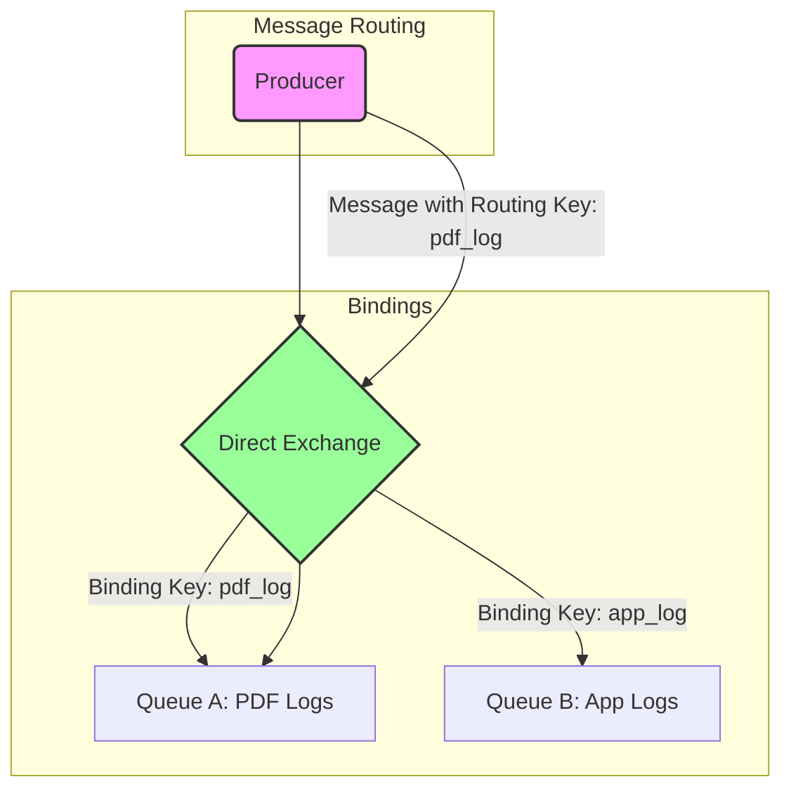
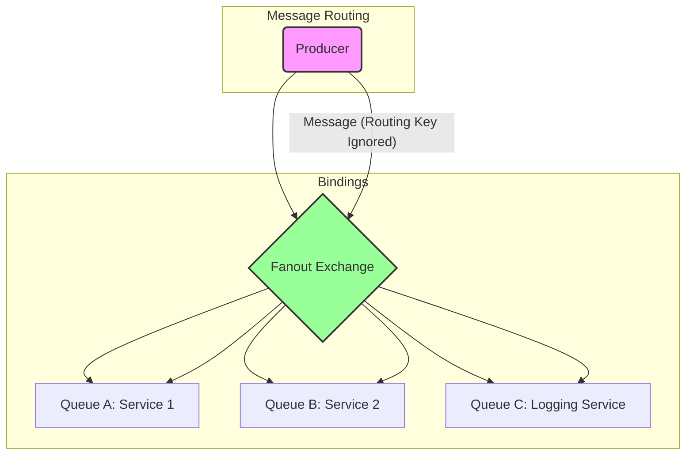
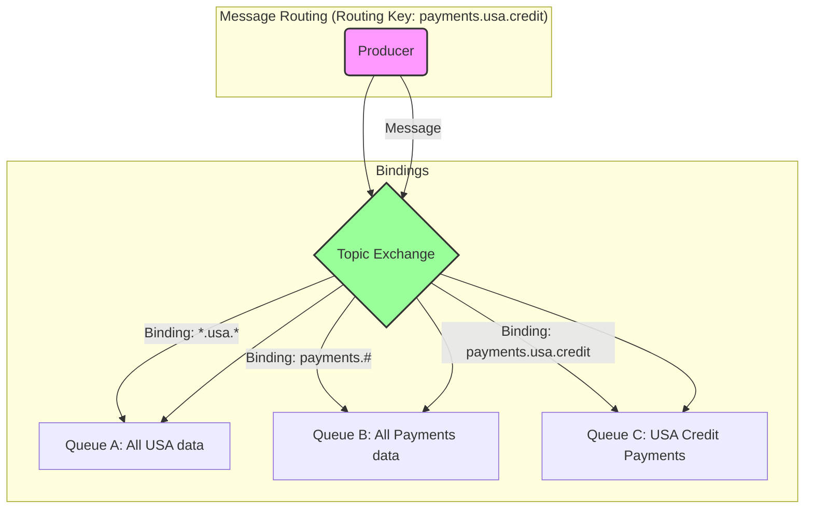
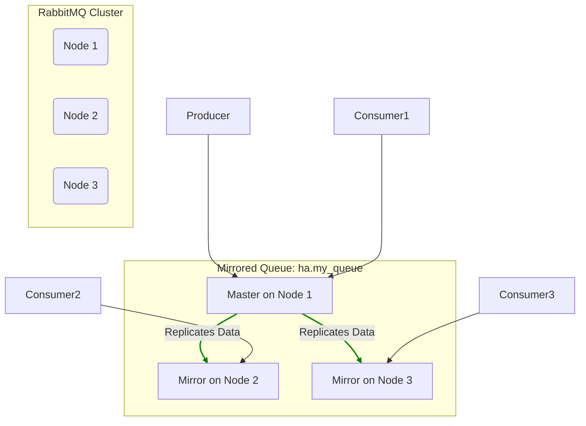
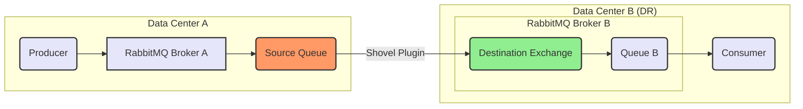

### Basic Message Flow

```mermaid
%% RabbitMQ Basic Message Flow Diagram
%% -------------------------------------
%% This diagram shows the fundamental path of a message from a producer to a consumer.

graph TD
    %% Define the main applications/services as subgraphs for clarity.
    subgraph Producer Application
        P(Producer)
    end

    subgraph RabbitMQ Broker
        X(Exchange) --> |Routes Message based on Binding| Q(Queue)
    end

    subgraph Consumer Application
        C(Consumer)
    end

    %% Define the flow of the message and the acknowledgement.
    P -- "Publishes Message with Routing Key" --> X
    Q -- "Delivers Message" --> C
    C -- "Sends Acknowledgement (ACK)" --> Q

    %% Apply styling to match the reference image.
    style P fill:#f9f,stroke:#333,stroke-width:2px
    style X fill:#9f9,stroke:#333,stroke-width:2px
    style Q fill:#f96,stroke:#333,stroke-width:2px
    style C fill:#ccf,stroke:#333,stroke-width:2px
```

### Direct Exchange

```mermaid
graph TD
    P(Producer) --> X{Direct Exchange};

    subgraph Bindings
        X -- "Binding Key: pdf_log" --> Q1[Queue A: PDF Logs];
        X -- "Binding Key: app_log" --> Q2[Queue B: App Logs];
    end

    subgraph Message Routing
        P -- "Message with Routing Key: pdf_log" --> X;
        X --> Q1;
    end

    style P fill:#f9f,stroke:#333,stroke-width:2px
    style X fill:#9f9,stroke:#333,stroke-width:2px
```

### Fanout Exchange

```mermaid
graph TD
    P(Producer) --> X{Fanout Exchange};

    subgraph Bindings
        X --> Q1[Queue A: Service 1];
        X --> Q2[Queue B: Service 2];
        X --> Q3[Queue C: Logging Service];
    end

    subgraph Message Routing
        P -- "Message (Routing Key Ignored)" --> X;
        X --> Q1;
        X --> Q2;
        X --> Q3;
    end

    style P fill:#f9f,stroke:#333,stroke-width:2px
    style X fill:#9f9,stroke:#333,stroke-width:2px
```

### Topic Exchange

```mermaid
graph TD
    P(Producer) --> X{Topic Exchange};

    subgraph Bindings
        X -- "Binding: *.usa.*" --> Q1[Queue A: All USA data];
        X -- "Binding: payments.#" --> Q2[Queue B: All Payments data];
        X -- "Binding: payments.usa.credit" --> Q3[Queue C: USA Credit Payments];
    end

    subgraph "Message Routing (Routing Key: payments.usa.credit)"
        P -- "Message" --> X;
        X --> Q1;
        X --> Q2;
        X --> Q3;
    end

    style P fill:#f9f,stroke:#333,stroke-width:2px
    style X fill:#9f9,stroke:#333,stroke-width:2px
```

### High-Availability Cluster with a Mirrored Queue

```mermaid
graph TD
    subgraph RabbitMQ Cluster
        Node1(Node 1)
        Node2(Node 2)
        Node3(Node 3)
    end

    subgraph "Mirrored Queue: ha.my_queue"
        Master[Master on Node 1]
        Mirror1[Mirror on Node 2]
        Mirror2[Mirror on Node 3]
    end

    Producer --> Master
    Master -- "Replicates Data" --> Mirror1
    Master -- "Replicates Data" --> Mirror2

    Consumer1 --> Master
    Consumer2 --> Mirror1
    Consumer3 --> Mirror2

    linkStyle 1 stroke:green,stroke-width:2px
    linkStyle 2 stroke:green,stroke-width:2px
```

### Shovel Plugin for Geo-Replication

```mermaid
%% Shovel Plugin for Geo-Replication Diagram
%% ------------------------------------------
%% This diagram shows how the Shovel plugin moves messages from a queue
%% in a source data center to an exchange in a destination/DR data center.

graph LR
    %% --- Data Center A (Source) ---
    subgraph "Data Center A"
        P(Producer) --> BrokerA[RabbitMQ Broker A] --> QA(Source Queue)
    end

    %% --- Data Center B (Destination / Disaster Recovery) ---
    subgraph "Data Center B (DR)"
        %% Broker B is its own subgraph containing its components
        subgraph "RabbitMQ Broker B"
            XB(Destination Exchange) --> QB(Queue B)
        end
        %% The consumer is in the data center, but connects externally to the broker
        QB --> C(Consumer)
    end

    %% --- The Shovel Connection ---
    QA -- "Shovel Plugin" --> XB

    %% --- Styling to match the original image ---
    style QA fill:#ff9966,stroke:#333,stroke-width:2px
    style XB fill:#90ee90,stroke:#333,stroke-width:2px
    style P fill:#e6e6fa,stroke:#333,stroke-width:2px
    style BrokerA fill:#e6e6fa,stroke:#333,stroke-width:2px
    style QB fill:#e6e6fa,stroke:#333,stroke-width:2px
    style C fill:#e6e6fa,stroke:#333,stroke-width:2px
```
