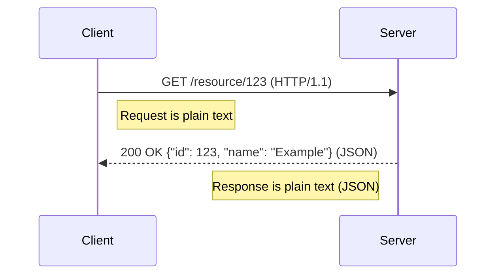
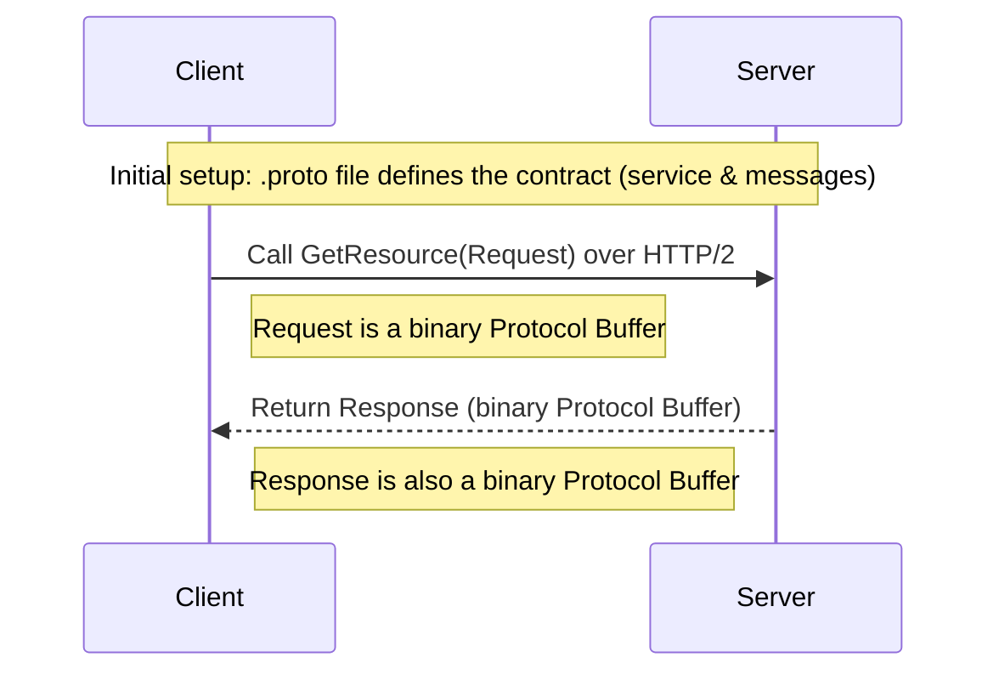
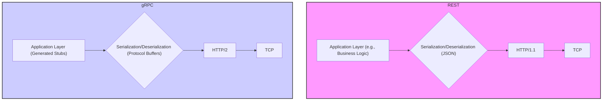
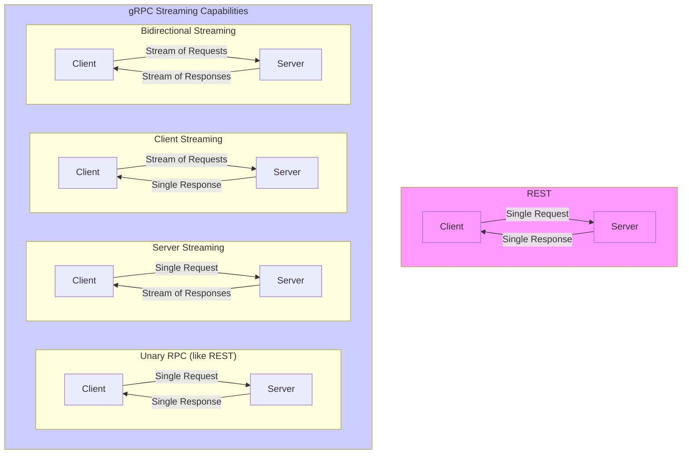
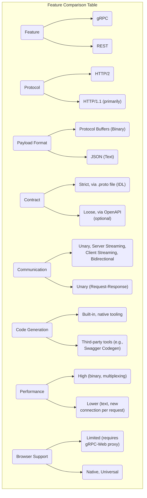

### REST (using HTTP/1.1 & JSON)

```mermaid
sequenceDiagram
    participant Client
    participant Server

    Client->>Server: GET /resource/123 (HTTP/1.1)
    Note right of Client: Request is plain text
    Server-->>Client: 200 OK {"id": 123, "name": "Example"} (JSON)
    Note left of Server: Response is plain text (JSON)
```

### gRPC (using HTTP/2 & Protocol Buffers)

```mermaid
sequenceDiagram
    participant Client
    participant Server

    Note over Client,Server: Initial setup: .proto file defines the contract (service & messages)

    Client->>Server: Call GetResource(Request) over HTTP/2
    Note right of Client: Request is a binary Protocol Buffer
    Server-->>Client: Return Response (binary Protocol Buffer)
    Note left of Server: Response is also a binary Protocol Buffer
```

### Protocol Stack Comparison

```mermaid
graph TD
    subgraph REST
        A["Application Layer (e.g., Business Logic)"] --> B{"Serialization/Deserialization (JSON)"};
        B --> C[HTTP/1.1];
        C --> D[TCP];
    end

    subgraph gRPC
        E["Application Layer (Generated Stubs)"] --> F{"Serialization/Deserialization (Protocol Buffers)"};
        F --> G[HTTP/2];
        G --> H[TCP];
    end

    style REST fill:#f9f,stroke:#333,stroke-width:2px
    style gRPC fill:#ccf,stroke:#333,stroke-width:2px
```

### Communication Patterns

```mermaid
graph TD
    subgraph REST
        direction LR
        REST_Client[Client] -- Single Request --> REST_Server[Server];
        REST_Server -- Single Response --> REST_Client;
        style REST_Client fill:#f9f
        style REST_Server fill:#f9f
    end

    subgraph gRPC [gRPC Streaming Capabilities]
        direction LR
        subgraph "Unary RPC (like REST)"
            direction LR
            Unary_Client[Client] -- Single Request --> Unary_Server[Server];
            Unary_Server -- Single Response --> Unary_Client;
        end

        subgraph Server Streaming
             direction LR
            SS_Client[Client] -- Single Request --> SS_Server[Server];
            SS_Server -- Stream of Responses --> SS_Client;
        end

        subgraph Client Streaming
             direction LR
            CS_Client[Client] -- Stream of Requests --> CS_Server[Server];
            CS_Server -- Single Response --> CS_Client;
        end

        subgraph Bidirectional Streaming
             direction LR
            BiDi_Client[Client] -- Stream of Requests --> BiDi_Server[Server];
            BiDi_Server -- Stream of Responses --> BiDi_Client;
        end

        style gRPC fill:#ccf
        style REST fill:#f9f
    end
```

### Feature Comparison Table

```mermaid
graph TB
    subgraph "Feature Comparison Table"
        A(Feature) --> B(gRPC)
        A --> C(REST)

        D(Protocol) --> E("HTTP/2")
        D --> F("HTTP/1.1 (primarily)")

        G(Payload Format) --> H("Protocol Buffers (Binary)")
        G --> I("JSON (Text)")

        J(Contract) --> K("Strict, via .proto file (IDL)")
        J --> L("Loose, via OpenAPI<br/>(optional)")

        M(Communication) --> N("Unary, Server Streaming,<br/>Client Streaming, Bidirectional")
        M --> O("Unary (Request-Response)")

        P(Code Generation) --> Q("Built-in, native tooling")
        P --> R("Third-party tools (e.g.,<br/>Swagger Codegen)")

        S(Performance) --> T("High (binary, multiplexing)")
        S --> U("Lower (text, new<br/>connection per request)")

        V(Browser Support) --> W("Limited (requires<br/>gRPC-Web proxy)")
        V --> X("Native, Universal")
    end
```
