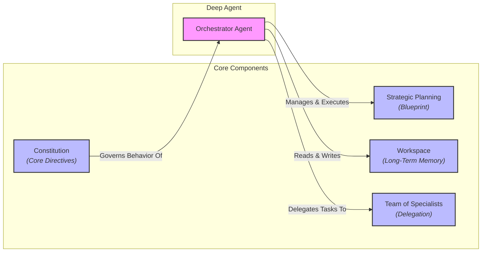
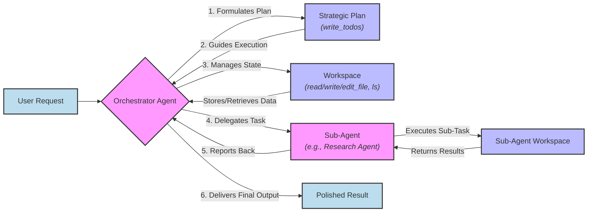

### The Four Components of the Deep Agents Pattern

```mermaid
graph LR
    subgraph Core Components
        direction TB
        E["Constitution <br><i>(Core Directives)</i>"]

        subgraph F[" "]
            direction LR
            B["Strategic Planning <br><i>(Blueprint)</i>"]
            C["Workspace <br><i>(Long-Term Memory)</i>"]
            D["Team of Specialists <br><i>(Delegation)</i>"]
        end
    end

    subgraph Deep Agent
        A[Orchestrator Agent]
    end

    %% --- Relationships ---
    E -- Governs Behavior Of --> A
    A -- Manages & Executes --> B
    A -- Reads & Writes --> C
    A -- Delegates Tasks To --> D

    %% --- Styling ---
    style F fill:none,stroke:none
    style A fill:#f9f,stroke:#333,stroke-width:2px
    style E fill:#bbf,stroke:#333,stroke-width:2px
    style B fill:#bbf,stroke:#333,stroke-width:2px
    style C fill:#bbf,stroke:#333,stroke-width:2px
    style D fill:#bbf,stroke:#333,stroke-width:2px
```

### Deep Agents Workflow

```mermaid
graph LR
    %% --- Node Definitions ---
    A[User Request]
    B{Orchestrator Agent}
    C["Strategic Plan <br><i>(write_todos)</i>"]
    D["Workspace <br><i>(read/write/edit_file, ls)</i>"]
    E["Sub-Agent <br><i>(e.g., Research Agent)</i>"]
    F["Sub-Agent Workspace"]
    G["Polished Result"]

    %% --- Relationships ---
    A --> B
    B -- 1. Formulates Plan --> C
    C -- 2. Guides Execution --> B
    B -- 3. Manages State --> D
    D -- Stores/Retrieves Data --> B
    B -- 4. Delegates Task --> E
    E -- 5. Reports Back --> B
    B -- 6. Delivers Final Output --> G
    E -- Executes Sub-Task --> F
    F -- Returns Results --> E

    %% --- Styling ---
    style A fill:#bde,stroke:#333,stroke-width:2px
    style G fill:#bde,stroke:#333,stroke-width:2px
    style B fill:#f9f,stroke:#333,stroke-width:2px
    style E fill:#f9f,stroke:#333,stroke-width:2px
    style C fill:#bbf,stroke:#333,stroke-width:2px
    style D fill:#bbf,stroke:#333,stroke-width:2px
    style F fill:#bbf,stroke:#333,stroke-width:2px
```
