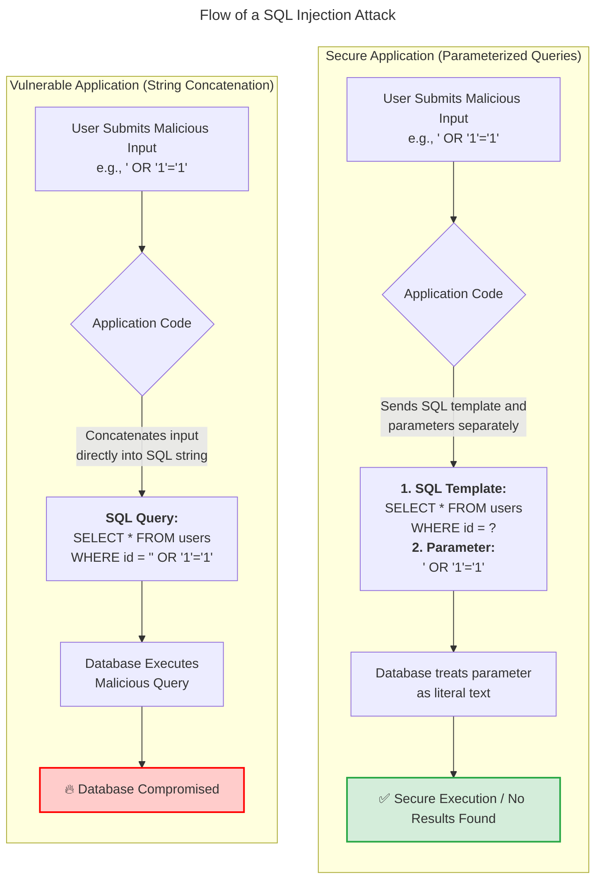
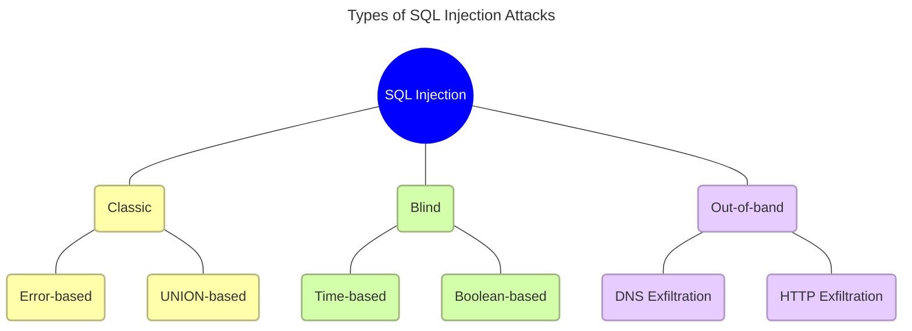
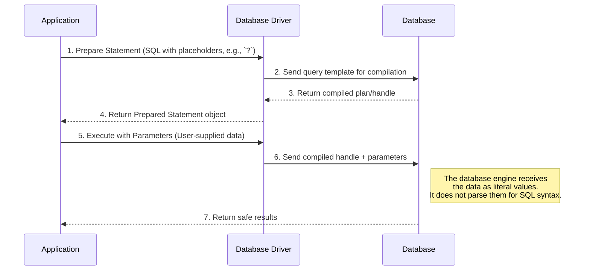
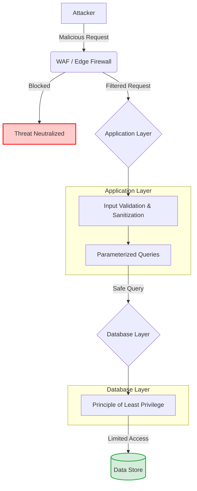

### Flow of a SQL Injection Attack

```mermaid
---
title: Flow of a SQL Injection Attack
---
graph TD
    subgraph "Secure Application (Parameterized Queries)"
        direction TB

        A2[User Submits Malicious Input<br/>e.g., ' OR '1'='1'] --> B2{Application Code};
        B2 -- "Sends SQL template and<br/>parameters separately" --> C2["<b>1. SQL Template:</b><br/>SELECT * FROM users<br/>WHERE id = ?<br/><b>2. Parameter:</b><br/>' OR '1'='1'"];
        C2 --> D2[Database treats parameter<br/>as literal text];
        D2 --> E2[✅ Secure Execution / No Results Found];
    end

    subgraph "Vulnerable Application (String Concatenation)"
        direction TB
        A1[User Submits Malicious Input<br/>e.g., ' OR '1'='1'] --> B1{Application Code};
        B1 -- "Concatenates input<br/>directly into SQL string" --> C1["<b>SQL Query:</b><br/>SELECT * FROM users<br/>WHERE id = '' OR '1'='1'"];
        C1 --> D1[Database Executes<br/>Malicious Query];
        D1 --> E1[🔥 Database Compromised];
    end

    %% Styling
    style E1 fill:#ffcccb,stroke:#ff0000,stroke-width:2px
    style E2 fill:#d4edda,stroke:#28a745,stroke-width:2px
```

### Types of SQL Injection Attacks

```mermaid
---
title: Types of SQL Injection Attacks
---
graph TD
    %% Node Definitions
    A((SQL Injection))
    B(Classic)
    C(Blind)
    D(Out-of-band)
    B1(Error-based)
    B2(UNION-based)
    C1(Time-based)
    C2(Boolean-based)
    D1(DNS Exfiltration)
    D2(HTTP Exfiltration)

    %% Link Definitions
    A --- B & C & D
    B --- B1 & B2
    C --- C1 & C2
    D --- D1 & D2

    %% Style Definitions (classDef)
    classDef root fill:#0000ff,color:#fff,stroke-width:2px,stroke:#0000ff
    classDef classic fill:#ffffaa,color:#333,stroke-width:2px,stroke:#b8b87e
    classDef blind fill:#d4ffaa,color:#333,stroke-width:2px,stroke:#9fb87e
    classDef outofband fill:#e6ccff,color:#333,stroke-width:2px,stroke:#b399cc

    %% Apply Styles to Nodes
    class A root
    class B,B1,B2 classic
    class C,C1,C2 blind
    class D,D1,D2 outofband
```

### The Parameterized Query Execution Flow

```mermaid
sequenceDiagram
    participant App as Application
    participant Driver as Database Driver
    participant DB as Database

    App->>Driver: 1. Prepare Statement (SQL with placeholders, e.g., `?`)
    Driver->>DB: 2. Send query template for compilation
    DB-->>Driver: 3. Return compiled plan/handle
    Driver-->>App: 4. Return Prepared Statement object

    App->>Driver: 5. Execute with Parameters (User-supplied data)
    Driver->>DB: 6. Send compiled handle + parameters
    
    Note right of DB: The database engine receives<br/>the data as literal values.<br/>It does not parse them for SQL syntax.

    DB-->>App: 7. Return safe results
```

### Defense-in-Depth Strategy

```mermaid
graph TD
    A[Attacker] -- Malicious Request --> B(WAF / Edge Firewall);
    B -- Blocked --> X[Threat Neutralized];
    B -- Filtered Request --> C{Application Layer};
    
    subgraph Application Layer
        D[Input Validation & Sanitization] --> E[Parameterized Queries];
    end

    C --> D;
    E -- Safe Query --> F{Database Layer};

    subgraph Database Layer
        G[Principle of Least Privilege]
    end

    F --> G;
    G -- Limited Access --> H[(Data Store)];

    style X fill:#ffcccb,stroke:#ff0000,stroke-width:2px
    style H fill:#d4edda,stroke:#28a745,stroke-width:2px
```
