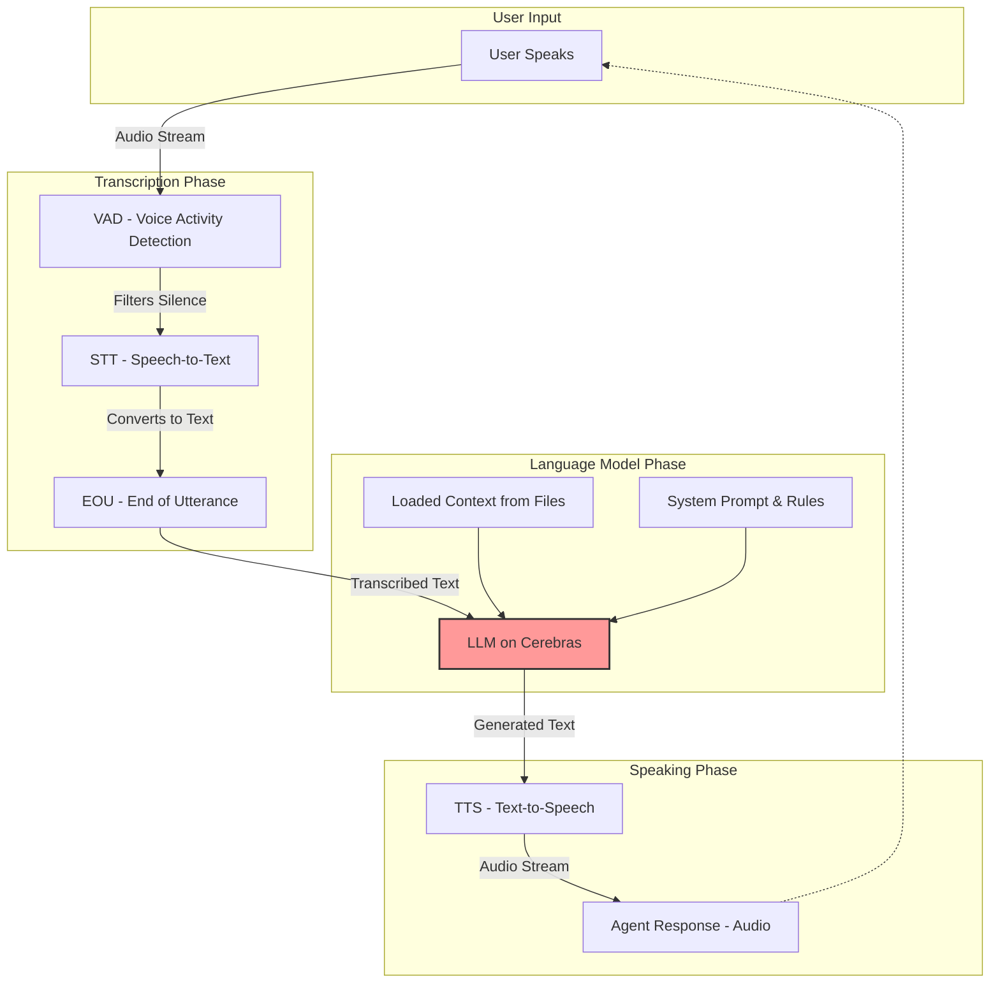
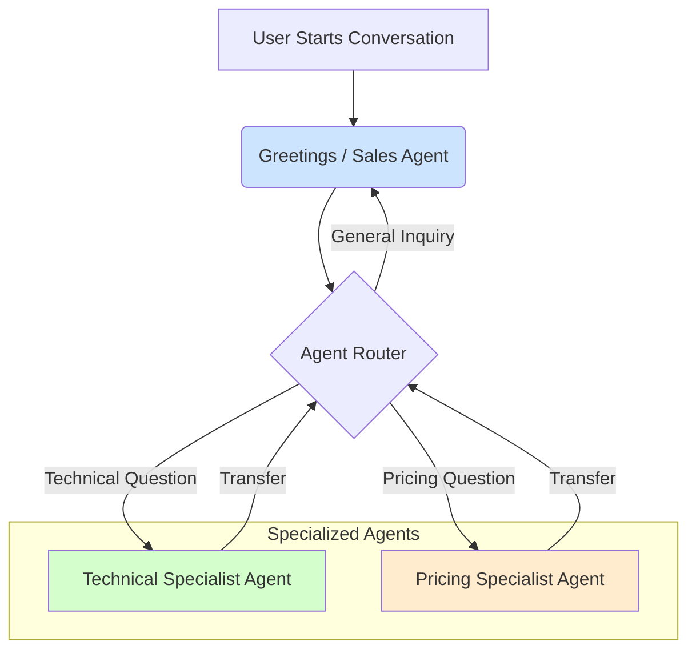

### Single Voice Agent Architecture

```mermaid
graph TB
    subgraph User Input
        UserSpeaks[User Speaks]
    end

    subgraph Transcription Phase
        VAD[VAD - Voice Activity Detection]
        STT[STT - Speech-to-Text]
        EOU[EOU - End of Utterance]
    end

    subgraph Language Model Phase
        LLM[LLM on Cerebras]
        style LLM fill:#ff9999,stroke:#333,stroke-width:2px
        Context[Loaded Context from Files]
        Prompt[System Prompt & Rules]
    end

    subgraph Speaking Phase
        TTS[TTS - Text-to-Speech]
        AgentResponse[Agent Response - Audio]
    end

    UserSpeaks -- Audio Stream --> VAD
    VAD -- Filters Silence --> STT
    STT -- Converts to Text --> EOU
    EOU -- Transcribed Text --> LLM
    Context --> LLM
    Prompt --> LLM
    LLM -- Generated Text --> TTS
    TTS -- Audio Stream --> AgentResponse
    AgentResponse -.-> UserSpeaks
```

### Multi-Agent System Workflow

```mermaid
graph TD
    A[User Starts Conversation] --> B(Greetings / Sales Agent);
    B --> C{Agent Router};
    C -- Technical Question --> D[Technical Specialist Agent];
    C -- Pricing Question --> E[Pricing Specialist Agent];
    C -- General Inquiry --> B;
    D -- Transfer --> C;
    E -- Transfer --> C;

    subgraph "Specialized Agents"
        D
        E
    end

    style B fill:#cde4ff
    style D fill:#d4ffcd
    style E fill:#ffebcd
```

Source: [How to Build Advanced AI Agents](https://www.youtube.com/watch?v=B0TJC4lmzEM)
