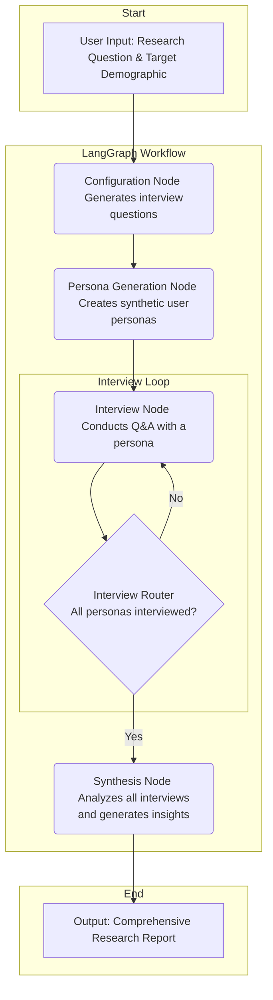
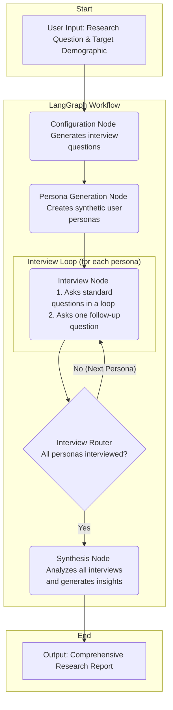

### Core User Research Workflow

```mermaid
graph TD
    subgraph "Start"
        A[User Input: Research Question & Target Demographic]
    end

    subgraph "LangGraph Workflow"
        B(Configuration Node <br> Generates interview questions)
        C(Persona Generation Node <br> Creates synthetic user personas)

        subgraph "Interview Loop"
            D(Interview Node <br> Conducts Q&A with a persona)
            E{Interview Router <br> All personas interviewed?}
        end

        F(Synthesis Node <br> Analyzes all interviews and generates insights)
    end

    subgraph "End"
        G[Output: Comprehensive Research Report]
    end

    A --> B
    B --> C
    C --> D
    D --> E
    E -- No --> D
    E -- Yes --> F
    F --> G
```

### Optional Workflow with Follow-Up Questions

```mermaid
graph TD
    subgraph "Start"
        A[User Input: Research Question & Target Demographic]
    end

    subgraph "LangGraph Workflow"
        B(Configuration Node <br> Generates interview questions)
        C(Persona Generation Node <br> Creates synthetic user personas)

        subgraph "Interview Loop (for each persona)"
            D(Interview Node <br> 1. Asks standard questions in a loop <br> 2. Asks one follow-up question)
        end

        E{Interview Router <br> All personas interviewed?}

        F(Synthesis Node <br> Analyzes all interviews and generates insights)
    end

    subgraph "End"
        G[Output: Comprehensive Research Report]
    end

    A --> B
    B --> C
    C --> D
    D --> E
    E -- No (Next Persona) --> D
    E -- Yes --> F
    F --> G
```

Sources:

- [How to Build Advanced AI Agents](https://www.youtube.com/watch?v=B0TJC4lmzEM)
