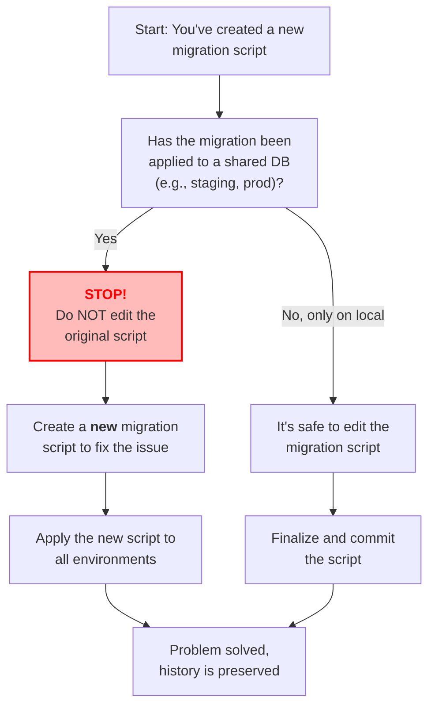
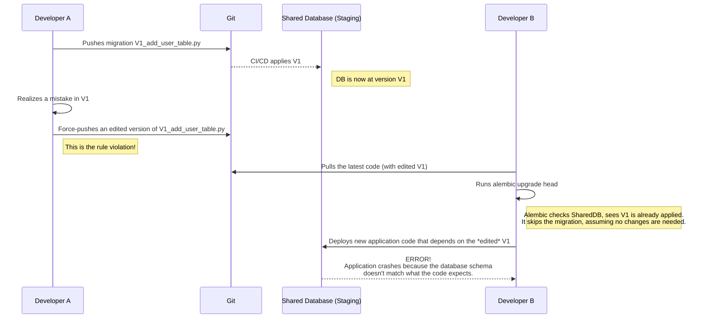
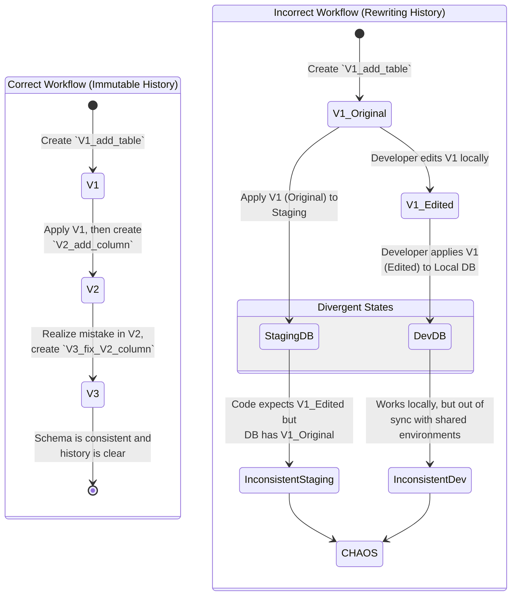

### The Golden Rule Decision Flowchart

```mermaid
graph TD
    A[Start: You've created a new<br>migration script] --> B["Has the migration been<br>applied to a shared DB<br>(e.g., staging, prod)?"];
    B -- No, only on local --> C[It's safe to edit the<br>migration script];
    B -- Yes --> D[<font color=red><b>STOP!</b></font><br>Do NOT edit the<br>original script];
    D --> E[Create a <b>new</b> migration<br>script to fix the issue];
    E --> F[Apply the new script to<br>all environments];
    C --> G[Finalize and commit<br>the script];
    F --> H[Problem solved,<br>history is preserved];
    G --> H;

    style D fill:#ffbaba,stroke:#ff0000,stroke-width:2px
```

### The Danger of Breaking the Rule

```mermaid
sequenceDiagram
    participant DevA as Developer A
    participant Git
    participant SharedDB as Shared Database (Staging)
    participant DevB as Developer B

    DevA->>Git: Pushes migration V1_add_user_table.py
    Git-->>SharedDB: CI/CD applies V1
    note right of SharedDB: DB is now at version V1

    DevA->>DevA: Realizes a mistake in V1
    DevA->>Git: Force-pushes an edited version of V1_add_user_table.py
    note right of DevA: This is the rule violation!

    DevB->>Git: Pulls the latest code (with edited V1)
    DevB->>DevB: Runs alembic upgrade head
    note right of DevB: Alembic checks SharedDB, sees V1 is already applied.<br/>It skips the migration, assuming no changes are needed.

    DevB->>SharedDB: Deploys new application code that depends on the *edited* V1
    SharedDB-->>DevB: ERROR!<br>Application crashes because the database schema<br/>doesn't match what the code expects.
```

### Correct vs. Incorrect Migration Workflows

```mermaid
stateDiagram-v2
    direction TB

    state "Correct Workflow (Immutable History)" as Correct {
        [*] --> V1 : Create `V1_add_table`
        V1 --> V2 : Apply V1, then create<br>`V2_add_column`
        V2 --> V3 : Realize mistake in V2,<br>create `V3_fix_V2_column`
        V3 --> [*] : Schema is consistent and<br>history is clear
    }

    state "Incorrect Workflow (Rewriting History)" as Incorrect {
        [*] --> V1_Original: Create `V1_add_table`
        V1_Original --> StagingDB: Apply V1 (Original) to<br>Staging
        V1_Original --> V1_Edited: Developer edits V1 locally
        V1_Edited --> DevDB: Developer applies V1<br>(Edited) to Local DB

        state "Divergent States" as Divergence {
            StagingDB --> InconsistentStaging: Code expects V1_Edited but<br>DB has V1_Original
            DevDB --> InconsistentDev: Works locally, but out of<br>sync with shared environments
        }
        InconsistentStaging --> CHAOS
        InconsistentDev --> CHAOS
    }
```
